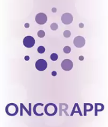
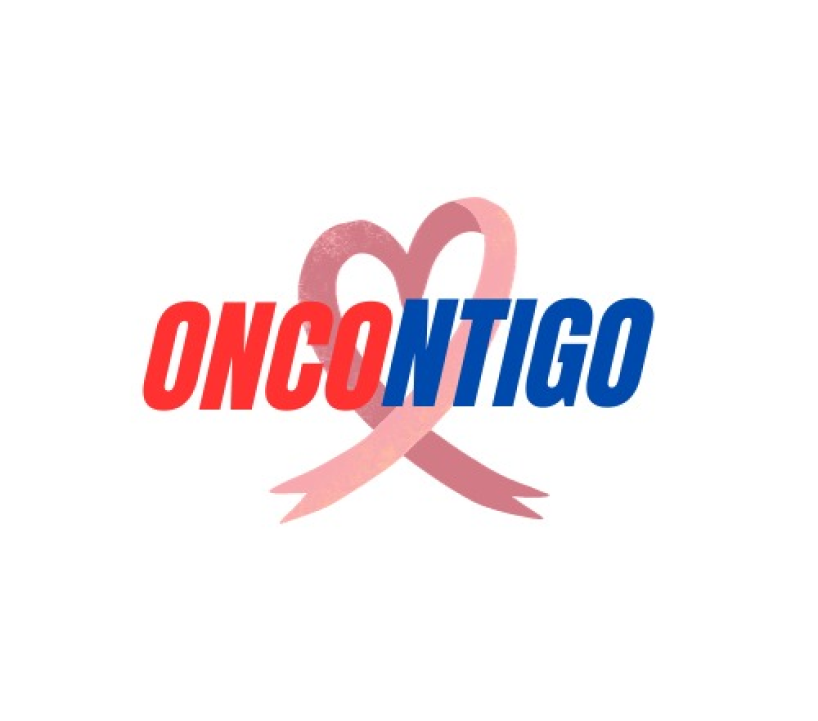

   
   <h1>Universidad Peruana de Ciencias Aplicadas</h1>
   <h2>Ingeniería de Software</h2>
   <h2>Aplicaciones Web</h2>
     
   
<strong>Sección:</strong> SW55

   
<strong>Docente:</strong> Francisco José Cáceres Honores

   
<strong>Informe:</strong> TB1

   
<strong>Nombre de la Startup:</strong> Los Ramos

   
<strong>Nombre del producto:</strong> OnContigo

   
<strong>Ciclo:</strong> 2024-01

<h3>Integrantes</h3>

| Alumnos                         |   Codigo   |
| :------------------------------ | :--------: |
| Alexandra Belen Ramos Argüelles | U202215164 |
| Diego Jose Acuña Gomez          | U20201C794 |
| Gustavo Adolfo Pardo Zapata    | U202120347|
|   Juan Pablo Ramos Mendoza  | U202019545 |
| Renzo Manuel Ramos Ramirez |  U202113745|-

 
 
<h4>Link del repositorio: https://github.com/OnContigo-upc/OnContigo-informe</h4>

 

   <h1>Registro de versiones</h1>
    
   
      <table>
         <thead>
            <tr>
               <th>Versión</th>
               <th>Fecha</th>
               <th>Autor</th>
               <th>Descripción de modificaciones</th>
            </tr>
         </thead>
         <tbody>
            <tr>
               <td>0.1</td>
               <td>26/03/2024</td>
               <td>Acuña, Diego</td>
               <td>Caratula del informe</td>
            </tr>
            <tr>
               <td>0.2</td>
               <td>04/04/2024</td>
               <td>Ramos, Juan Pablo</td>
               <td>Lean UX Process</td>
            </tr>
    </table>

<h1 align="center">Contenido</h1>
 
<ul style="list-style-type: none;">
   <li><h1><a href="./content/student-outcome.md">Student Outcome</a></h1></li>
   <li><h1><a href="./content/chapter-1/chapter-1.md">Capítulo I: Introducción</a></h1></li>
   <li><h3><a href="./content/chapter-1/chapter-1.md">1.1. Startup Profile</a></h3></li>
   <ul style="list-style-type: none;">
      <li><h3><a href="./content/chapter-1/chapter-1.md">1.1.1.  Descripción de la Startup</a></h3></li>
</ul>
<ul style="list-style-type: none;">
      <li><h3><a href="./content/chapter-1/chapter-1.md">1.1.2. Perfiles de integrantes del equipo</a></h3></li>
   </ul>
   <li><h3><a href="./content/chapter-1/chapter-1.md">1.2. Solution Profile</a></h3></li>
   <ul>
      <il><h3><a href="./content/chapter-1/chapter-1.md">1.2.1 Antecedentes y problemática</a></h3></il>
      <il><h3><a href="./content/chapter-1/chapter-1.md">1.2.2 Lean UX Process</a></h3>
      </il>
          <il><h3><a href="./content/chapter-1/chapter-1.md">1.2.2.1. Lean UX Problem Statements</a></h3></il>
         <il><h3><a href="./content/chapter-1/chapter-1.md">1.2.2.2. Lean UX Assumptions</a></h3></il>
         <il><h3><a href="./content/chapter-1/chapter-1.md">1.2.2.3. Lean UX Hypothesis Statements</a></h3></il>
         <il><h3><a href="./content/chapter-1/chapter-1.md">1.2.2.4. Lean UX Canvas</a></h3></il>
      </ul>
   </ul>
<ul style="list-style-type: none;">
   <li><h3><a href="./content/chapter-1/chapter-1.md">1.3. Segmentos objetivo</a></h3></li>
</ul>
<li><h1><a href="./content/chapter-2/1-competidores.md">Capítulo II: Requirements Elicitation & Analysis</a></h1></il>
<li><h3><a href="./content/chapter-2/1-competidores.md">2.1. Competidores</a></h3></li>

   <ul>
      <il><h3><a href="./content/chapter-2/1-competidores.md">2.1.1. Análisis competitivo</a></h3></il>
<table>
  <tr>
    <th colspan="6" valign="top"><b>Análisis Competitivo</b></th>
  </tr>
  <tr>
    <td colspan="1" rowspan="2" valign="top">¿Por qué llevar a cabo este Análisis?</td>
    <td colspan="5" valign="top">Este análisis nos ayudará a comprender mejor a nuestra competencia para así ver las debilidades y fortalezas de nuestra aplicación web. Esto nos permitirá desarrollar diversas estrategias para mejorar nuestro producto.</td>
  </tr>
  <tr></tr>
  <tr>
    <td colspan="2" valign="top"></td>
    <td colspan="1" valign="top">
OncorApp

</td>
    <td colspan="1" valign="top">
Outcome4Me
 

</td>
    <td colspan="1" valign="top">
My Cancer Coach

</td>
    <td colspan="1" valign="top">
Oncontigo
</td>
  </tr>
  <tr>
    <td colspan="1" rowspan="2" valign="top">

Perfil
</td>
    <td colspan="1" valign="top">Overview</td>
    <td colspan="1" valign="top">Aplicación móvil que ofrece información y consejos de cuidado emocional, nutricional y físico para pacientes que padecen cáncer.</td>
    <td colspan="1" valign="top">Aplicación que brinda apoyo personalizado a pacientes con cáncer.</td>
    <td colspan="1" valign="top">Aplicación que permite a los médicos monitorear sus pacientes mediante encuestas diarias.</td>
    <td colspan="1" valign="top">Aplicativo de ayuda y organización para
   pacientes oncológicos y médicos oncólogos.</td>
  </tr>
  <tr>
    <td colspan="1" valign="top">¿Qué valor ofrece a los clientes?</td>
    <td colspan="1" valign="top">
Brinda consejos y ejercicios para la salud física como mental para los pacientes que aún están en tratamiento.

</td>
    <td colspan="1" valign="top">
Ofrece un seguimiento de la salud del paciente y recomienda clínicas para realizar los tratamientos y exámenes adecuados.
</td>
    <td colspan="1" valign="top">
Ofrece herramientas y recursos para que los monitoreen su salud de forma continua.
</td>
    <td colspan="1" valign="top">
Ofrece diversos servicios que ayudan tanto a los pacientes y médicos como: Calendarios, asignación de medicamentos
</td>
  </tr>
  <tr>
    <td colspan="1" rowspan="2" valign="top">

Perfil de Marketing
</td>
    <td colspan="1" valign="top">Mercado objetivo</td>
    <td colspan="1" valign="top">
- Personas que empiezan o aún están en tratamiento.
</td>
    <td colspan="1" valign="top">
- Personas que buscan tratamiento o que ya empezaron a realizar sus exámenes.

</td>
    <td colspan="1" valign="top">
- Pacientes que padecen de cáncer que requieren ayuda a lo largo de su tratamiento.
</td>
    <td colspan="1" valign="top">
- Médicos y pacientes que quieran tener una comunicación directa entre ambos.
</td>
  </tr>
  <tr>
    <td colspan="1" valign="top">Estrategias de marketing</td>
    <td colspan="1" valign="top">
Promoción en su sitio web
</td>
    <td colspan="1" valign="top">
Realizan Webinars y videos para promocionar su app en su sitio web
</td>
    <td colspan="1" valign="top">
Incluyen una prueba gratis de la aplicación para que los usuarios después cambien de plan.
</td>
    <td colspan="1" valign="top">Los servicios que brinda son: Calendario, creación de citas, recetar medicamentes,  registrar tratamientos y chat directo entre médico y paciente.</td>
  </tr>
  <tr>
    <td colspan="1" rowspan="3" valign="top">

Perfil de Producto
</td>
    <td colspan="1" valign="top">Productos & Servicios</td>
    <td colspan="1" valign="top">
- Brinda consejos sobre la nutrición para los pacientes. Puedes obtener informacion importante sobre los tratamientos

- Recomienda ejercicios para la salud mental y fisica.
</td>
    <td colspan="1" valign="top">
- Ayuda a monitorear al paciente y brinda información útil sobre el tipo de cáncer que padezca

- Brinda las ubicaciones de clínicas recomendadas en base al tipo de tratamiento requerido.
</td>
    <td colspan="1" valign="top">
- Monitoreo continuo mediante preguntas personalizadas

- Consejos y recursos acerca de nutrición, ejercicio y manejo del estrés.

</td>
    <td colspan="1" valign="top">
Los servicios que brinda son: Calendario, creación de citas, recetar medicamentes,  registrar tratamientos y chat directo entre médico y paciente.
</td>
  </tr>
  <tr>
    <td colspan="1" valign="top">Precios y costos</td>
    <td colspan="1" valign="top">Es totalmente gratuita.</td>
    <td colspan="1" valign="top">Es de uso gratuito y sin restricciones</td>
    <td colspan="1" valign="top">Cuenta con suscripciones y contenido de paga. También hay una suscripción gratuita.</td>
    <td colspan="1" valign="top">
Nuestra plataforma contará con planes como: Free, Premium y Pro Service.
</td>
  </tr>
  <tr>
    <td colspan="1" valign="top">Canales de distribución </td>
    <td colspan="1" valign="top">Solo aplicación móvil (Google PlayStore y App Store)</td>
    <td colspan="1" valign="top">Solo aplicación móvil (Google Playstore y App Store) y Aplicación Web (Desde su sitio oficial)</td>
    <td colspan="1" valign="top">
Solo aplicación móvil (Google Playstore y App Store)
</td>
    <td colspan="1" valign="top">Landing Page que redirige a la Web Application</td>
  </tr>
  <tr>
    <td colspan="1" rowspan="4" valign="top">

Análisis SWOT
</td>
    <td colspan="1" valign="top">Fortalezas</td>
    <td colspan="1" valign="top">
      
- Ser parte de una asociación cientifica.

      
- Poseer con una variedad de información respaldada científicamente.

    </td>
    <td colspan="1" valign="top">
      
- Cuenta con ayuda de especialistas en el tema.

      
- Posee una gran cantidad de información de las clínicas que recomieda.

      
- Cuenta con los aportes de la comunidad.

    </td>
    <td colspan="1" valign="top">
      
- Posee una gran variedad de herramientas de ayuda.

      
- Gestión de sítomas incluído. Información útil acerca de los tratamientos.

    </td>
    <td colspan="1" valign="top">
      
- Las herramientas que proporciona son muy útiles ya que facilita la comunicación entre médico y paciente

      
- Además cuenta con un calendario interactivo para organizar las citas.

    </td>
  </tr>
  <tr>
    <td colspan="1" valign="top">Debilidades</td>
    <td colspan="1" valign="top">
      
- Carece de interaccion directa con el usuario

      
- Es un producto que no puede mantenerse por si mismo si es gratis.

    </td>
    <td colspan="1" valign="top">
      
- Solo se limitan a atender a unos ciertos tipos de cáncer.

    </td>
    <td colspan="1" valign="top">
      
- Falta un medio para comunicarse con un médico directamente..

    </td>
    <td colspan="1" valign="top">
      
- No tiene la característica de realizar videollamadas de consulta dentro de la plataforma.

      

    </td>
  </tr>
  <tr>
    <td colspan="1" valign="top">Oportunidades</td>
    <td colspan="1" valign="top">
      
- Muy pocas aplicaciones le dan la misma importancia a la salud mental y fisica.

    </td>
    <td colspan="1" valign="top">
      
- Cuentan con inversionistas grandes como instituciones relacionadas al área de la Oncología.

    </td>
    <td colspan="1" valign="top">
      
- Puede ser un buen complemento  necesario en los hospitales debido al buen recibimiento.

    </td>
    <td colspan="1" valign="top">
      
- Hay pocas plataformas que ofrecen herramientas que faciliten la comunicación entre médico-paciente

    </td>
  </tr>
  <tr>
    <td colspan="1" valign="top">Amenazas</td>
    <td colspan="1" valign="top">
      
-Surgimiento de otras aplicaciones multiplataformas (Web).

    </td>
    <td colspan="1" valign="top">
      
- Muchas personas padecen de otros tipos de cáncer que la aplicación no puede atender.

    </td>
    <td colspan="1" valign="top">
      
- Surgimiento de otras aplicaciones multiplataformas (Web).

    </td>
    <td colspan="1" valign="top">
      
- Aplicaciones de mensajería instantanea tradicionales: Whatsapp y Telegram.

      
- Aplicaciones de recordatorio: Google Calendar.

    </td>
  </tr>
</table>
      <il><h3><a href="./content/chapter-2/1-competidores.md">2.1.2. Estrategias y tácticas frente a competidores</a></h3></il>
      
**Estrategias:**

**Desarrollo de una Interfaz de Usuario Intuitiva y Amigable:**  
**Estrategia:** Mejorar la interacción del usuario mediante una interfaz intuitiva y amigable, para contrarrestar la falta de interacción directa con el usuario identificada como una debilidad. 
**Táctica:** Realizar pruebas de usabilidad y obtener retroalimentación de los usuarios para iterar en el diseño de la interfaz y mejorar la experiencia del usuario.

**Modelo de Negocio Sostenible:**  
**Estrategia:** Explorar modelos de negocio que garanticen la sostenibilidad financiera a largo plazo, considerando la limitación de mantener la aplicación gratuita identificada como una debilidad. 
**Táctica:** Investigar la viabilidad de ofrecer servicios premium o suscripciones pagas con funciones adicionales y beneficios exclusivos.

**Tácticas:**

**Mejorar la Comunicación Médico-Paciente:** 
**Estrategia:** Mejorar la comunicación directa entre médicos y pacientes, que actualmente falta en la aplicación, para satisfacer mejor las necesidades de los usuarios. 
**Táctica:** Desarrollar una función de mensajería o chat en tiempo real dentro de la aplicación que permita a los usuarios comunicarse fácilmente con sus médicos para consultas y seguimiento.

**Aprovechar la Escasez de Plataformas de Comunicación Médico-Paciente:** 
**Estrategia:** Capitalizar la oportunidad identificada en la falta de plataformas que faciliten la comunicación entre médicos y pacientes. 
**Táctica:** Promocionar activamente la función de comunicación médico-paciente de la aplicación a través de campañas de marketing dirigidas.

**Invertir en Marketing y Promoción:** 
**Estrategia:** Incrementar las estrategias de marketing y promoción, como webinars y videos, para aumentar la visibilidad y la adopción de la aplicación. 
**Táctica:** Colaborar con médicos en el campo de la oncología para promover la aplicación y organizar eventos de lanzamiento y charlas informativas.
  
   </ul>
<il><h3><a href="./content/chapter-2/2-entrevistas.md">2.2. Entrevistas</a></h3></il>
   <ul>
      <il><h3><a href="./content/chapter-2/2-entrevistas.md">2.2.1. Diseño de entrevistas</a></h3></il>
      <il><h3><a href="./content/chapter-2/2-entrevistas.md">2.2.2. Registro de entrevistas</a></h3></il>
      <il><h3><a href="./content/chapter-2/2-entrevistas.md">2.2.3. Análisis de entrevistas</a></h3></il>
   </ul>
<il><h3><a href="./content/chapter-2/3-user-persona.md">2.3. Needfinding</a></h3></il>
   <ul>
      <il><h3><a href="./content/chapter-2/3-user-persona.md">2.3.1. User Personas</a></h3></il>
      <il><h3><a href="./content/chapter-2/4-user-task-matrix.md">2.3.2. User Task Matrix</a></h3></il>
      <il><h3><a href="./content/chapter-2/5-user-journey-mapping.md">2.3.3. User Journey Mapping</a></h3></il>
      <il><h3><a href="./content/chapter-2/6-empathy-mapping.md">2.3.4. Empathy Mapping</a></h3></il>
      <il><h3><a href="./content/chapter-2/7-as-is.md">2.3.5. As-is Scenario Mapping</a></h3></il>
   </ul>

<il><h1><a href="./content/chapter-3/1-to-be.md">Capítulo III: Requirements Specification</a></h1></il>
<il><h3><a href="./content/chapter-3/1-to-be.md">3.1. To-Be Scenario Mapping</a></h3></il>
<il><h3><a href="./content/chapter-3/2-user-stories.md">3.2. User Stories</a></h3></il>
<il><h3><a href="./content/chapter-3/3-impact-mapping.md">3.3. Impact Mapping</a></h3></il>
<il><h3><a href="./content/chapter-3/4-product-backlog.md">3.4. Product Backlog</a></h3></il>

<il><h1><a href="./content/chapter-4/1-style-guidelines.md">Capítulo IV: Product Design</a></h1></il>
<il><h3><a href="./content/chapter-4/1-style-guidelines.md">4.1. Style Guidelines</a></h3></il>

   <ul>
      <il><h3><a href="./content/chapter-4/1-style-guidelines.md">4.1.1. General Style Guidelines</a></h3></il>
      <il><h3><a href="">4.1.2. Web Style Guidelines</a></h3></il>
   </ul>
<il><h3><a href="./content/chapter-4/2-information-architecture.md">4.2. Information Architecture</a></h3></il>
   <ul>
      <il><h3><a href="./content/chapter-4/2-information-architecture.md">4.2.1. Organization Systems</a></h3></il>
      <il><h3><a href="./content/chapter-4/2-information-architecture.md">4.2.2. Labeling Systems</a></h3></il>
      <il><h3><a href="./content/chapter-4/2-information-architecture.md">4.2.3. SEO Tags and Meta Tags</a></h3></il>
      <il><h3><a href="./content/chapter-4/2-information-architecture.md">4.2.4. Searching Systems</a></h3></il>
      <il><h3><a href="./content/chapter-4/2-information-architecture.md">4.2.5. Navigation Systems</a></h3></il>
   </ul>
<il><h3><a href="./content/chapter-4/3-landing-page-ui-design.md">4.3. Landing Page UI Design</a></h3></il>
   <ul>
      <il><h3><a href="./content/chapter-4/3-landing-page-ui-design.md">4.3.1. Landing Page Wireframe</a></h3></il>
      <il><h3><a href="./content/chapter-4/3-landing-page-ui-design.md">4.3.2. Landing Page Mock-up</a></h3></il>
   </ul>
<il><h3><a href="./content/chapter-4/4-web-app-ux-ui-design.md">4.4. Web Applications UX/UI Design</a></h3></il>
   <ul>
      <il><h3><a href="./content/chapter-4/4-web-app-ux-ui-design.md">4.4.1. Web Applications Wireframes</a></h3></il>
      <il><h3><a href="./content/chapter-4/4-web-app-ux-ui-design.md">4.4.2. Web Applications Wireflow Diagrams</a></h3></il>
      <il><h3><a href="./content/chapter-4/4-web-app-ux-ui-design.md">4.4.3. Web Applications Mock-ups</a></h3></il>
      <il><h3><a href="./content/chapter-4/4-web-app-ux-ui-design.md">4.4.4. Web Applications User Flow Diagrams</a></h3></il>
   </ul>
<il><h3><a href="./content/chapter-4/5-web-app-prototyping.md">4.5. Web Applications Prototyping</a></h3></il>
<il><h3><a href="./content/chapter-4/6-domain-driven-software-architecture.md">4.6. Domain-Driven Software Architecture</a></h3></il>
   <ul>
      <il><h3><a href="./content/chapter-4/6-domain-driven-software-architecture.md">4.6.1. Software Architecture Context Diagram</a></h3></il>
      <il><h3><a href="./content/chapter-4/6-domain-driven-software-architecture.md">4.6.2. Software Architecture Container Diagrams</a></h3></il>
      <il><h3><a href="./content/chapter-4/6-domain-driven-software-architecture.md">4.6.3. Software Architecture Components Diagrams</a></h3></il>
   </ul>
<il><h3><a href="./content/chapter-4/7-software-object-oriented-design.md">4.7. Software Object-Oriented Design</a></h3></il>
   <ul>
      <il><h3><a href="./content/chapter-4/7-software-object-oriented-design.md">4.7.1. Class Diagrams</a></h3></il>
      <il><h3><a href="./content/chapter-4/7-software-object-oriented-design.md">4.7.2. Class Dictionary</a></h3></il>
   </ul>
<il><h3><a href="./content/chapter-4/8-database-design.md">4.8. Database Design</a></h3></il>
   <ul>
      <il><h3><a href="./content/chapter-4/8-database-design.md">4.8.1. Database Diagram</a></h3></il>
   </ul>

<il><h1><a href="./content/chapter-5/1-software-configuration-managment.md">Capítulo V: Product Implementation, Validation & Deployment</a></h1></il>
<il><h3><a href="./content/chapter-5/1-software-configuration-managment.md">5.1. Software Configuration Management</a></h3></il>

   <ul>
      <il><h3><a href="./content/chapter-5/1-software-configuration-managment.md">5.1.1. Software Development Environment Configuration</a></h3></il>
      <il><h3><a href="./content/chapter-5/1-software-configuration-managment.md">5.1.2. Source Code Management</a></h3></il>
      <il><h3><a href="./content/chapter-5/1-software-configuration-managment.md">5.1.3. Source Code Style Guide & Conventions</a></h3></il>
      <il><h3><a href="./content/chapter-5/1-software-configuration-managment.md">5.1.4. Software Deployment Configuration</a></h3></il>
   </ul>
<il><h3><a href="./content/chapter-5/sprint-1/1-sprint-planing-1.md">5.2. Landing Page, Services & Applications Implementation</a></h3></il>
   <ul>
      <il><h3><a href="./content/chapter-5/sprint-1/1-sprint-planing-1.md">5.2.1. Sprint 1</a></h3></il>
      <ul>
         <il><h3><a href="./content/chapter-5/sprint-1/1-sprint-planing-1.md">5.2.1.1. Sprint Planning 1</a></h3></il>
         <il><h3><a href="./content/chapter-5/sprint-1/2-sprint-backlog-1.md">5.2.1.2. Sprint Backlog 1</a></h3></il>
         <il><h3><a href="./content/chapter-5/sprint-1/3-development-evidence-1.md">5.2.1.3. Development Evidence for Sprint Review</a></h3></il>
         <il><h3><a href="./content/chapter-5/sprint-1/4-testing-suit-evidence-1.md">5.2.1.4. Testing Suite Evidence for Sprint Review</a></h3></il>
         <il><h3><a href="./content/chapter-5/sprint-1/5-execution-evidence-1.md">5.2.1.5. Execution Evidence for Sprint Review</a></h3></il>
         <il><h3><a href="./content/chapter-5/sprint-1/6-services-documentation-evicence-1.md">5.2.1.6. Services Documentation Evidence for Sprint Review</a></h3></il>
         <il><h3><a href="./content/chapter-5/sprint-1/7-software-deployment-evidence-1.md">5.2.1.7. Software Deployment Evidence for Sprint Review</a></h3></il>
         <il><h3></h3></il>
      </ul>
   </ul>
       <il><h3><a href="./content/chapter-5/validation-interviews/5.3.1-diseño-entrevistas.md">5.3 Validation Interviews</a></h3></il>
      <ul>
         <il><h3><a href="./content/chapter-5/validation-interviews/5.3.1-diseño-entrevistas.md">5.3.1. Diseño de Entrevista</a></h3></il>
          <il><h3><a href="./content/chapter-5/validation-interviews/5.3.1-diseño-entrevistas.md">5.3.2. Registro de Entrevista</a></h3></il>
           <il><h3><a href="./content/chapter-5/validation-interviews/5.3.3-evaluaciones-segun-heuristicas.md">5.3.3.Evaluaciones según heuristicas</a></h3></il>
      </ul>
         <il><h3><a href="./content/chapter-5/video-about-the-product/5.4.Video About-the-product.md">5.4 Video About The Product</a></h3></il>
      <ul>
      </ul>
   </ul>
</ul>
 

