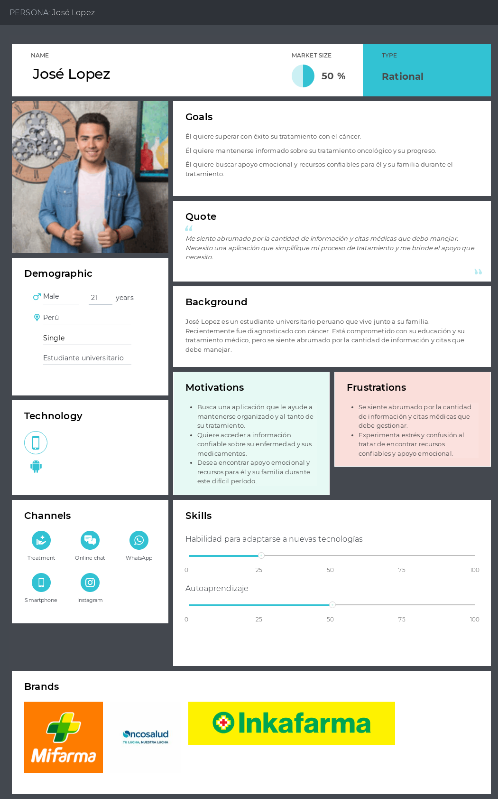
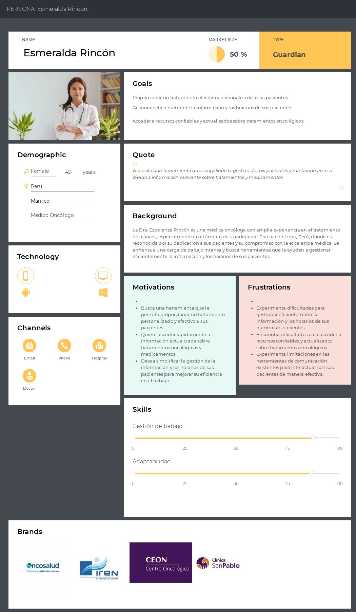
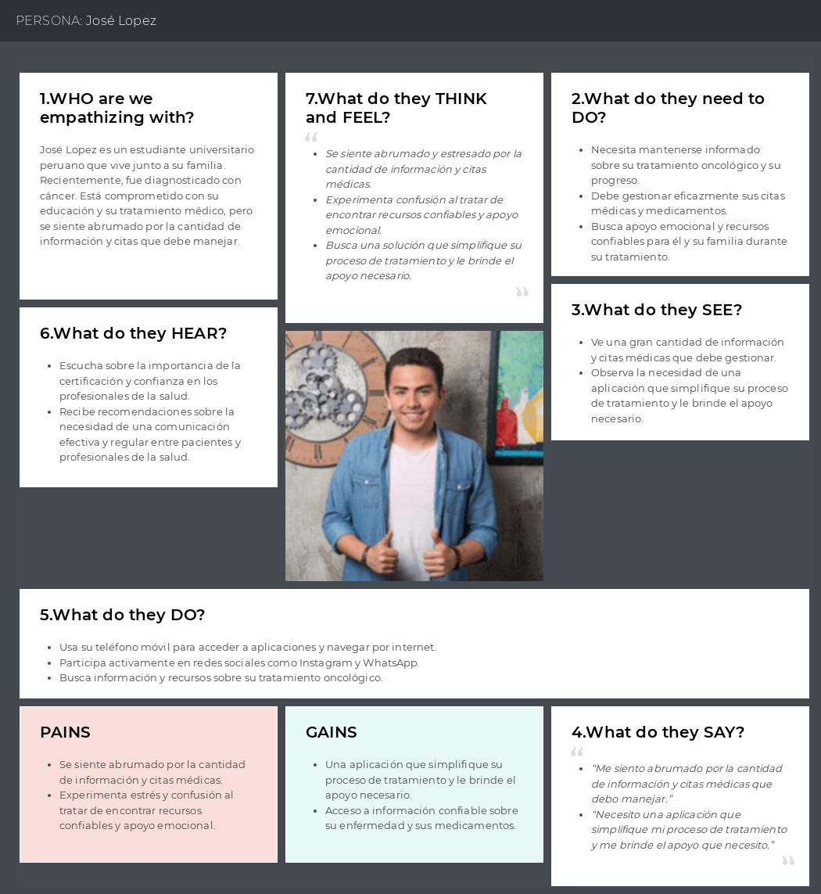
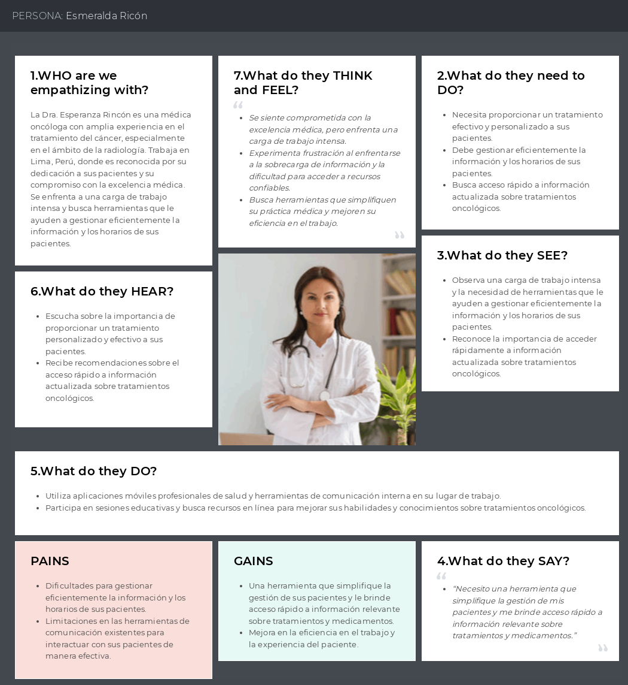

   
   <h1>Universidad Peruana de Ciencias Aplicadas</h1>
   <h2>Ingeniería de Software</h2>
   <h2>Aplicaciones Web</h2>
     
   
<strong>Sección:</strong> SW55

   
<strong>Docente:</strong> Francisco José Cáceres Honores

   
<strong>Informe:</strong> TB1

   
<strong>Nombre de la Startup:</strong> Los Ramos

   
<strong>Nombre del producto:</strong> OnContigo

   
<strong>Ciclo:</strong> 2024-01

<h3>Integrantes</h3>

| Alumnos                         |   Codigo   |
| :------------------------------ | :--------: |
| Alexandra Belen Ramos Argüelles | U202215164 |
| Diego Jose Acuña Gomez          | U20201C794 |
| Gustavo Adolfo Pardo Zapata    | U202120347|
|   Juan Pablo Ramos Mendoza  | U202019545 |
| Renzo Manuel Ramos Ramirez |  U202113745|-

 
 
<h4>Link del repositorio: https://github.com/OnContigo-upc/OnContigo-informe</h4>

 

   <h1>Registro de versiones</h1>
    
   
      <table>
         <thead>
            <tr>
               <th>Versión</th>
               <th>Fecha</th>
               <th>Autor</th>
               <th>Descripción de modificaciones</th>
            </tr>
         </thead>
         <tbody>
            <tr>
               <td>0.1</td>
               <td>26/03/2024</td>
               <td>Acuña, Diego</td>
               <td>Caratula del informe</td>
            </tr>
            <tr>
               <td>0.2</td>
               <td>04/04/2024</td>
               <td>Ramos, Juan Pablo</td>
               <td>Lean UX Process</td>
            </tr>
             <tr>
               <td>1.0</td>
               <td>14/04/2024</td>
               <td>Acuña, Diego </td>
               <td>Antecedentes y problemáticas</td>
            </tr>
            <tr>
               <td>1.1</td>
               <td>14/04/2024</td>
               <td>Acuña, Diego </td>
               <td>Cambio de directorio del informe(Capítulo 1 y 2)</td>
            </tr>
            <tr>
               <td>1.2</td>
               <td>14/04/2024</td>
               <td>Acuña, Diego </td>
               <td>As-Is-Scenario-Mapping</td>
            </tr>
            <tr>
               <td>1.3</td>
               <td>14/04/2024</td>
               <td>Acuña, Diego </td>
               <td>User Task Matrix</td>
            </tr>
            <tr>
               <td>1.4</td>
               <td>14/04/2024</td>
               <td>Acuña, Diego </td>
               <td>To-be-scenario mapping</td>
            </tr>
             <tr>
               <td>1.5</td>
               <td>14/04/2024</td>
               <td>Acuña, Diego </td>
               <td>SEO y Meta Tags</td>
            </tr>
            <tr>
               <td>1.6</td>
               <td>14/04/2024</td>
               <td>Acuña, Diego </td>
               <td>Organization Systems</td>
            </tr>
            <tr>
               <td>1.7</td>
               <td>14/04/2024</td>
               <td>Acuña, Diego </td>
               <td>Labeling Systems</td>
            </tr>
            <tr>
               <td>1.8</td>
               <td>14/04/2024</td>
               <td>Acuña, Diego </td>
               <td>Searching Systems</td>
            </tr> 
            <tr>
               <td>1.9</td>
               <td>14/04/2024</td>
               <td>Acuña, Diego </td>
               <td> Navigation Systems</td>
            </tr>
            <tr>
               <td>1.10</td>
               <td>14/04/2024</td>
               <td>Acuña, Diego </td>
               <td>Diseño de entrevistas </td>
            </tr>
            <tr>
               <td>1.11</td>
               <td>14/04/2024</td>
               <td>Acuña, Diego </td>
               <td>Software Architecture Components Diagram </td>
            </tr>
            <tr>
               <td>1.12</td>
               <td>14/04/2024</td>
               <td>Ramos, Juan Pablo </td>
               <td>Registro y Análisis de Entrevistas </td>
            </tr>
    </table>

<h1 align="center">Contenido</h1>
 
<ul style="list-style-type: none;">
   <li><h1><a href="./content/student-outcome.md">Student Outcome</a></h1></li>
   <li><h1><a href="./content/chapter-1/chapter-1.md">Capítulo I: Introducción</a></h1></li>
   <li><h3><a href="./content/chapter-1/chapter-1.md">1.1. Startup Profile</a></h3></li>
   <ul style="list-style-type: none;">
      <li><h3><a href="./content/chapter-1/1-startup-profile.md">1.1.1.  Descripción de la Startup</a></h3></li>
        OnContigo es una aplicación creada por alumnos de ingeniería de software de la Universidad Peruana de Ciencias Aplicadas (UPC), con el objetivo de ofrecer apoyo y organización tanto a pacientes oncológicos como a médicos oncólogos en el sector de la salud peruano. Reconocemos las complejidades y desafíos que enfrentan estos dos grupos en el proceso de tratamiento del cáncer, por lo que consideramos darle la importancia debida

OnContigo ofrece una plataforma integral que facilita la gestión de pacientes y la organización de su información. Los médicos pueden administrar eficientemente la información y los horarios de una gran cantidad de pacientes, así como asignar medicamentos y procedimientos de manera efectiva. Además, nuestro calendario integrado proporciona recordatorios específicos para cada paciente, incluyendo citas médicas y procedimientos importantes, y facilita la comunicación directa entre médicos y pacientes.

Otro punto relevante de OnContigo es que proporciona un espacio seguro y comprensivo para que los pacientes oncológicos y sus familias gestionen su tratamiento y bienestar. Los pacientes pueden registrar los medicamentos que toman y acceder a información detallada sobre ellos, incluyendo los efectos secundarios. Además, nuestro calendario ofrece recordatorios de citas médicas, procedimientos y la duración de los medicamentos. También facilitamos la búsqueda y el contacto con médicos oncólogos y otros recursos importantes.

- Misión: Nuestra misión es mejorar la calidad de vida y el proceso de tratamiento para pacientes oncológicos y médicos oncólogos en el Perú. Nos esforzamos por ser un aliado confiable en su viaje, proporcionando herramientas tecnológicas innovadoras que simplifiquen la gestión de la atención médica y promuevan una mayor conexión entre pacientes y profesionales de la salud.

- Visión: Nuestra visión es convertirnos en la plataforma líder en el sector peruano de la salud, reconocida por nuestro compromiso con la excelencia en el apoyo a pacientes oncológicos y médicos oncólogos. Buscamos transformar positivamente la experiencia de tratamiento del cáncer al proporcionar soluciones integrales, accesibles y centradas en las necesidades de nuestros usuarios.
</ul>
<ul style="list-style-type: none;">
      <li><h3><a href="./content/chapter-1/chapter-1.md">1.1.2. Perfiles de integrantes del equipo</a></h3></li>
   </ul>
   <li><h3><a href="./content/chapter-1/chapter-1.md">1.2. Solution Profile</a></h3></li>
   <ul>
      <il><h3><a href="./content/chapter-1/chapter-1.md">1.2.1 Antecedentes y problemática</a></h3></il>
      <il><h3><a href="./content/chapter-1/chapter-1.md">1.2.2 Lean UX Process</a></h3>
      </il>
          <il><h3><a href="./content/chapter-1/chapter-1.md">1.2.2.1. Lean UX Problem Statements</a></h3></il>
         <il><h3><a href="./content/chapter-1/chapter-1.md">1.2.2.2. Lean UX Assumptions</a></h3></il>
         <il><h3><a href="./content/chapter-1/chapter-1.md">1.2.2.3. Lean UX Hypothesis Statements</a></h3></il>
         <il><h3><a href="./content/chapter-1/chapter-1.md">1.2.2.4. Lean UX Canvas</a></h3></il>
      </ul>
   </ul>
<ul style="list-style-type: none;">
   <li><h3><a href="./content/chapter-1/chapter-1.md">1.3. Segmentos objetivo</a></h3></li>
Dentro del marco de nuestra propuesta innovadora, hemos detectado segmentos fundamentales que están vinculados al ámbito problemático que abordamos.

- Médicos Oncólogos:
Este grupo incluye a profesionales médicos especializados en el tratamiento del cáncer, que trabajan en hospitales, clínicas oncológicas y consultorios privados en el Perú. Además, es importante destacar que estos médicos se enfrentan a una carga de trabajo intensa, con la necesidad de gestionar la información y los horarios de numerosos pacientes en un entorno altamente exigente.

- Pacientes Oncológicos y Sus Familiares:
Este grupo abarca a personas de todas las edades que han sido diagnosticadas con cáncer, así como a sus familiares y cuidadores que están involucrados en su proceso de tratamiento y recuperación. Todos comparten la necesidad de acceder a recursos y herramientas que faciliten la gestión de su enfermedad y mejoren su calidad de vida durante el tratamiento.

</ul>
<il><h1><a href="./content/chapter-2/chapter-2.md">Capítulo II: Requirements Elicitation & Analysis</a></h1></il>
<li><h3><a href="./content/chapter-2/chapter-2.md">2.1. Competidores</a></h3></li>

   <ul>
      <il><h3><a href="./content/chapter-2/chapter-2.md">2.1.1. Análisis competitivo</a></h3></il>
      <il><h3><a href="./content/chapter-2/chapter-2.md">2.1.2. Estrategias y tácticas frente a competidores</a></h3></il>
   </ul>
<il><h3><a href="./content/chapter-2/chapter-2.md">2.2. Entrevistas</a></h3></il>
   <ul>
      <il><h3><a href="./content/chapter-2/chapter-2.md">2.2.1. Diseño de entrevistas</a></h3></il>
      <il><h3><a href="./content/chapter-2/chapter-2.md">2.2.2. Registro de entrevistas</a></h3></il>
      <il><h3><a href="./content/chapter-2/chapter-2.md">2.2.3. Análisis de entrevistas</a></h3></il>
   </ul>
<il><h3><a href="./content/chapter-2/chapter-2.md">2.3. Needfinding</a></h3></il>
   <ul>
<ul style="list-style-type: none;">
      <il><h3><a href="./content/chapter-2/chapter-2.md">2.3.1. User Personas</a></h3></il>
      En esta sección, se presentan personajes ficticios, uno para cada segmento objetivo. La información empleada en la elaboración de los User personas proviene de entrevistas previas realizadas a cada segmento objetivo. El propósito de estas entrevistas fue comprender mejor a las personas a las que está dirigida la aplicación. Entre la información extraída de las entrevistas se incluyen datos demográficos, metas, motivaciones, frustraciones, marcas relacionadas con el tema de la aplicación, canales digitales más utilizados, entre otros. La creación de esta sección se llevó a cabo utilizando la plataforma UXPressia.

Segmento objetivo: Pacientes y familiares

Link de UXPressia: https://uxpressia.com/w/mDdvz/p/tViVP

Segmento objetivo: Oncólogos

Link de UXPressia: https://uxpressia.com/w/mDdvz/p/mxqb4

</ul>
<il><h3><a href="./content/chapter-2/chapter-2.md">2.3.2. User Task Matrix</a></h3></il>
      <il><h3><a href="./content/chapter-2/chapter-2.md">2.3.3. User Journey Mapping</a></h3></il>
      <ul style="list-style-type: none;"><il><h3><a href="./content/chapter-2/chapter-2.md">2.3.4. Empathy Mapping</a></h3></il>
En esta parte, se exhibirán los Empathy maps basados en los user personas creados, considerando los dos segmentos objetivos. La utilización de estos mapas de empatía será beneficiosa, ya que nos permitirá comprender con mayor profundidad a nuestros clientes, lo que a su vez nos posibilitará mejorar diversos aspectos de la aplicación.

Segmento objetivo: Pacientes y familiares

Link de UXPressia: https://uxpressia.com/w/mDdvz/p/JzlFH
  
           Segmento objetivo: Oncólogos 

Link de UXPressia: https://uxpressia.com/w/mDdvz/p/lg65v 
   
            
</ul>      
<il><h3><a href="./content/chapter-2/chapter-2.md">2.3.5. As-is Scenario Mapping</a></h3></il>
   </ul>
<il><h3><a href="./content/chapter-2/chapter-2.md">2.4. Ubiquitous Language</a></h3></il>

<il><h1><a href="./content/chapter-3/chapter-3.md">Capítulo III: Requirements Specification</a></h1></il>
<il><h3><a href="./content/chapter-3/chapter-3.md">3.1. To-Be Scenario Mapping</a></h3></il>
<il><h3><a href="./content/chapter-3/chapter-3.md">3.2. User Stories</a></h3></il>
<il><h3><a href="./content/chapter-3/chapter-3.md">3.3. Impact Mapping</a></h3></il>
<il><h3><a href="./content/chapter-3/chapter-3.md">3.4. Product Backlog</a></h3></il>

<il><h1><a href="./content/chapter-4/chapter-4.md">Capítulo IV: Product Design</a></h1></il>
<il><h3><a href="./content/chapter-4/chapter-4.md">4.1. Style Guidelines</a></h3></il>

   <ul>
      <il><h3><a href="./content/chapter-4/chapter-4.md">4.1.1. General Style Guidelines</a></h3></il>
      <il><h3><a href="">4.1.2. Web Style Guidelines</a></h3></il>
   </ul>
<il><h3><a href="./content/chapter-4/chapter-4.md">4.2. Information Architecture</a></h3></il>
   <ul>
      <il><h3><a href="./content/chapter-4/chapter-4.md">4.2.1. Organization Systems</a></h3></il>
      <il><h3><a href="./content/chapter-4/chapter-4.md">4.2.2. Labeling Systems</a></h3></il>
      <il><h3><a href="./content/chapter-4/chapter-4.md">4.2.3. SEO Tags and Meta Tags</a></h3></il>
      <il><h3><a href="./content/chapter-4/chapter-4.md">4.2.4. Searching Systems</a></h3></il>
      <il><h3><a href="./content/chapter-4/chapter-4.md">4.2.5. Navigation Systems</a></h3></il>
   </ul>
<il><h3><a href="./content/chapter-4/chapter-4.md">4.3. Landing Page UI Design</a></h3></il>
   <ul>
      <il><h3><a href="./content/chapter-4/chapter-4.md">4.3.1. Landing Page Wireframe</a></h3></il>
      <il><h3><a href="./content/chapter-4/chapter-4.md">4.3.2. Landing Page Mock-up</a></h3></il>
   </ul>
<il><h3><a href="./content/chapter-4/chapter-4.md">4.4. Web Applications UX/UI Design</a></h3></il>
   <ul>
      <il><h3><a href="./content/chapter-4/chapter-4.md">4.4.1. Web Applications Wireframes</a></h3></il>
      <il><h3><a href="./content/chapter-4/chapter-4.md">4.4.2. Web Applications Wireflow Diagrams</a></h3></il>
      <il><h3><a href="./content/chapter-4//chapter-4.md">4.4.3. Web Applications Mock-ups</a></h3></il>
      <il><h3><a href="./content/chapter-4/chapter-4.md">4.4.4. Web Applications User Flow Diagrams</a></h3></il>
   </ul>
<il><h3><a href="./content/chapter-4/chapter-4.md">4.5. Web Applications Prototyping</a></h3></il>
<il><h3><a href="./content/chapter-4/chapter-4.md">4.6. Domain-Driven Software Architecture</a></h3></il>
   <ul>
      <il><h3><a href="./content/chapter-4/chapter-4.md">4.6.1. Software Architecture Context Diagram</a></h3></il>
      <il><h3><a href="./content/chapter-4/chapter-4.md">4.6.2. Software Architecture Container Diagrams</a></h3></il>
      <il><h3><a href="./content/chapter-4/chapter-4.md">4.6.3. Software Architecture Components Diagrams</a></h3></il>
   </ul>
<il><h3><a href="./content/chapter-4/chapter-4.md">4.7. Software Object-Oriented Design</a></h3></il>
   <ul>
      <il><h3><a href="./content/chapter-4/chapter-4.md">4.7.1. Class Diagrams</a></h3></il>
      <il><h3><a href="./content/chapter-4/chapter-4.md">4.7.2. Class Dictionary</a></h3></il>
   </ul>
<il><h3><a href="./content/chapter-4/chapter-4.md">4.8. Database Design</a></h3></il>
   <ul>
      <il><h3><a href="./content/chapter-4/chapter-4.md">4.8.1. Database Diagram</a></h3></il>
   </ul>

<il><h1><a href="./content/chapter-5/chapter-5.md">Capítulo V: Product Implementation, Validation & Deployment</a></h1></il>
<il><h3><a href="./content/chapter-5/chapter-5.md">5.1. Software Configuration Management</a></h3></il>

   <ul>
      <il><h3><a href="./content/chapter-5/chapter-5.md">5.1.1. Software Development Environment Configuration</a></h3></il>
      <il><h3><a href="./content/chapter-5/chapter-5.md">5.1.2. Source Code Management</a></h3></il>
      <il><h3><a href="./content/chapter-5/chapter-5.md">5.1.3. Source Code Style Guide & Conventions</a></h3></il>
      <il><h3><a href="./content/chapter-5/chapter-5.md">5.1.4. Software Deployment Configuration</a></h3></il>
   </ul>
<il><h3><a href="./content/chapter-5/chapter-5.md">5.2. Landing Page, Services & Applications Implementation</a></h3></il>
   <ul>
      <il><h3><a href="./content/chapter-5/chapter-5.md">5.2.1. Sprint 1</a></h3></il>
      <ul>
         <il><h3><a href="./content/chapter-5/chapter-5.md">5.2.1.1. Sprint Planning 1</a></h3></il>
         <il><h3><a href="./content/chapter-5/chapter-5.md">5.2.1.2. Sprint Backlog 1</a></h3></il>
         <il><h3><a href="./content/chapter-5/chapter-5.md">5.2.1.3. Development Evidence for Sprint Review</a></h3></il>
         <il><h3><a href="./content/chapter-5/chapter-5.md">5.2.1.4. Testing Suite Evidence for Sprint Review</a></h3></il>
         <il><h3><a href="./content/chapter-5/chapter-5.md">5.2.1.5. Execution Evidence for Sprint Review</a></h3></il>
         <il><h3><a href="./content/chapter-5/chapter-5.md">5.2.1.6. Services Documentation Evidence for Sprint Review</a></h3></il>
         <il><h3><a href="./content/chapter-5/chapter-5.md">5.2.1.7. Software Deployment Evidence for Sprint Review</a></h3></il>
         <il><h3><a href="./content/chapter-5/chapter-5.md">5.2.1.8. Team Collaboration Insights during Sprint</a></h3></il>
      </ul>
   </ul>
       <il><h3><a href="./content/chapter-5/chapter-5.md">5.3 Validation Interviews</a></h3></il>
      <ul>
         <il><h3><a href="./content/chapter-5/chapter-5.md">5.3.1. Diseño de Entrevista</a></h3></il>
          <il><h3><a href="./content/chapter-5/chapter-5.md">5.3.2. Registro de Entrevista</a></h3></il>
           <il><h3><a href="./content/chapter-5/chapter-5.md">5.3.3.Evaluaciones según heuristicas</a></h3></il>
      </ul>
         <il><h3><a href="./content/chapter-5/chapter-5.md">5.4 Video About The Product</a></h3></il>
      <ul>
      </ul>
   </ul>
</ul>
 

