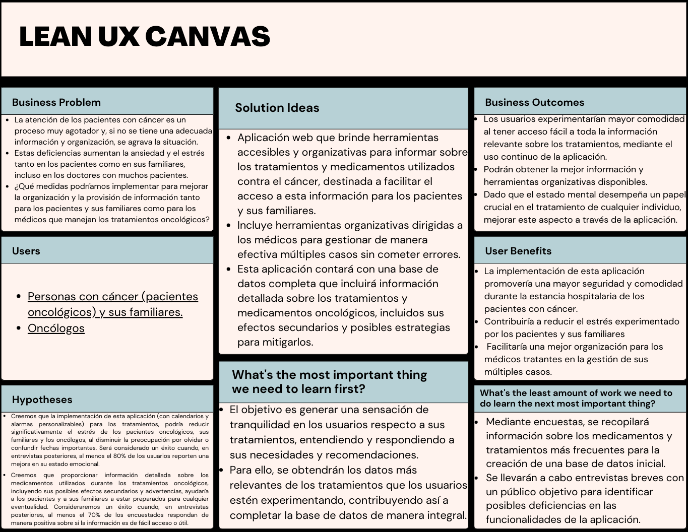

   
   <h1>Universidad Peruana de Ciencias Aplicadas</h1>
   <h2>Ingeniería de Software</h2>
   <h2>Aplicaciones Web</h2>
     
   
<strong>Sección:</strong> SW55

   
<strong>Docente:</strong> Francisco José Cáceres Honores

   
<strong>Informe:</strong> TB1

   
<strong>Nombre de la Startup:</strong> Los Ramos

   
<strong>Nombre del producto:</strong> OnContigo

   
<strong>Ciclo:</strong> 2024-01

<h3>Integrantes</h3>

| Alumnos                         |   Codigo   |
| :------------------------------ | :--------: |
| Alexandra Belen Ramos Argüelles | U202215164 |
| Diego Jose Acuña Gomez          | U20201C794 |
| Gustavo Adolfo Pardo Zapata    | U202120347|
|   Juan Pablo Ramos Mendoza  | U202019545 |
| Renzo Manuel Ramos Ramirez |  U202113745|-

 
 
<h4>Link del repositorio: https://github.com/OnContigo-upc/OnContigo-informe</h4>

 

   <h1>Registro de versiones</h1>
    
   
      <table>
         <thead>
            <tr>
               <th>Versión</th>
               <th>Fecha</th>
               <th>Autor</th>
               <th>Descripción de modificaciones</th>
            </tr>
         </thead>
         <tbody>
            <tr>
               <td>0.1</td>
               <td>26/03/2024</td>
               <td>Acuña, Diego</td>
               <td>Caratula del informe</td>
            </tr>
            <tr>
               <td>0.2</td>
               <td>04/04/2024</td>
               <td>Ramos, Juan Pablo</td>
               <td>Lean UX Process</td>
            </tr>
    </table>

<h1 align="center">Contenido</h1>
 
<ul style="list-style-type: none;">
   <li><h1><a href="./content/student-outcome.md">Student Outcome</a></h1></li>
   <li><h1><a href="./content/chapter-1/1-startup-profile.md">Capítulo I: Introducción</a></h1></li>
   <li><h3><a href="./content/chapter-1/1-startup-profile.md">1.1. Startup Profile</a></h3></li>
   <ul>
      <li><h3><a href="./content/chapter-1/1-startup-profile.md">1.1.1.  Descripción de la Startup</a></h3></li>
      <li><h3><a href="./content/chapter-1/1-startup-profile.md">1.1.2. Perfiles de integrantes del equipo</a></h2></li>
   </ul>
   <li><h3><a href="./content/chapter-1/2-solution-profile.md">1.2. Solution Profile</a></h3></li>
   <ul>
      <il><h3><a href="./content/chapter-1/2-solution-profile.md">1.2.1 Antecedentes y problemática</a></h3></il>
      <il><h3><a href="./content/chapter-1/3-lean-ux-process.md">1.2.2 Lean UX Process</a></h3></il>
      <ul>
         <il><h3><a href="./content/chapter-1/3-lean-ux-process.md">1.2.2.1. Lean UX Problem Statements</a></h3></il>
         El tratamiento y atención de los pacientes con cáncer es bastante agotador y agobiante, siendo la falta de información, organización y claridad del tratamiento en sí un factor que incrementa la ansiedad y estrés en los pacientes y en sus familiares.

Además de esto, los médicos oncólogos deben tratar a una gran cantidad de clientes con horarios y tratamientos muy delicados y específicos, causando problemas para ellos también.

Con el problema de la falta de información sobre medicamentos y tratamientos y de la falta de organización accesible para los pacientes, sus familiares y los médicos, podemos plantear la siguiente pregunta: **¿qué herramientas podríamos brindar para mejorar el acceso de información y organización de los pacientes oncológicos y sus médicos tratantes para reducir el estrés causado por esta situación tan delicada?**
         <il><h3><a href="../content/chapter-1/3-lean-ux-process.md">1.2.2.2. Lean UX Assumptions</a></h3></il>
         **Features:**

- Uso y acceso sencillo a las herramientas
- Aplicación web de uso gratuito
- Información principal e importante sobre los diferentes tratamientos y medicamentos oncológicos del paciente
- Herramientas organizativas y planificadoras para los pacientes y médicos
- Contacto con los pacientes o médicos y laboratorios especializados.

**Business Assumptions:**

- Creemos que los pacientes oncológicos valoran el acceso fácil y rápido a información detallada sobre sus tratamientos, incluyendo procedimientos, efectos secundarios y cuidados posteriores.
- Creemos que los familiares de los pacientes oncológicos se beneficiarían de una mayor comprensión de los tratamientos y de la especialización de los médicos tratantes, lo que les proporcionaría un sentido de seguridad y reduciría su ansiedad sobre el bienestar del paciente.
- Creemos que la organización eficiente de citas, fechas de tratamientos y otros datos relacionados con el tratamiento oncológico es crucial para mejorar la experiencia de los pacientes, sus familiares y los médicos tratantes, y una aplicación puede ser una herramienta efectiva para lograr esto.

**Business Outcomes:**

- Los usuarios experimentaran mayor comodidad al tener acceso fácil a toda la información relevante sobre los tratamientos, mediante el uso continuo de la aplicación.
- Además, los usuarios podrán obtener la mejor información y herramientas organizativas disponibles.
- Dado que el estado mental desempeña un papel crucial en el tratamiento de cualquier individuo, mejorar este aspecto a través de la aplicación.

**User Benefits:**

- La implementación de esta aplicación promovería una mayor seguridad y comodidad durante la estancia hospitalaria de los pacientes con cáncer.
- Contribuiría a reducir el estrés experimentado por los pacientes y sus familiares
- Facilitará una mejor organización para los médicos tratantes en la gestión de sus múltiples casos.
         <il><h3><a href="./content/chapter-1/3-lean-ux-process.md">1.2.2.3. Lean UX Hypothesis Statements</a></h3></il>
**Hypothesis 1:**

Creemos que la implementación de esta aplicación (con calendarios y alarmas personalizables) para los tratamientos, podría reducir significativamente el estrés de los pacientes oncológicos, sus familiares y los oncólogos, al disminuir la preocupación por olvidar o confundir fechas importantes. Será considerado un éxito cuando, en entrevistas posteriores, al menos el 70% de los usuarios reporten una mejora en su estado emocional.

**Hypothesis 2:**

Creemos que al proporcionar información detallada sobre los medicamentos utilizados durante los tratamientos oncológicos, incluyendo sus posibles efectos secundarios y advertencias, ayudaría a los pacientes y a sus familiares a estar preparados para cualquier eventualidad. Consideraremos un éxito cuando, en entrevistas posteriores, al menos el 60% de los encuestados respondan de manera positiva sobre si la información es de fácil acceso o útil.

**Hypothesis 3:**

Creemos que los oncólogos como médicos encargados del cuidado de pacientes con cáncer mejorarán su organización al gestionar el tratamiento de múltiples pacientes, así como otras fechas relevantes. Consideraremos que hemos alcanzado nuestro objetivo cuando, de los médicos entrevistados que utilizan el sistema, al menos el 70% reporten una reducción en la cantidad de errores organizativos entre sus pacientes.
         <il><h3><a href="./content/chapter-1/3-lean-ux-process.md">1.2.2.4. Lean UX Canvas</a></h3></il>
         
      </ul>
   </ul>
   <il><h3><a href="./content/chapter-1/4-segmento-objetivo.md">1.3. Segmentos objetivo</a></h3></il>

<il><h1><a href="./content/chapter-2/1-competidores.md">Capítulo II: Requirements Elicitation & Analysis</a></h1></il>
<il><h3><a href="./content/chapter-2/1-competidores.md">2.1. Competidores</a></h3></il>

   <ul>
      <il><h3><a href="./content/chapter-2/1-competidores.md">2.1.1. Análisis competitivo</a></h3></il>
      <il><h3><a href="./content/chapter-2/1-competidores.md">2.1.2. Estrategias y tácticas frente a competidores</a></h3></il>
   </ul>
<il><h3><a href="./content/chapter-2/2-entrevistas.md">2.2. Entrevistas</a></h3></il>
   <ul>
      <il><h3><a href="./content/chapter-2/2-entrevistas.md">2.2.1. Diseño de entrevistas</a></h3></il>
      <il><h3><a href="./content/chapter-2/2-entrevistas.md">2.2.2. Registro de entrevistas</a></h3></il>
      <il><h3><a href="./content/chapter-2/2-entrevistas.md">2.2.3. Análisis de entrevistas</a></h3></il>
   </ul>
<il><h3><a href="./content/chapter-2/3-user-persona.md">2.3. Needfinding</a></h3></il>
   <ul>
      <il><h3><a href="./content/chapter-2/3-user-persona.md">2.3.1. User Personas</a></h3></il>
      <il><h3><a href="./content/chapter-2/4-user-task-matrix.md">2.3.2. User Task Matrix</a></h3></il>
      <il><h3><a href="./content/chapter-2/5-user-journey-mapping.md">2.3.3. User Journey Mapping</a></h3></il>
      <il><h3><a href="./content/chapter-2/6-empathy-mapping.md">2.3.4. Empathy Mapping</a></h3></il>
      <il><h3><a href="./content/chapter-2/7-as-is.md">2.3.5. As-is Scenario Mapping</a></h3></il>
   </ul>

<il><h1><a href="./content/chapter-3/1-to-be.md">Capítulo III: Requirements Specification</a></h1></il>
<il><h3><a href="./content/chapter-3/1-to-be.md">3.1. To-Be Scenario Mapping</a></h3></il>
<il><h3><a href="./content/chapter-3/2-user-stories.md">3.2. User Stories</a></h3></il>
<il><h3><a href="./content/chapter-3/3-impact-mapping.md">3.3. Impact Mapping</a></h3></il>
<il><h3><a href="./content/chapter-3/4-product-backlog.md">3.4. Product Backlog</a></h3></il>

<il><h1><a href="./content/chapter-4/1-style-guidelines.md">Capítulo IV: Product Design</a></h1></il>
<il><h3><a href="./content/chapter-4/1-style-guidelines.md">4.1. Style Guidelines</a></h3></il>

   <ul>
      <il><h3><a href="./content/chapter-4/1-style-guidelines.md">4.1.1. General Style Guidelines</a></h3></il>
      <il><h3><a href="">4.1.2. Web Style Guidelines</a></h3></il>
   </ul>
<il><h3><a href="./content/chapter-4/2-information-architecture.md">4.2. Information Architecture</a></h3></il>
   <ul>
      <il><h3><a href="./content/chapter-4/2-information-architecture.md">4.2.1. Organization Systems</a></h3></il>
      <il><h3><a href="./content/chapter-4/2-information-architecture.md">4.2.2. Labeling Systems</a></h3></il>
      <il><h3><a href="./content/chapter-4/2-information-architecture.md">4.2.3. SEO Tags and Meta Tags</a></h3></il>
      <il><h3><a href="./content/chapter-4/2-information-architecture.md">4.2.4. Searching Systems</a></h3></il>
      <il><h3><a href="./content/chapter-4/2-information-architecture.md">4.2.5. Navigation Systems</a></h3></il>
   </ul>
<il><h3><a href="./content/chapter-4/3-landing-page-ui-design.md">4.3. Landing Page UI Design</a></h3></il>
   <ul>
      <il><h3><a href="./content/chapter-4/3-landing-page-ui-design.md">4.3.1. Landing Page Wireframe</a></h3></il>
      <il><h3><a href="./content/chapter-4/3-landing-page-ui-design.md">4.3.2. Landing Page Mock-up</a></h3></il>
   </ul>
<il><h3><a href="./content/chapter-4/4-web-app-ux-ui-design.md">4.4. Web Applications UX/UI Design</a></h3></il>
   <ul>
      <il><h3><a href="./content/chapter-4/4-web-app-ux-ui-design.md">4.4.1. Web Applications Wireframes</a></h3></il>
      <il><h3><a href="./content/chapter-4/4-web-app-ux-ui-design.md">4.4.2. Web Applications Wireflow Diagrams</a></h3></il>
      <il><h3><a href="./content/chapter-4/4-web-app-ux-ui-design.md">4.4.3. Web Applications Mock-ups</a></h3></il>
      <il><h3><a href="./content/chapter-4/4-web-app-ux-ui-design.md">4.4.4. Web Applications User Flow Diagrams</a></h3></il>
   </ul>
<il><h3><a href="./content/chapter-4/5-web-app-prototyping.md">4.5. Web Applications Prototyping</a></h3></il>
<il><h3><a href="./content/chapter-4/6-domain-driven-software-architecture.md">4.6. Domain-Driven Software Architecture</a></h3></il>
   <ul>
      <il><h3><a href="./content/chapter-4/6-domain-driven-software-architecture.md">4.6.1. Software Architecture Context Diagram</a></h3></il>
      <il><h3><a href="./content/chapter-4/6-domain-driven-software-architecture.md">4.6.2. Software Architecture Container Diagrams</a></h3></il>
      <il><h3><a href="./content/chapter-4/6-domain-driven-software-architecture.md">4.6.3. Software Architecture Components Diagrams</a></h3></il>
   </ul>
<il><h3><a href="./content/chapter-4/7-software-object-oriented-design.md">4.7. Software Object-Oriented Design</a></h3></il>
   <ul>
      <il><h3><a href="./content/chapter-4/7-software-object-oriented-design.md">4.7.1. Class Diagrams</a></h3></il>
      <il><h3><a href="./content/chapter-4/7-software-object-oriented-design.md">4.7.2. Class Dictionary</a></h3></il>
   </ul>
<il><h3><a href="./content/chapter-4/8-database-design.md">4.8. Database Design</a></h3></il>
   <ul>
      <il><h3><a href="./content/chapter-4/8-database-design.md">4.8.1. Database Diagram</a></h3></il>
   </ul>

<il><h1><a href="./content/chapter-5/1-software-configuration-managment.md">Capítulo V: Product Implementation, Validation & Deployment</a></h1></il>
<il><h3><a href="./content/chapter-5/1-software-configuration-managment.md">5.1. Software Configuration Management</a></h3></il>

   <ul>
      <il><h3><a href="./content/chapter-5/1-software-configuration-managment.md">5.1.1. Software Development Environment Configuration</a></h3></il>
      <il><h3><a href="./content/chapter-5/1-software-configuration-managment.md">5.1.2. Source Code Management</a></h3></il>
      <il><h3><a href="./content/chapter-5/1-software-configuration-managment.md">5.1.3. Source Code Style Guide & Conventions</a></h3></il>
      <il><h3><a href="./content/chapter-5/1-software-configuration-managment.md">5.1.4. Software Deployment Configuration</a></h3></il>
   </ul>
<il><h3><a href="./content/chapter-5/sprint-1/1-sprint-planing-1.md">5.2. Landing Page, Services & Applications Implementation</a></h3></il>
   <ul>
      <il><h3><a href="./content/chapter-5/sprint-1/1-sprint-planing-1.md">5.2.1. Sprint 1</a></h3></il>
      <ul>
         <il><h3><a href="./content/chapter-5/sprint-1/1-sprint-planing-1.md">5.2.1.1. Sprint Planning 1</a></h3></il>
         <il><h3><a href="./content/chapter-5/sprint-1/2-sprint-backlog-1.md">5.2.1.2. Sprint Backlog 1</a></h3></il>
         <il><h3><a href="./content/chapter-5/sprint-1/3-development-evidence-1.md">5.2.1.3. Development Evidence for Sprint Review</a></h3></il>
         <il><h3><a href="./content/chapter-5/sprint-1/4-testing-suit-evidence-1.md">5.2.1.4. Testing Suite Evidence for Sprint Review</a></h3></il>
         <il><h3><a href="./content/chapter-5/sprint-1/5-execution-evidence-1.md">5.2.1.5. Execution Evidence for Sprint Review</a></h3></il>
         <il><h3><a href="./content/chapter-5/sprint-1/6-services-documentation-evicence-1.md">5.2.1.6. Services Documentation Evidence for Sprint Review</a></h3></il>
         <il><h3><a href="./content/chapter-5/sprint-1/7-software-deployment-evidence-1.md">5.2.1.7. Software Deployment Evidence for Sprint Review</a></h3></il>
         <il><h3></h3></il>
      </ul>
   </ul>
       <il><h3><a href="./content/chapter-5/validation-interviews/5.3.1-diseño-entrevistas.md">5.3 Validation Interviews</a></h3></il>
      <ul>
         <il><h3><a href="./content/chapter-5/validation-interviews/5.3.1-diseño-entrevistas.md">5.3.1. Diseño de Entrevista</a></h3></il>
          <il><h3><a href="./content/chapter-5/validation-interviews/5.3.1-diseño-entrevistas.md">5.3.2. Registro de Entrevista</a></h3></il>
           <il><h3><a href="./content/chapter-5/validation-interviews/5.3.3-evaluaciones-segun-heuristicas.md">5.3.3.Evaluaciones según heuristicas</a></h3></il>
      </ul>
         <il><h3><a href="./content/chapter-5/video-about-the-product/5.4.Video About-the-product.md">5.4 Video About The Product</a></h3></il>
      <ul>
      </ul>
   </ul>
</ul>

# **Capítulo II: Requirements Elicitation & Analysis**

## 2.1. Competidores.

|Logo|Decripción| 
|----|----------| 
| | Aplicacion diseñada para ayudar a los pacientes oncologicos el cual les permite gestionar su tratamiento y cuidado. Proporcion recordatorios de medicamentos y citas médicas,asi como recursos de apoyo|

|Logo|Decripción| 
|----|----------| 
| | Aplicacion destinada a ayudar a las personas afectadas por el cáncer. Ofrece información sobre opciones de tratamientos,ensayos clínicos, calidad de vida y coordinar su atención médica|

**2.1.1. Análisis competitivo.**

|Competitice Analysis Landscape | 
|-------------------------------|

     
**2.1.2. Estrategias y tácticas frente a competidores.**
FODA
