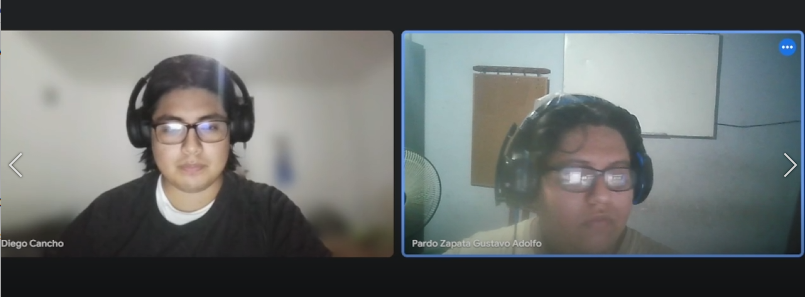
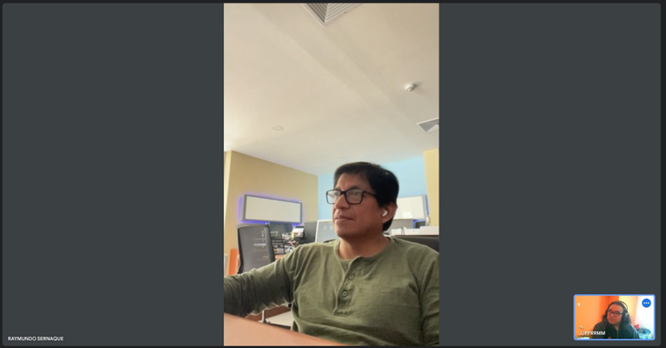
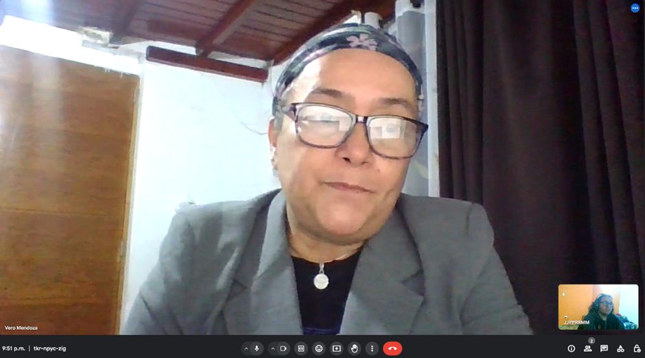
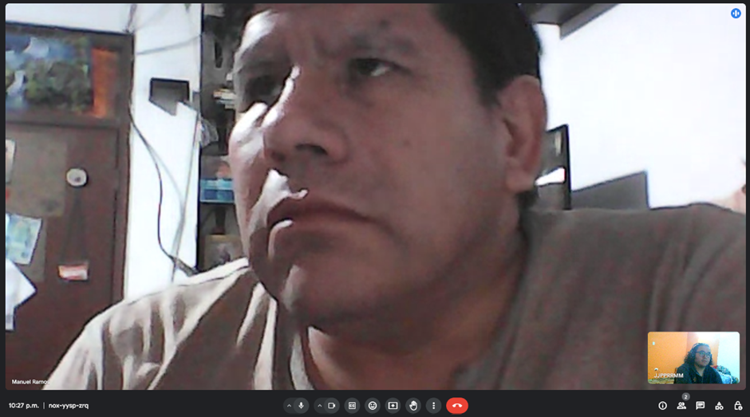
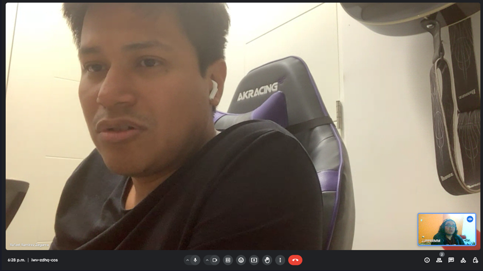
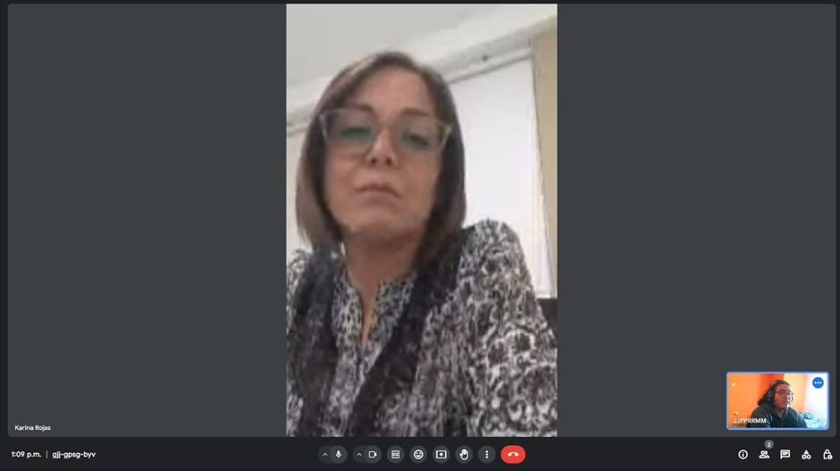
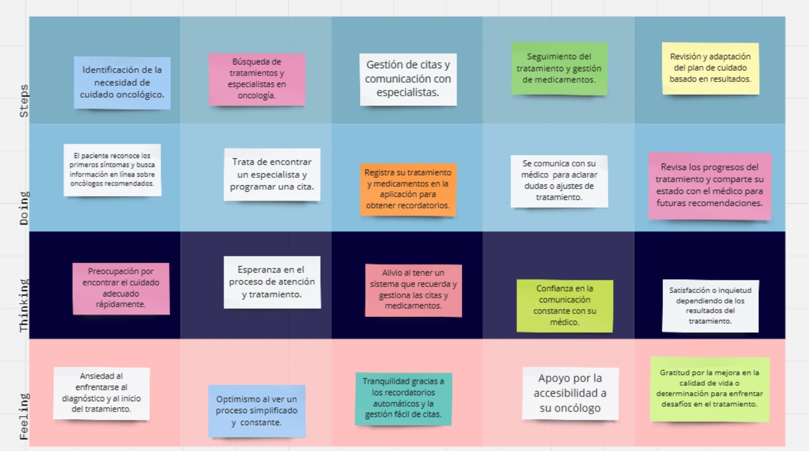
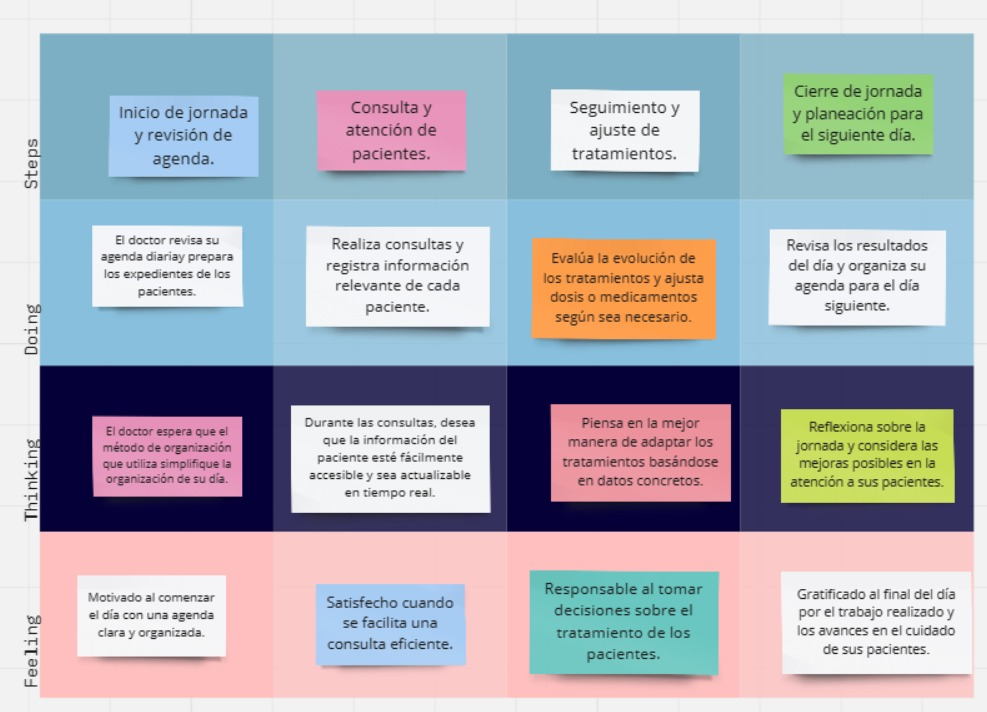

<li><h1><a href="./content/chapter-2/1-competidores.md">Capítulo II: Requirements Elicitation & Analysis</a></h1></il>
<li><h3><a href="./content/chapter-2/1-competidores.md">2.1. Competidores</a></h3></li>

   <ul>
      <il><h3><a href="./content/chapter-2/1-competidores.md">2.1.1. Análisis competitivo</a></h3></il>
<table>
  <tr>
    <th colspan="6" valign="top"><b>Análisis Competitivo</b></th>
  </tr>
  <tr>
    <td colspan="1" rowspan="2" valign="top">¿Por qué llevar a cabo este Análisis?</td>
    <td colspan="5" valign="top">Este análisis nos ayudará a comprender mejor a nuestra competencia para así ver las debilidades y fortalezas de nuestra aplicación web. Esto nos permitirá desarrollar diversas estrategias para mejorar nuestro producto.</td>
  </tr>
  <tr></tr>
  <tr>
    <td colspan="2" valign="top"></td>
    <td colspan="1" valign="top">
OncorApp

</td>
    <td colspan="1" valign="top">
Outcome4Me
 

</td>
    <td colspan="1" valign="top">
My Cancer Coach

</td>
    <td colspan="1" valign="top">
Oncontigo
</td>
  </tr>
  <tr>
    <td colspan="1" rowspan="2" valign="top">

Perfil
</td>
    <td colspan="1" valign="top">Overview</td>
    <td colspan="1" valign="top">Aplicación móvil que ofrece información y consejos de cuidado emocional, nutricional y físico para pacientes que padecen cáncer.</td>
    <td colspan="1" valign="top">Aplicación que brinda apoyo personalizado a pacientes con cáncer.</td>
    <td colspan="1" valign="top">Aplicación que permite a los médicos monitorear sus pacientes mediante encuestas diarias.</td>
    <td colspan="1" valign="top">Aplicativo de ayuda y organización para
   pacientes oncológicos y médicos oncólogos.</td>
  </tr>
  <tr>
    <td colspan="1" valign="top">¿Qué valor ofrece a los clientes?</td>
    <td colspan="1" valign="top">
Brinda consejos y ejercicios para la salud física como mental para los pacientes que aún están en tratamiento.

</td>
    <td colspan="1" valign="top">
Ofrece un seguimiento de la salud del paciente y recomienda clínicas para realizar los tratamientos y exámenes adecuados.
</td>
    <td colspan="1" valign="top">
Ofrece herramientas y recursos para que los monitoreen su salud de forma continua.
</td>
    <td colspan="1" valign="top">
Ofrece diversos servicios que ayudan tanto a los pacientes y médicos como: Calendarios, asignación de medicamentos
</td>
  </tr>
  <tr>
    <td colspan="1" rowspan="2" valign="top">

Perfil de Marketing
</td>
    <td colspan="1" valign="top">Mercado objetivo</td>
    <td colspan="1" valign="top">
- Personas que empiezan o aún están en tratamiento.
</td>
    <td colspan="1" valign="top">
- Personas que buscan tratamiento o que ya empezaron a realizar sus exámenes.

</td>
    <td colspan="1" valign="top">
- Pacientes que padecen de cáncer que requieren ayuda a lo largo de su tratamiento.
</td>
    <td colspan="1" valign="top">
- Médicos y pacientes que quieran tener una comunicación directa entre ambos.
</td>
  </tr>
  <tr>
    <td colspan="1" valign="top">Estrategias de marketing</td>
    <td colspan="1" valign="top">
Promoción en su sitio web
</td>
    <td colspan="1" valign="top">
Realizan Webinars y videos para promocionar su app en su sitio web
</td>
    <td colspan="1" valign="top">
Incluyen una prueba gratis de la aplicación para que los usuarios después cambien de plan.
</td>
    <td colspan="1" valign="top">Los servicios que brinda son: Calendario, creación de citas, recetar medicamentes,  registrar tratamientos y chat directo entre médico y paciente.</td>
  </tr>
  <tr>
    <td colspan="1" rowspan="3" valign="top">

Perfil de Producto
</td>
    <td colspan="1" valign="top">Productos & Servicios</td>
    <td colspan="1" valign="top">
- Brinda consejos sobre la nutrición para los pacientes. Puedes obtener informacion importante sobre los tratamientos

- Recomienda ejercicios para la salud mental y fisica.
</td>
    <td colspan="1" valign="top">
- Ayuda a monitorear al paciente y brinda información útil sobre el tipo de cáncer que padezca

- Brinda las ubicaciones de clínicas recomendadas en base al tipo de tratamiento requerido.
</td>
    <td colspan="1" valign="top">
- Monitoreo continuo mediante preguntas personalizadas

- Consejos y recursos acerca de nutrición, ejercicio y manejo del estrés.

</td>
    <td colspan="1" valign="top">
Los servicios que brinda son: Calendario, creación de citas, recetar medicamentes,  registrar tratamientos y chat directo entre médico y paciente.
</td>
  </tr>
  <tr>
    <td colspan="1" valign="top">Precios y costos</td>
    <td colspan="1" valign="top">Es totalmente gratuita.</td>
    <td colspan="1" valign="top">Es de uso gratuito y sin restricciones</td>
    <td colspan="1" valign="top">Cuenta con suscripciones y contenido de paga. También hay una suscripción gratuita.</td>
    <td colspan="1" valign="top">
Nuestra plataforma contará con planes como: Free, Premium y Pro Service.
</td>
  </tr>
  <tr>
    <td colspan="1" valign="top">Canales de distribución </td>
    <td colspan="1" valign="top">Solo aplicación móvil (Google PlayStore y App Store)</td>
    <td colspan="1" valign="top">Solo aplicación móvil (Google Playstore y App Store) y Aplicación Web (Desde su sitio oficial)</td>
    <td colspan="1" valign="top">
Solo aplicación móvil (Google Playstore y App Store)
</td>
    <td colspan="1" valign="top">Landing Page que redirige a la Web Application</td>
  </tr>
  <tr>
    <td colspan="1" rowspan="4" valign="top">

Análisis SWOT
</td>
    <td colspan="1" valign="top">Fortalezas</td>
    <td colspan="1" valign="top">
      
- Ser parte de una asociación cientifica.

      
- Poseer con una variedad de información respaldada científicamente.

    </td>
    <td colspan="1" valign="top">
      
- Cuenta con ayuda de especialistas en el tema.

      
- Posee una gran cantidad de información de las clínicas que recomieda.

      
- Cuenta con los aportes de la comunidad.

    </td>
    <td colspan="1" valign="top">
      
- Posee una gran variedad de herramientas de ayuda.

      
- Gestión de sítomas incluído. Información útil acerca de los tratamientos.

    </td>
    <td colspan="1" valign="top">
      
- Las herramientas que proporciona son muy útiles ya que facilita la comunicación entre médico y paciente

      
- Además cuenta con un calendario interactivo para organizar las citas.

    </td>
  </tr>
  <tr>
    <td colspan="1" valign="top">Debilidades</td>
    <td colspan="1" valign="top">
      
- Carece de interaccion directa con el usuario

      
- Es un producto que no puede mantenerse por si mismo si es gratis.

    </td>
    <td colspan="1" valign="top">
      
- Solo se limitan a atender a unos ciertos tipos de cáncer.

    </td>
    <td colspan="1" valign="top">
      
- Falta un medio para comunicarse con un médico directamente..

    </td>
    <td colspan="1" valign="top">
      
- No tiene la característica de realizar videollamadas de consulta dentro de la plataforma.

      

    </td>
  </tr>
  <tr>
    <td colspan="1" valign="top">Oportunidades</td>
    <td colspan="1" valign="top">
      
- Muy pocas aplicaciones le dan la misma importancia a la salud mental y fisica.

    </td>
    <td colspan="1" valign="top">
      
- Cuentan con inversionistas grandes como instituciones relacionadas al área de la Oncología.

    </td>
    <td colspan="1" valign="top">
      
- Puede ser un buen complemento  necesario en los hospitales debido al buen recibimiento.

    </td>
    <td colspan="1" valign="top">
      
- Hay pocas plataformas que ofrecen herramientas que faciliten la comunicación entre médico-paciente

    </td>
  </tr>
  <tr>
    <td colspan="1" valign="top">Amenazas</td>
    <td colspan="1" valign="top">
      
-Surgimiento de otras aplicaciones multiplataformas (Web).

    </td>
    <td colspan="1" valign="top">
      
- Muchas personas padecen de otros tipos de cáncer que la aplicación no puede atender.

    </td>
    <td colspan="1" valign="top">
      
- Surgimiento de otras aplicaciones multiplataformas (Web).

    </td>
    <td colspan="1" valign="top">
      
- Aplicaciones de mensajería instantanea tradicionales: Whatsapp y Telegram.

      
- Aplicaciones de recordatorio: Google Calendar.

    </td>
  </tr>
</table>
      <il><h3><a href="./content/chapter-2/1-competidores.md">2.1.2. Estrategias y tácticas frente a competidores</a></h3></il>
      
**Estrategias:**

**Desarrollo de una Interfaz de Usuario Intuitiva y Amigable:**  
**Estrategia:** Mejorar la interacción del usuario mediante una interfaz intuitiva y amigable, para contrarrestar la falta de interacción directa con el usuario identificada como una debilidad. 
**Táctica:** Realizar pruebas de usabilidad y obtener retroalimentación de los usuarios para iterar en el diseño de la interfaz y mejorar la experiencia del usuario.

**Modelo de Negocio Sostenible:**  
**Estrategia:** Explorar modelos de negocio que garanticen la sostenibilidad financiera a largo plazo, considerando la limitación de mantener la aplicación gratuita identificada como una debilidad. 
**Táctica:** Investigar la viabilidad de ofrecer servicios premium o suscripciones pagas con funciones adicionales y beneficios exclusivos.

**Tácticas:**

**Mejorar la Comunicación Médico-Paciente:** 
**Estrategia:** Mejorar la comunicación directa entre médicos y pacientes, que actualmente falta en la aplicación, para satisfacer mejor las necesidades de los usuarios. 
**Táctica:** Desarrollar una función de mensajería o chat en tiempo real dentro de la aplicación que permita a los usuarios comunicarse fácilmente con sus médicos para consultas y seguimiento.

**Aprovechar la Escasez de Plataformas de Comunicación Médico-Paciente:** 
**Estrategia:** Capitalizar la oportunidad identificada en la falta de plataformas que faciliten la comunicación entre médicos y pacientes. 
**Táctica:** Promocionar activamente la función de comunicación médico-paciente de la aplicación a través de campañas de marketing dirigidas.

**Invertir en Marketing y Promoción:** 
**Estrategia:** Incrementar las estrategias de marketing y promoción, como webinars y videos, para aumentar la visibilidad y la adopción de la aplicación. 
**Táctica:** Colaborar con médicos en el campo de la oncología para promover la aplicación y organizar eventos de lanzamiento y charlas informativas.
  
   </ul>
<il><h3><a href="./content/chapter-2/2-entrevistas.md">2.2. Entrevistas</a></h3></il>
   <ul>
      <il><h3><a href="./content/chapter-2/2-entrevistas.md">2.2.1. Diseño de entrevistas</a></h3></il>

### PREGUNTAS GENERALES

#### Información Demográfica
<ul>
<li>¿Podría decirme su edad y distrito de residencia?</li>
<li>¿Cuál es su estado civil y composición familiar (número de hijos, personas a cargo, etc.)?</li>
<li>¿A qué se dedica actualmente? (Estudiante, profesión, jubilado, etc.)</li>
</ul>

#### Hábitos y Preferencias Digitales
<ul>
<li>¿Qué dispositivos digitales utiliza con más frecuencia (smartphone, tablet, computadora, etc.)?</li>
<li>¿Cuáles son sus aplicaciones o servicios en línea favoritos y por qué?</li>
<li>¿Cómo prefiere comunicarse digitalmente con profesionales de la salud o servicios médicos (correo electrónico, mensajes de texto, llamadas, videoconferencias)?</li>
</ul>

#### Objetivos y Frustraciones
<ul>
<li>¿Cuáles son sus principales objetivos al buscar una aplicación relacionada con la salud o el cuidado oncológico?</li>
<li>¿Ha experimentado frustraciones o dificultades al usar aplicaciones o servicios en línea de salud? Por favor, descríbalas.</li>
</ul>

#### Experiencia Personal
<ul>
<li>Relacionado con su salud o la gestión del cuidado oncológico, ¿podría compartir alguna experiencia positiva o negativa que haya tenido?</li>
<li>¿Qué características considera indispensables en una aplicación de salud?</li>
</ul>

#### Expectativas y Necesidades Específicas
<ul>
<li>En términos de ayuda y organización para el cuidado oncológico, ¿qué es lo que más valora o necesitaría?</li>
<li>¿Cómo cree que una aplicación podría mejorar su experiencia o la gestión del cuidado oncológico?</li>
</ul>

### PREGUNTAS ESPECÍFICAS PARA MÉDICOS ONCÓLOGOS

#### Gestión de Pacientes
<ul>
<li>¿Cuál es su método actual para organizar la información y los horarios de sus pacientes?</li>
<li>¿Qué desafíos enfrenta al asignar y hacer seguimiento de los medicamentos y procedimientos para sus pacientes?</li>
</ul>

#### Comunicación y Recordatorios
<ul>
<li>¿Cómo se comunica actualmente con sus pacientes para recordatorios o información importante?</li>
<li>¿Qué funcionalidades considera clave en una aplicación para mejorar la comunicación con sus pacientes?</li>
</ul>

#### Herramientas Digitales
<ul>
<li>¿Utiliza actualmente alguna herramienta o software de gestión de pacientes? Si es así, ¿qué le gusta y qué le falta a estas herramientas?</li>
</ul>

### PREGUNTAS ESPECÍFICAS PARA PACIENTES ONCOLÓGICOS Y SUS FAMILIARES

#### Gestión de la Información Médica
<ul>
<li>¿Cómo lleva registro de los medicamentos, citas y procedimientos actualmente?</li>
<li>¿Cuáles son las principales fuentes de información que utiliza para obtener información sobre su cáncer y su tratamiento?</li>
<li>¿Qué recursos y servicios de apoyo le han sido útiles durante el tratamiento y recuperación?</li>
<li>¿Ha tenido dificultades para entender o recordar las indicaciones médicas y los detalles de los medicamentos?</li>
</ul>

#### Comunicación con Profesionales de la Salud
<ul>
<li>¿Qué tan fácil o difícil ha sido para usted comunicarse con su médico oncólogo o encontrar nuevos especialistas cuando lo necesita?</li>
<li>¿Qué características valoraría en una aplicación que le facilite el contacto con profesionales de la salud o servicios de apoyo oncológico?</li>
</ul>

#### Experiencias y Mejoras
<ul>
<li>¿Qué información te hubiera gustado tener cuando usted o su familiar pasó por el proceso de tratamiento oncológico?</li>
<li>¿Qué recomendaciones tiene para mejorar la experiencia de los pacientes con cáncer en el sistema de atención médica?</li>
<li>Basándose en su experiencia, ¿qué aspectos cree que podrían mejorar en la gestión del cuidado oncológico a través de una aplicación?</li>
<li>¿Cómo cree que una aplicación podría ayudarle a sentirse más apoyado y menos abrumado en su proceso de cuidado oncológico?</li>
</ul>
      <il><h3><a href="./content/chapter-2/2-entrevistas.md">2.2.2. Registro de entrevistas</a></h3></il>
      
**Enlace al video: [Registro de entrevistas.mp4](https://upcedupe-my.sharepoint.com/:v:/g/personal/u202120347_upc_edu_pe/EeiGu0IcJhRClMfqP0iZWf0BpbnCvsxxMBspt8jwCPMvrg?e=DT4ljF&nav=eyJyZWZlcnJhbEluZm8iOnsicmVmZXJyYWxBcHAiOiJTdHJlYW1XZWJBcHAiLCJyZWZlcnJhbFZpZXciOiJTaGFyZURpYWxvZy1MaW5rIiwicmVmZXJyYWxBcHBQbGF0Zm9ybSI6IldlYiIsInJlZmVycmFsTW9kZSI6InZpZXcifX0%3D)**  
**Duración total:** 1:15:17

**Entrevistado N°1 :** Diego Cancho Colla  
**Segmento objetivo :** Paciente oncológicos y sus familiares  
  
**Sexo:** Masculino  
**Edad:** 21 años  
**Ubicación en la que vive:** Villa Salvador   
**Acerca de la entrevista:** Estudiante Ing de software de la UPC  
**Estado y Composición familiar:** Soltero y actualmente vive con sus padres, hermanos y su Abuelo  
**Instante en el que inicia:** 0:20  
**Duración:** 14:21   
**Resumen:**  
Se destaca la importancia de la certificación y confianza en los profesionales de la salud, así como la necesidad de respuestas rápidas y actualizadas. El impacto emocional del cáncer en el paciente y su familia resalta la necesidad de apoyo psicológico. Además, se demanda una mayor personalización, incluyendo recordatorios específicos y acceso a información confiable sobre restricciones alimentarias. La simplicidad y facilidad de uso son esenciales, junto con una comunicación efectiva y regular entre pacientes y profesionales de la salud, incluido el reporte de estado de paciente. También se resalta la importancia de la seguridad y confidencialidad de la información médica, garantizando que la aplicación y servicio de salud sean seguros y protejan la privacidad de los usuarios.    

**Entrevistado N°2 :** Diego Cancho Colla  
**Segmento objetivo :** Médico Oncólogo  
  
**Sexo:** Masculino   
**Edad:** 45 años  
**Acerca del entrevistado:** Médico radiólogo, jefe de la división de oncología en Resocentro, jefe de radiología del Hospital Nacional de Neoplásicas   
**Instante en el que inicia:** 14:21   
**Duración:** 8:22  
**Resumen:**  
El doctor explica un énfasis en una aplicación que sea de fácil uso y con información clara y útil sobre los medicamentos, tratamientos, etc. de los pacientes que presente información bibliográfica para demostrar su validez. Para los pacientes, el doctor explicó que una aplicación sobre los procesos de tratamiento oncológico debe tener a los pacientes como precedencia y mayor enfoque, con la información sobre sus medicamentos y la opción de declarar citas rápidamente siendo de gran importancia.  
Con respecto a las herramientas que utiliza actualmente, los programas que brinda Resocentro son de gran ayuda ya que son altamente editables en respecto a la ubicación de la información sobre cada paciente, pero muchas de las ventajas que presenta actualmente solo aparecieron luego de muchas actualizaciones. Además de esto, no presenta formas de comunicarse con los pacientes, los médicos deben buscar el número del paciente en cada informe y luego utilizar herramientas externas para su comunicación, por lo que el doctor muestra interés en que nuestra aplicación permita el contacto directo a los pacientes a través de un solo botón.  

**Entrevistado N°3 :** Verónica Mendoza Ibarra  
**Segmento objetivo :** Pariente de paciente oncológico  
  
**Sexo:** Femenino  
**Edad:** 51 años  
**Acerca de la entrevistada:** Profesora de contabilidad en la UPC  
**Instante en el que inicia:** 22:43   
**Duración:** 10:26   
**Resumen:**  
La entrevistada explica que, a pesar de la falta de problemas para comunicarse con los médicos principales, esto se hacía por métodos externos a una aplicación dedicada a la salud. Además, hubo mucho problema para encontrar especialistas a parte de los médicos tratantes principales. La profesora muestra un gran interés en una aplicación que sirva para controlar y organizar la gran cantidad de información presentada por los tratamientos y medicamentos, los cuales causaron mucho estrés y confusión durante el tratamiento del familiar. La información adicional, como de los efectos secundarios de medicamentos, fue obtenida por páginas web, pero tuvo que buscar páginas de calidad ya que herramientas como Google muestran muchas páginas de baja fidelidad.  
El aplicativo de la clínica donde el paciente fue internado fue de gran ayuda a la hora de recordatorios, pero este no se encontraba disponible durante la mayor parte del tratamiento y no presentaba más funcionalidades además de esta.  
Finalmente, la entrevistada considera que una aplicación que sea rápida y de fácil uso, que permita el contacto directo con médicos y presente información de los tratamientos que el paciente está llevando hubiera sido de gran ayuda y le hubiera permitido evitar grandes momentos de estrés.  

**Entrevistado N°4 :** Manuel Luis Ramos Silva  
**Segmento objetivo :** Pariente de paciente oncológico  
  
**Sexo:** Masculino   
**Edad:** 52 años  
**Acerca de la entrevistada:** Asistente médico en Resocentro  
**Instante en el que inicia:** 33:08   
**Duración:** 17:41  
**Resumen:** El entrevistado menciona un gran interés e importancia sobre la comunicación directa con los médicos, explicando que la falta de esta usualmente se daba por la falta de conocimiento sobre la disponibilidad de los doctores. Además, el entrevistado repitió varias veces lo valioso que es la información durante el tratamiento del paciente, como el estado en el que se encuentra, la información sobre efectos negativos de los medicamentos y cómo impactan al paciente, los estados de disponibilidad de los médicos explicado anteriormente y las fechas aproximadas de duración de las etapas del tratamiento.  
El entrevistado menciona la gran falta de aplicaciones centradas en el tratamiento oncológico como uno de los mayores problemas, ya que el aplicativo de la clínica solo tenía funcionalidades básicas y fallaba varias veces al inicio del tratamiento. La aplicación de la clínica tampoco mostraba el estado de los medicamentos presentes dentro de la clínica, por lo que ocurrían mayores problemas al no conocer si es que se debería buscar lugares externos para conseguir los medicamentos requeridos.  
El entrevistado explica que el estrés generado por la falta de conocimiento podría haber sido eliminado si es que se tuviera acceso directo a la información real del estado del pariente, ya que él solo podía buscar información por internet que no mostraba el estado real del pariente mientras no podría darle compañía debido a la pandemia.  

**Entrevistado N°5 :** Rafael Ramirez  
**Segmento objetivo :** Médico Oncólogo  
  
**Sexo:** Masculino   
**Edad:** 34 años   
**Acerca de la entrevistada:** Médico Radiólogo en Oncosalud   
**Instante en el que inicia:** 50:57   
**Duración:** 14:48   
**Resumen:** Una de las funcionalidades principales que el doctor menciona que una aplicación de salud que funcione entre los pacientes y médicos es que debería ser similar a una red social en el sentido que varios médicos puedan comunicarse entre sí sobre la información de un paciente, que los pacientes puedan reservar tiempos específicos para llamadas o videollamadas con los médicos y que puedan revisar los tiempos en los que los médicos estén utilizando el aplicativo. Además, el doctor resalta la importancia de que los pacientes puedan registrar información propia de los medicamentos y tratamientos que han recibido, como reacciones adversas a ciertos medicamentos para mostrarle a los médicos o incluso una línea de tiempo de los tratamientos recibidos por el paciente para que los médicos tratantes se encuentren actualizados.  
El doctor menciona que las herramientas actuales que utiliza son de las clínicas en sí, pero toda comunicación con los pacientes es o con herramientas externas como llamadas telefónicas o a través de correos, con los pacientes requiriendo enviar correos a la cuenta de la empresa en sí para que luego sea enviado a los médicos.  
Finalmente, el doctor vuelve a resaltar la importancia de que los datos como tratamientos anteriores y futuros que el paciente haya tenido y tendrá debería ser de fácil acceso para los médicos.  

**Entrevistado N°6 :** Karina Rojas  
**Segmento objetivo :** Médico Oncólogo  
  
**Edad:** 52 años   
**Acerca de la entrevistada:** Médica oncóloga especializada en hematología   
**Instante en el que inicia:** 1:05:40   
**Duración:** 9:37   
**Resumen:** La doctora muestra un gran interés en que los pacientes oncológicos obtuvieran alertas y recordatorios de sus tratamientos y citas y en mejorar la facilidad en la que ellos pueden ingresar a dichas citas y tratamientos, usando como ejemplo que un médico simplemente encargue un análisis de sangre al paciente y que dicho paciente pueda obtener el análisis simplemente mostrando la cita del doctor. La doctora menciona que los pacientes oncológicos no presentan mucho apoyo actualmente, con la aplicación que utiliza al momento presentando una falta de opciones especiales en los pagos y citas para pacientes oncológicos.  
La doctora también menciona que, actualmente, su única forma de tomar notas para todos los pacientes a quienes trata es con un cuaderno y con su asistente, quien se encarga de realizar llamadas como recordatorios y con quien comparte el cuaderno, causando mucho estrés por su parte al no conocer exactamente si es que los pacientes han recibido sus recordatorios o, incluso, si es que ambas tienen la misma información anotada, por lo que considera que una aplicación enfocada a la organización de los médicos oncólogos con comunicaciones directas a los pacientes ayudaría bastante en su trabajo.  
Finalmente, menciona la importancia en que los pacientes puedan ver un cronograma de las fechas mostradas por los médicos, además de permitirle a los doctores un poco de privacidad, al realizar la comunicación entre ellos con los pacientes a través de la aplicación, ya que actualmente, usando los números personales, la comunicación convierte “el teléfono personal a uno no personal” al ser usado para contactar a todos los pacientes.  
      <il><h3><a href="./content/chapter-2/2-entrevistas.md">2.2.3. Análisis de entrevistas</a></h3></il>
Gracias a las entrevistas realizadas, se pueden identificar los siguientes puntos:  

- De forma técnica, un uso fácil y rápido de la aplicación es de vital importancia, con énfasis en la facilidad de identificar las opciones de la aplicación. Además, podemos apreciar que los entrevistados piden una buena y sencilla comunicación entre los médicos tratantes y los pacientes, sin interrumpir la privacidad de ambos grupos.
- La calidad de la información es mencionada varias veces por los entrevistados, con referencias bibliográficas sobre la información de las medicinas y tratamientos siendo un beneficio que una aplicación como la nuestra debería presentar. La información también debería ser bastante clara en la forma que es presentada, con las notas de los medicamentos y tratamientos y otras notas escritas por los médicos en sí presentando la información de una forma directa.
- Los entrevistados del grupo de pacientes y parientes de pacientes mostraron gran énfasis en que, si una aplicación como OnContigo hubiera existido mientras ocurría el tratamiento oncológico completo, su estrés hubiera sido mínimo, principalmente por la información encontrada en la aplicación y sus herramientas organizativas.
- Los médicos entrevistados, por otra parte, creen que una buena comunicación directa y una organización entre tantos pacientes reduciría en gran parte su estrés y les permitiría una mejor experiencia en el cuidado de tantos pacientes a la vez.
- Los médicos entrevistados también mostraron un enfoque en la organización de tratamientos y medicamentos recibidos anteriormente por sus pacientes para evitar problemas futuros, como las reacciones alérgicas.
   </ul>
<il><h3><a href="./content/chapter-2/3-user-persona.md">2.3. Needfinding</a></h3></il>
   <ul>
      <il><h3><a href="./content/chapter-2/3-user-persona.md">2.3.1. User Personas</a></h3></il>
      <il><h3><a href="./content/chapter-2/4-user-task-matrix.md">2.3.2. User Task Matrix</a></h3></il>
      <table>
  <tr>
    <th>Tareas</th>
    <th>Paciente: Frecuencia</th>
    <th>Paciente: Importancia</th>
    <th>Doctor: Frecuencia</th>
    <th>Doctor: Importancia</th>
  </tr>
  <tr>
    <td>Buscar información sobre el cáncer</td>
    <td>Alta</td>
    <td>Alta</td>
    <td>Media</td>
    <td>Alta</td>
  </tr>
  <tr>
    <td>Gestionar citas médicas</td>
    <td>Alta</td>
    <td>Alta</td>
    <td>Alta</td>
    <td>Alta</td>
  </tr>
  <tr>
    <td>Comunicarse con especialistas</td>
    <td>Alta</td>
    <td>Alta</td>
    <td>Alta</td>
    <td>Alta</td>
  </tr>
  <tr>
    <td>Registrar y monitorear medicamentos</td>
    <td>Alta</td>
    <td>Alta</td>
    <td>Alta</td>
    <td>Alta</td>
  </tr>
   <tr>
    <td>Seguimiento del progreso del paciente	</td>
    <td>Media</td>
    <td>Alta</td>
    <td>Alta</td>
    <td>Alta</td>
  </tr>
   <tr>
    <td>Coordinar con otros especialistas	</td>
    <td>Baja</td>
    <td>Media</td>
    <td>Alta</td>
    <td>Alta</td>
  </tr>
   <tr>
    <td>Gestionar pagos y citas especiales</td>
    <td>Media</td>
    <td>Media</td>
    <td>Media</td>
    <td>Media</td>
  </tr>
   <tr>
    <td>Buscar apoyo psicológico	</td>
    <td>Media</td>
    <td>Alta</td>
    <td>Baja</td>
    <td>Alta</td>
  </tr>
   <tr>
    <td>Revisar tratamientos anteriores	</td>
    <td>Baja</td>
    <td>Alta</td>
    <td>Alta</td>
    <td>Alta</td>
  </tr>
   <tr>
    <td>Acceder a recordatorios de tratamientos	</td>
    <td>Alta</td>
    <td>Alta</td>
    <td>Alta</td>
    <td>Alta</td>
  </tr>
  <!-- Agrega más filas según sea necesario -->
</table>
      <il><h3><a href="./content/chapter-2/5-user-journey-mapping.md">2.3.3. User Journey Mapping</a></h3></il>
      <il><h3><a href="./content/chapter-2/6-empathy-mapping.md">2.3.4. Empathy Mapping</a></h3></il>
      <il><h3><a href="./content/chapter-2/7-as-is.md">2.3.5. As-is Scenario Mapping</a></h3></il>

**Segmento:Pacientes**
  

 **Segmento:Doctor Oncologo**
   
   </ul>

<il><h3><a href="./content/chapter-2/3-user-persona.md">2.4. Ubiquitous Language</a></h3></il>

Esta es la parte donde se explicará el Ubiquitous Language. Este término hace referencia a un lenguaje común entre los desarrolladores y el dominio. En esta ocasión se va presentar un glosario con conceptos y términos comunes que se emplean en el ámbito de la oncología.

1. **Tumor:** Una masa anormal de tejido que puede ser benigna o maligna.

2. **Cáncer:** Un término general para enfermedades caracterizadas por el crecimiento descontrolado de células anormales que pueden invadir tejidos y propagarse a otras partes del cuerpo.

3. **Metástasis:** La propagación del cáncer desde su sitio original a otro órgano del cuerpo.

4. **Quimioterapia:** un tratamiento que utiliza medicamentos para destruir células cancerosas mediante el uso de fármacos.

5. **Radioterapia:** Tratamiento que usa altas dosis de radiación para destruir células cancerosas. 

6. **Oncólogo:** Médico especializado en el diagnóstico y tratamiento del cáncer.

7. **Biopsia:** Extracción de tejido para realizar exámenes bajo un microscopio con el fin de diagnósticar el cáncer.

8. **Cuidados paliativos:** Atención médica que se centra en proporcionar alivio del dolor y otros síntomas de una enfermedad grave, como el cáncer.
