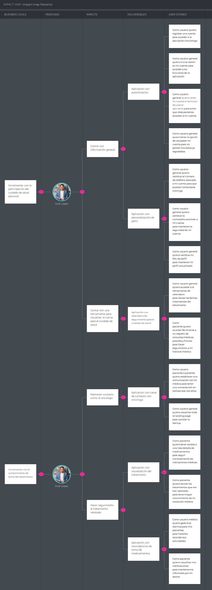
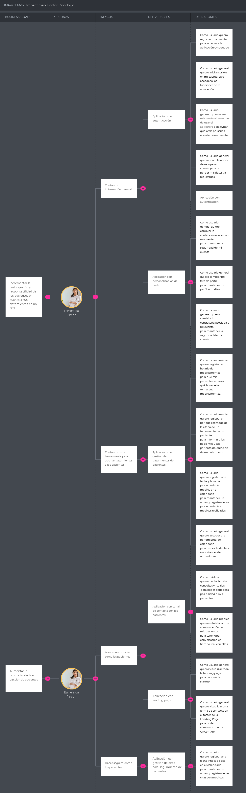

<il><h1><a href="./content/chapter-3/chapter-3.md">Capítulo III: Requirements Specification</a></h1></il>
<il><h3><a href="./content/chapter-3/chapter-3.md">3.1. To-Be Scenario Mapping</a></h3></il>

**Segmento:Paciente**

**Segmento:Doctor Oncólogo**

<il><h3><a href="./content/chapter-3/chapter-3.md">3.2. User Stories</a></h3></il>
<ul style="list-style-type: none;"><il><h3><a href="./content/chapter-3/chapter-3.md">3.3. Impact Mapping</a></h3></il>
En esta sección, se ha llevado a cabo la creación del impact mapping, partiendo de las metas comerciales establecidas para cada user persona. Se han identificado los impactos deseados, los entregables necesarios y se han relacionado con las historias de usuario correspondientes.

Segmento objetivo: Pacientes y familiares

Link de UXPressia: https://uxpressia.com/w/mDdvz/i/qzusH

Segmento objetivo: Oncólogos

Link de UXPressia: https://uxpressia.com/w/mDdvz/i/f0s3H

</ul>
<il><h3><a href="./content/chapter-3/chapter-3.md">3.4. Product Backlog</a></h3></il>