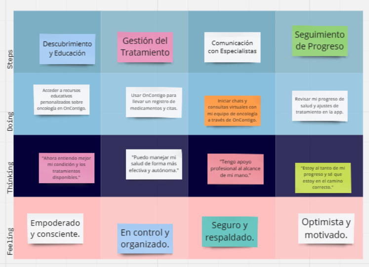
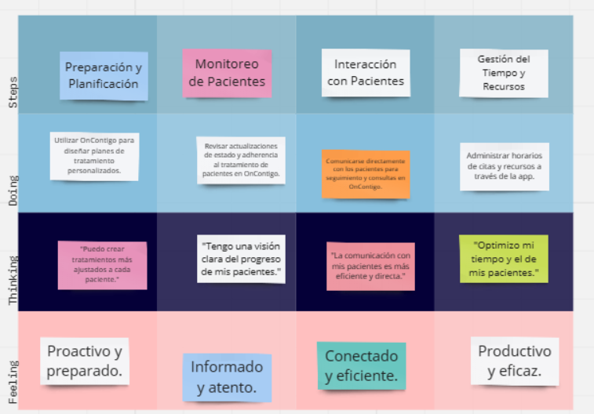

<il><h1><a href="./content/chapter-3/chapter-3.md">Capítulo III: Requirements Specification</a></h1></il>
<il><h3><a href="./content/chapter-3/chapter-3.md">3.1. To-Be Scenario Mapping</a></h3></il>

**Segmento:Paciente**

**Segmento:Doctor Oncólogo**

<il><h3><a href="./content/chapter-3/chapter-3.md">3.2. User Stories</a></h3></il>
<table>
  <tr>
    <th>Epic/StoryID</th>
    <th>Título</th>
    <th>Descripción</th>
    <th>Criterios de aceptación</th>
    <th>Epic ID</th>
  </tr>
  <tr>
    <td>EP01</td>
    <td>Gestión de cuenta de usuarios</td>
    <td>Como usuario general Quiero acceder con mi cuenta Para ingresar a la plataforma</td>
    <td></td>
    <td>EP01</td>
  </tr>
  <tr>
    <td>EP02</td>
    <td>Gestión de perfil</td>
    <td>Como usuario general Quiero realizar cambios en mi perfil Para actualizar mis datos personales</td>
    <td></td>
    <td>EP02</td>
  </tr>
   <tr>
    <td>EP03</td>
    <td>Herramientas organizativas</td>
    <td>Como usuario general
Quiero acceder a las herramientas organizativas de OnContigo
Para mantener un orden con los tratamientos y medicamentos.</td>
    <td></td>
    <td>EP03</td>
  </tr>
   <tr>
    <td>EP04</td>
    <td>Contacto para usuarios mediante la Landing Page
</td>
    <td>Como usuario general
Quiero que la Landing Page me muestra una forma de contacto
Para poder contactar con OnContigo

</td>
    <td></td>
    <td>EP04</td>
  </tr>
   <tr>
    <td>EP05</td>
    <td>Contacto entre médico y paciente mediante la Web Application
</td>
    <td>Como usuario general
Quiero formas de comunicarme con mi paciente o médico
Para poder establecer una buena comunicación</td>
    <td></td>
    <td>EP05</td>
  </tr>
    <tr>
    <td>EP06</td>
    <td>Consultas virtuales
</td>
    <td>Como usuario general
Quiero realizar consultas virtuales con mis pacientes
Para poder darles esa facilidad.</td>
    <td></td>
    <td>EP06</td>
  </tr>  <tr>
    <td>EP07</td>
    <td>Gestión de información médica para pacientes</td>
    <td>Como paciente
Quiero tener acceso a con mayor detalle mi información médica
Para estar informado

</td>
    <td></td>
    <td>EP07</td>
  </tr>
    <tr>
    <td>EP08</td>
    <td>Visualizacion de la Landing Page</td>
    <td>Como paciente
Quiero visualizar la landing page
Para tener una primera impresion de la aplicacion</td>
    <td></td>
    <td>EP08</td>
  </tr>
  <tr>
    <td>US01</td>
    <td>Registrar cuenta</td>
    <td>Como usuario general Quiero registrar una cuenta Para acceder a la aplicación OnContigo</td>
    <td>
      E01: Ingreso correcto de datos Dado que el usuario se encuentra en el formulario de registro Cuando ingresa su nombre, apellidos, correo, edad, número de celular y contraseña correctamente Entonces se registra su nueva cuenta  
      E02: Ingreso incorrecto de datos Dado que el usuario se encuentra en el formulario de registro Cuando ingresa su nombre, apellidos, correo, edad, número de celular y contraseña incorrectamente Entonces el sistema rechazará la solicitud de registro y pedirá completar los datos correctamente.
    </td>
    <td>EP01</td>
  </tr>
  <tr>
    <td>US02</td>
    <td>Iniciar sesión</td>
    <td>Como usuario general Quiero iniciar sesión en mi cuenta Para acceder a las funciones de la aplicación</td>
    <td>
      E01: Inicio de sesión satisfactorio Dado que el usuario se encuentra en el inicio de sesión. Cuando ingrese sus credenciales correctas. Entonces inicia sesión en su cuenta.  
      E02: Inicio de sesión sin registrar Dado que el usuario se encuentra en el inicio de sesión. Cuando ingrese las credenciales incorrectas. Entonces le aparece un mensaje indicando que la cuenta no existe.
    </td>
    <td>EP01</td>
  </tr>
  <tr>
    <td>US03</td>
    <td>Cierre de sesión</td>
    <td>Como usuario general Quiero cerrar mi cuenta al terminar de usar el aplicativo Para evitar que otras personas accedan a mi cuenta</td>
    <td>
      E01: Cerrar sesión Dado que el usuario está dentro de la aplicación. Y selecciona el menú de la barra de navegación. Cuando presione la opción “Sign out”. Y confirme la acción. Entonces será dirigido a la landing page.
    </td>
    <td>EP01</td>
  </tr>
  <tr>
    <td>US04</td>
    <td>Recuperación de cuenta</td>
    <td>Como usuario general Quiero tener la opción de recuperar mi cuenta Para no perder mis datos ya registrados</td>
    <td>
      E01: Envío de mensaje a correo Dado que el usuario no pueda acceder a su cuenta Cuando elige la opción “Recuperar cuenta” y la opción “Por email” Entonces el sistema envía un mensaje con una opción de recuperación al correo electrónico asociado a la cuenta  
      E02: Envío de mensaje de texto Dado que el usuario no pueda acceder a su cuenta Cuando elige la opción “Recuperar cuenta” y la opción “Por mensaje de texto” Entonces el sistema envía un mensaje con una opción de recuperación al número asociado a la cuenta
    </td>
    <td>EP01</td>
  </tr>
  <tr>
    <td>US05</td>
    <td>Cambio de número telefónico</td>
    <td>Como usuario general Quiero cambiar el número de teléfono asociado a mi cuenta Para que puedan contactarse conmigo</td>
    <td>
      E01: Ingreso correcto de datos Dado que el usuario se encuentra en su perfil de usuario Cuando presiona la opción de modificar número telefónico e ingresa un número correcto Entonces se cambió el número de usuario  
      E02: Ingreso incorrecto de datos Dado que el usuario se encuentra en su perfil de usuario Cuando presiona la opción de modificar número telefónico e ingresa caracteres no permitidos o inexistente Entonces sale un mensaje que advierta que se ingresó un número incorrecto.
    </td>
    <td>EP02</td>
  </tr>
  <tr>
    <td>US06</td>
    <td>Cambio de contraseña</td>
    <td>Como usuario general Quiero cambiar la contraseña asociada a mi cuenta Para mantener la seguridad de mi cuenta</td>
    <td>
      E01: Cambio de contraseña exitoso Dado que el usuario se encuentra en su perfil de usuario Cuando presiona la opción de modificar la contraseña Y escribe una nueva contraseña y la confirma Entonces la contraseña se actualiza con éxito  
      E02: Cambio de contraseña erróneo Dado que el usuario se encuentra en su perfil de usuario Cuando presiona la opción de modificar la contraseña Y escribe una nueva contraseña, pero no cumple con los parámetros de seguridad Entonces la contraseña no se actualiza
    </td>
    <td>EP02</td>
  </tr>
  <tr>
    <td>US07</td>
    <td>Actualizar foto de perfil</td>
    <td>Como usuario general Quiero cambiar mi foto de perfil Para mantener mi perfil actualizado</td>
    <td>
      E01: Actualizar foto de perfil Dado que el usuario se encuentra en su perfil de usuario. Cuando presiona su perfil. Y presiona la opción “Actualizar foto de perfil”. Y elige una foto de su galería de fotos con el formato correcto. Entonces su foto de perfil se actualizará con éxito.  
      E02: Actualización de foto de perfil incorrecta Dado que el usuario se encuentra en su perfil de usuario. Cuando presiona en su perfil de usuario. Y presiona la opción “Actualizar foto de perfil” Y elige una foto de perfil con el formato incorrecto. Entonces le aparece el mensaje que le indica que la foto de perfil tiene el formato incorrecto.
    </td>
    <td>EP02</td>
  </tr>
  <tr>
    <td>US08</td>
    <td>Acceso al calendario</td>
    <td>Como usuario general Quiero acceder a la herramienta de calendario Para revisar las fechas importantes del tratamiento</td>
    <td>
      E01: Acceder al calendario como médico Dado que el médico se encuentra en la pantalla principal de la aplicación. Cuando acceda a la opción de “Calendario”. Entonces podrá visualizar el calendario con las fechas importantes de los tratamientos de sus pacientes.  
      E02: Acceder al calendario como paciente/pariente Dado que el paciente se encuentra en la pantalla principal de la aplicación. Cuando acceda a la opción “calendario” Entonces podrá visualizar el calendario con las fechas importantes de su tratamiento.
    </td>
    <td>EP03</td>
  </tr>
  <tr>
    <td>US09</td>
    <td>Registrar fecha de cita</td>
    <td>Como usuario Quiero registrar una fecha y hora de cita en el calendario Para mantener un orden y registro de las citas con médicos</td>
    <td>
      E01: Registrar cita de un paciente como médico Dado que el médico se encuentra en el calendario Cuando selecciona un recuadro del calendario Entonces podrá registrar una fecha y hora de cita en el calendario.
    </td>
    <td>EP03</td>
</tr>
<tr>
    <td>US10</td>
    <td>Registrar fecha de procedimiento</td>
    <td>Como usuario Quiero registrar una fecha y hora de procedimiento médico en el calendario Para mantener un orden y registro de los procedimientos médicos realizados</td>
    <td>
      E01: Registrar fecha de procedimiento de un paciente como médico Dado que el médico se encuentra en la lista de pacientes. Cuando selecciona un paciente. Entonces podrá registrar una fecha y hora de los procedimientos que se realizaron en el paciente.
    </td>
    <td>EP03</td>
</tr>
<tr>
    <td>US11</td>
    <td>Registrar periodo de tratamiento</td>
    <td>Como usuario médico Quiero registrar el periodo estimado de la etapa de un tratamiento de un paciente Para informar a los pacientes y sus parientes la duración de un tratamiento</td>
    <td>
      E01: Registrar fecha de inicio de un periodo de tratamiento Dado que el médico se encuentra en la lista de pacientes. Cuando selecciona un paciente Entonces podrá registrar la fecha de inicio de un tratamiento.  
      E02: Registrar fecha de finalización de un periodo de tratamiento Dado que el médico se encuentra en la lista de pacientes. Cuando selecciona un paciente. Entonces podrá registrar la fecha de finalización de un tratamiento.
    </td>
    <td>EP03</td>
</tr>
<tr>
    <td>US12</td>
    <td>Registrar horario de medicamentos</td>
    <td>Como usuario médico. Quiero registrar el horario de medicamentos. Para que mis pacientes sepan a qué hora deben tomar sus medicamentos.</td>
    <td>
      E01: Registrar horario de medicamentos Dado que el médico se encuentra en la lista Cuando selecciona un paciente. Entonces podrá registrar el horario de medicamentos correspondientes al paciente.
    </td>
    <td>EP03</td>
</tr>
<tr>
    <td>US13</td>
    <td>Contactar con OnContigo</td>
    <td>Como usuario general Quiero visualizar una forma de contacto en el footer de la Landing Page. Para poder comunicarme con OnContigo.</td>
    <td>
      E01: Visualizar formas de contacto Dado que el usuario se encuentra visualizando la Landing Page. Cuando se dirija al footer de la página. Entonces podrá visualizar las formas de contacto de OnContigo.
    </td>
    <td>EP04</td>
</tr>
<tr>
    <td>US14</td>
    <td>Alarmas para pacientes</td>
    <td>Como usuario médico Quiero gestionar alarmas para mis pacientes Para hacerles recordar sus actividades</td>
    <td>
      E01: Programando alarma para paciente Dado que el médico se encuentra en la pestaña de paciente Cuando seleccione “Establecer alarma” Entonces la alarma para su paciente estará establecida  
      E02: Desprogramar alarma para paciente Dado que el médico se encuentra en la pestaña de paciente Cuando seleccione la “Alarma establecida” Y desactive la alarma Entonces la alarma quedará desactivada
    </td>
    <td>EP05</td>
</tr>
<tr>
    <td>US15</td>
    <td>Aviso de notificación</td>
    <td>Como paciente Quiero visualizar mis notificaciones Para mantenerme informado por mi doctor.</td>
    <td>
      E01: Visualizar notificaciones Dado que el paciente se encuentra en el menú de inicio Cuando seleccione el icono de la alarma Entonces se le mostrará las notificaciones.
    </td>
    <td>EP05</td>
</tr>
<tr>
    <td>US16</td>
    <td>Chat con pacientes</td>
    <td>Como usuario médico Quiero establecer una comunicación con mis pacientes Para tener una conversación en tiempo real con ellos</td>
    <td>
      E01: Abrir chat con el paciente Dado que el médico se encuentra en la pestaña de paciente Cuando seleccione “Chat” Entonces comenzará una conversación con su paciente  
    </td>
    <td>EP05</td>
</tr>
<tr>
    <td>US17</td>
    <td>Chat con médicos</td>
    <td>Como usuario paciente o pariente Quiero establecer una comunicación con mi médico Para tener una conversación en tiempo real con ellos</td>
    <td>
      E01: Abrir chat con el médico Dado que el paciente se encuentra en la pestaña de “Mi doctor” Cuando seleccione “Chat” Entonces comenzará una conversación con su médico 
    </td>
    <td>EP05</td>
</tr>
<tr>
    <td>US18</td>
    <td>Sesión virtual</td>
    <td>Como médico Quiero poder brindar consultas virtuales Para poder darles esa posibilidad a mis pacientes.</td>
    <td>
      E01: Agendar una sesión virtual. Dado que el médico se encuentra en el apartado de nueva cita Cuando seleccione la opción “virtual” Entonces se le abrirá la opción de colocar un link a la sala virtual que proporcione.
    </td>
    <td>EP06</td>
</tr>
<tr>
    <td>US19</td>
    <td>Revisar consultas</td>
    <td>Como paciente Quiero acceder fácilmente a un registro de consultas médicas pasadas y futuras Para hacer seguimiento a mi historial médico.</td>
    <td>
      E01: Acceso al historial de consultas Dado que el paciente se encuentra en la pantalla principal. Cuando se dirige a la sección “Historial médico”. Entonces podrá ver una lista completa de todas sus consultas médicas que incluyen las pasadas y futuras, con los médicos correspondientes.
    </td>
    <td>EP07</td>
</tr>
<tr>
    <td>US20</td>
    <td>Ver lista de medicamentos</td>
    <td>Como paciente Quiero tener acceso a una lista detallada de medicamentos Para seguir correctamente las indicaciones médicas.</td>
    <td>
      E01: Verificación de detalles de la receta Dado que el paciente se encuentra en la pantalla principal de la aplicación. Cuando se dirige a la sección de “Medicamentos recetados”. Entonces podrá revisar los detalles de los medicamentos, incluyendo nombre, dosis y frecuencia de administración.
    </td>
    <td>EP07</td>
</tr>
<tr>
    <td>US21</td>
    <td>Revisar tratamientos</td>
    <td>Como paciente Quiero revisar los tratamientos que me han realizado Para tener mayor conocimiento de mi condición médica.</td>
    <td>
      E01: Revisión de detalles del tratamiento Dado que el paciente se encuentra en la pantalla principal de la aplicación. Cuando acceda a sección “Tratamientos” Entonces podrá revisar todos los detalles del tratamiento.
    </td>
    <td>EP07</td>
</tr>
<tr>
    <td>US22</td>
    <td>Visualizar landing page</td>
    <td>Como usuario general Quiero visualizar toda la landing page Para conocer la startup</td>
    <td>
      E01: Landing page vista Dado que el paciente abre un navegador de búsqueda Cuando busque la empresa de OnContigo Entonces aparecerá en los resultados la Landing Page de OnContigo Y podrá ver la página
    </td>
    <td>EP08</td>
</tr>
</table>
  <!-- Repite las filas similares para cada historia de usuario restante -->
</table>

<il><h3><a href="./content/chapter-3/chapter-3.md">3.3. Impact Mapping</a></h3></il>
<il><h3><a href="./content/chapter-3/chapter-3.md">3.4. Product Backlog</a></h3></il>
Link del trello:  https://trello.com/invite/b/gx5i8rKM/ATTI09d174300e2bf371f3e5625280ecdb95A762E269/product-backlog-oncontigo 

<table border="1">
    <tr>
        <th>#Orden</th>
        <th>User Story Id</th>
        <th>Título</th>
        <th>Description</th>
        <th>Story Points (1/2/3/5/8)</th>
    </tr>
    <tr>
        <td>1</td>
        <td>EP03-US08</td>
        <td>Acceso al calendario</td>
        <td>Como usuario general Quiero acceder a la herramienta de calendario Para revisar las fechas importantes del tratamiento</td>
        <td>5</td>
    </tr>
    <tr>
        <td>2</td>
        <td>EP03-US09</td>
        <td>Registrar fecha de cita</td>
        <td>Como usuario Quiero registrar una fecha y hora de cita en el calendario Para mantener un orden y registro de las citas con médicos</td>
        <td>3</td>
    </tr>
    <tr>
        <td>3</td>
        <td>EP03-US10</td>
        <td>Registrar fecha de procedimiento</td>
        <td>Como usuario Quiero registrar una fecha y hora de procedimiento médico en el calendario Para mantener un orden y registro de los procedimientos médicos realizados</td>
        <td>3</td>
    </tr>
    <tr>
        <td>4</td>
        <td>EP03-US11</td>
        <td>Registrar periodo de tratamiento</td>
        <td>Como usuario médico Quiero registrar el periodo estimado de la etapa de un tratamiento de un paciente Para informar a los pacientes y sus parientes la duración de un tratamiento</td>
        <td>3</td>
    </tr>
    <tr>
        <td>5</td>
        <td>EP03-US12</td>
        <td>Registrar horario de medicamentos</td>
        <td>Como usuario médico. Quiero registrar el horario de medicamentos. Para que mis pacientes sepan a qué hora deben tomar sus medicamentos.</td>
        <td>3</td>
    </tr>
    <tr>
        <td>6</td>
        <td>EP07-US19</td>
        <td>Revisar consultas</td>
        <td>Como paciente Quiero acceder fácilmente a un registro de consultas médicas pasadas y futuras Para hacer seguimiento a mi historial médico.</td>
        <td>3</td>
    </tr>
    <tr>
        <td>7</td>
        <td>EP07-US20</td>
        <td>Ver lista de medicamentos</td>
        <td>Como paciente Quiero tener acceso a una lista detalla de medicamentos Para seguir correctamente las indicaciones médicas.</td>
        <td>3</td>
    </tr>
    <tr>
        <td>8</td>
        <td>EP07-US21</td>
        <td>Revisar tratamientos</td>
        <td>Como paciente Quiero revisar los tratamientos que me han realizado Para tener mayor conocimiento de mi condición médica.</td>
        <td>3</td>
    </tr>
    <tr>
        <td>9</td>
        <td>EP05-US14</td>
        <td>Aviso de notificación</td>
        <td>Como paciente Quiero visualizar mis notificaciones Para mantenerme informado por mi doctor.</td>
        <td>3</td>
    </tr>
    <tr>
        <td>10</td>
        <td>EP05-US15</td>
        <td>Alarmas para pacientes</td>
        <td>Como usuario médico Quiero gestionar alarmas para mis pacientes Para hacerles recordar sus actividades</td>
        <td>5</td>
    </tr>
    <tr>
        <td>11</td>
        <td>EP01-US01</td>
        <td>Registrar cuenta</td>
        <td>Como usuario general   Quiero registrar una cuenta Para  acceder a la aplicación OnContigo</td>
        <td>5</td>
    </tr>
    <tr>
        <td>12</td>
        <td>EP01-US02</td>
        <td>Iniciar sesión</td>
        <td>Como usuario general  Quiero iniciar sesión en mi cuenta Para acceder a las funciones de la aplicación</td>
        <td>3</td>
    </tr>
    <tr>
        <td>13</td>
        <td>EP05-US16</td>
        <td>Chat con pacientes</td>
        <td>Como usuario médico  Quiero establecer una comunicación con mis pacientes Para tener una conversación en tiempo real con ellos</td>
        <td>5</td>
    </tr>
    <tr>
        <td>14</td>
        <td>EP05-US17</td>
        <td>Chat con médicos</td>
        <td>Como usuario paciente o pariente Quiero establecer una comunicación con mi médico Para tener una conversación en tiempo real con ellos</td>
        <td>5</td>
    </tr>
    <tr>
        <td>15</td>
        <td>EP06-US18</td>
        <td>Sesión virtual</td>
        <td>Como médico Quiero poder brindar consultas virtuales  Para poder darles esa posibilidad a mis pacientes.</td>
        <td>3</td>
    </tr>
    <tr>
        <td>16</td>
        <td>EP01-US04</td>
        <td>Recuperación de cuenta</td>
        <td>Como usuario general Quiero tener la opción de recuperar mi cuenta Para no perder mis datos ya registrados</td>
        <td>3</td>
    </tr>
    <tr>
        <td>17</td>
        <td>EP02-US06</td>
        <td>Cambio de contraseña</td>
        <td>Como usuario general Quiero cambiar la contraseña asociado a mi cuenta Para mantener la seguridad de mi cuenta</td>
        <td>3</td>
    </tr>
    <tr>
        <td>18</td>
        <td>EP02-US07</td>
        <td>Actualizar foto de perfil</td>
        <td>Como usuario general Quiero cambiar mi foto de perfil Para mantener mi perfil actualizado</td>
        <td>3</td>
    </tr>
    <tr>
        <td>19</td>
        <td>EP02-US05</td>
        <td>Cambio de número telefónico </td>
        <td>Como usuario general Quiero cambiar el número de teléfono asociado a mi cuenta Para que puedan contactarse conmigo</td>
        <td>2</td>
    </tr>
    <tr>
        <td>20</td>
        <td>EP01-US03</td>
        <td>Cierre de sesión</td>
        <td>Como usuario general Quiero cerrar mi cuenta al terminar de usar el aplicativo Para evitar que otras personas accedan a mi cuenta</td>
        <td>2</td>
    </tr>
    <tr>
        <td>21</td>
        <td>EP04-US13</td>
        <td>Contactar con OnContigo</td>
        <td>Como usuario general Quiero visualizar una forma de contacto en el footer de la Landing Page. Para poder comunicarme con OnContigo.</td>
        <td>5</td>
    </tr>
    <tr>
        <td>22</td>
        <td>EP08-US22</td>
        <td>Visualizar Landing Page</td>
        <td>Como usuario general  Quiero visualizar toda la landing page Para conocer la startup</td>
        <td>8</td>
    </tr>
</table>
