<il><h1><a href="./content/chapter-4/chapter-4.md">Capítulo IV: Product Design</a></h1></il>
<il><h3><a href="./content/chapter-4/chapter-4.md">4.1. Style Guidelines</a></h3></il>

   <ul>
      <il><h3><a href="./content/chapter-4/chapter-4.md">4.1.1. General Style Guidelines</a></h3></il>
<table><tr><th valign="bottom"><b>Aspecto</b></th><th valign="bottom"><b>Directrices</b></th></tr>
<tr><td valign="top"><b>Nombre de la aplicación</b></td><td valign="top">OnContigo</td></tr>
<tr><td rowspan="2" valign="top"><b>Identidad Visual</b></td><td valign="top">
La identidad visual de la aplicación se caracteriza por un símbolo delicado en forma de corazón o abrazo en tonos suaves, que transmite sensaciones de calma, esperanza y confianza. 

Además, se utilizan colores vibrantes como el rojo para simbolizar la vitalidad y la fuerza de la vida, especialmente relacionados con la palabra "onco" de oncología. La palabra "contigo" se destaca en azul para transmitir una sensación de confianza, seguridad y serenidad, recordando el apoyo y la compañía de alguien cercano en momentos difíciles.
</td></tr>
<tr><td valign="top"></td></tr>
<tr><td valign="top"><b>Diseño de la Interfaz</b></td><td valign="top">
La interfaz de la aplicación se ha diseñado con el objetivo de asegurar una navegación sencilla y accesible para usuarios de todas las edades y niveles de habilidad tecnológica. 

Se ha implementado una estructura de menú lógica que facilita la ubicación de funciones y una navegación clara y fluida. Las funciones relacionadas se agrupan para simplificar la experiencia del usuario y garantizar una interacción intuitiva con la aplicación.
</td></tr>
<tr><td valign="top"><b>Diseño de Usuario (UX)</b></td><td valign="top">
Asegura una navegación clara y fluida mediante una estructura de menú lógica y concisa. 

El contenido proporciona información precisa y actualizada, incluyendo detalles sobre los efectos secundarios con consejos para minimizar su impacto. Se presentan citas de fuentes confiables y testimonios para inspirar y brindar apoyo emocional.
</td></tr>
<tr><td valign="top"><b>Funcionalidad</b></td><td valign="top">
La aplicación ofrece diversas funcionalidades, como:

- Búsqueda de oncólogos para facilitar la ubicación de especialistas

- Herramientas de planificación para organizar citas y tratamientos

- Funciones de recordatorio y notificación para ayudar a los usuarios a mantenerse al día con sus compromisos médicos.
</td></tr>
<tr><td valign="top"><b>Comunicación</b></td><td valign="top">Se incluyen capacidades de chat y correo electrónico para una comunicación directa y rápida, así como un formulario de contacto para recibir comentarios y sugerencias de los usuarios, permitiendo una mejora continua del servicio.</td></tr>
<tr><td valign="top"><b>Diseño Responsivo</b></td><td valign="top">La aplicación asegura compatibilidad con dispositivos móviles para una experiencia óptima en smartphones y tabletas.</td></tr>
<tr><td valign="top"><b>Seguridad y Privacidad</b></td><td valign="top">Se implementan medidas de protección para garantizar la seguridad de los datos sensibles de los usuarios, cumpliendo rigurosamente con las regulaciones de privacidad vigentes para asegurar la confidencialidad de la información del usuario.</td></tr>
<tr><td valign="top"><b>Actualizaciones y Mantenimiento</b></td><td valign="top">Se realizan actualizaciones periódicas de las bases de datos principales para mantener la información relevante y precisa, y se responde de manera oportuna a los problemas informados por los usuarios para garantizar una experiencia continua y sin interrupciones.</td></tr>
<tr><td valign="top"><b>Promoción</b></td><td valign="top">Se desarrollan estrategias de marketing digital, incluyendo publicidades en redes sociales, para aumentar la visibilidad y el alcance de la aplicación, y se establecen colaboraciones estratégicas con organizaciones oncológicas para proporcionar recursos adicionales y apoyo a los usuarios.</td></tr>
</table>
      <il><h3><a href="">4.1.2. Web Style Guidelines</a></h3></il>
<table><tr><th valign="bottom"><b>Aspecto</b></th><th valign="bottom"><b>Directrices</b></th></tr></tr>
<tr><td valign="top"><b>Tipografía</b></td><td valign="top">Se seleccionarán fuentes legibles y profesionales, priorizando la legibilidad sobre la llamatividad. Se optará por fuentes Sans Serif para una apariencia moderna y legible.</td></tr>
<tr><td valign="top"><b>Colores</b></td><td valign="top">Se utilizarán colores suaves y reconfortantes, como azul, rojo y rosa asociados con la tranquilidad, la empatía y el bienestar.</td></tr>
<tr><td valign="top"><b>Espaciado y Diseño</b></td><td valign="top">Se mantendrá un diseño limpio y simple, con espaciado uniforme para crear equilibrio visual y márgenes amplios para evitar que el contenido se sienta abarrotado. El espaciado será de entre 1.5 y 2 veces el tamaño de la fuente para mejorar la legibilidad y comodidad visual.</td></tr>
</table>
   </ul>
<il><h3><a href="./content/chapter-4/chapter-4.md">4.2. Information Architecture</a></h3></il>
En esta sección, definiremos la estructuración de nuestro producto para cada uno de nuestros
segmentos objetivo. Abarcaremos diversos componentes que permitirán al usuario a organizar y
encontrar su contenido: Organization systems, Labeling systems, SEO Tags and Meta Tags, Searching
systems y Navigation systems.
   <ul>
      <il><h3><a href="./content/chapter-4/chapter-4.md">4.2.1. Organization Systems</a></h3></il>
      A continuación, explicaremos en qué grupos de información se aplicaron los distintos tipos de
organización visual para los dos segmentos de OnContigo: pacientes y doctores oncologos, así como también en cuales se utiliza algún tipo de categorización.

#### Segmento: Pacientes

##### Jerárquica
- **Información de Tratamiento**: Organizada por tipos de tratamiento (quimioterapia, radioterapia, etc.), cada sección desglosa los tratamientos actuales, pendientes y completados.
- **Medicamentos**: Listado de medicamentos que el paciente debe tomar, organizado por horarios y dosis.

##### Secuencial
- **Programación de Citas**: Paso a paso desde la selección del especialista hasta la confirmación de la cita.
- **Guía de Cuidados Post-Tratamiento**: Instrucciones secuenciales para el cuidado en casa después de cada tipo de tratamiento.
- **Checklist de Síntomas**: Lista de comprobación que los pacientes pueden seguir para monitorizar su estado entre citas.

#### Segmento: Doctores Oncólogos

##### Jerárquica
- **Panel de Pacientes**: Vista que organiza a los pacientes por urgencia o próxima cita, con detalles expandibles para cada uno.
- **Agenda Diaria**: Organizada por horarios, con cada sesión de tratamiento o consulta y su duración estimada.

##### Secuencial
- **Proceso de Diagnóstico**: Etapas para el diagnóstico de un nuevo paciente, desde la recopilación de información hasta la planificación del tratamiento.
- **Seguimiento de Tratamiento**: Pasos para el seguimiento regular del progreso del tratamiento, con recordatorios y alertas programadas.
- **Educación Continua**: Cursos y materiales de formación presentados en un formato secuencial para el desarrollo profesional continuo.
      <il><h3><a href="./content/chapter-4/chapter-4.md">4.2.2. Labeling Systems</a></h3></il>
      A continuación, se mostrará el sistema de etiquetado que permitirá a nuestros visitantes recibir la información que nuestra Landing page ofrece a través de una sola palabra. Contamos con cuatro “headings” con fuente sans-serif ubicadas en la parte superior del Landing page:
 
    <ul>
    <li>Members: Sección donde el cliente podra ver los integrantes de nuestro equipo de desarrollo.
        <li>About us: Sección dónde el cliente podrá ver nuestra misión, visión, quienes somos y qué hacemos.
        <li>Services: Sección enfocada en listar y detallar los servicios que ofrecemos.
         <li>Plans: Sección dónde se detalla cuales son los planes de OnContigo
          <li>Testimonials: Seccion donde se muestra los testimonios de clientes satisfechos
    </ul>
      <il><h3><a href="./content/chapter-4/chapter-4.md">4.2.3. SEO Tags and Meta Tags</a></h3></il>
      A continuación, se mostrarán los SEO Tags y Meta Tags utilizados en el Landing Page con el propósito
de aumentar su visibilidad en los motores de búsqueda

#### Estructura del Documento
`<!DOCTYPE html>`: Declara el documento como HTML5.

`<html lang="en">`: Define el idioma de la página como inglés.

#### Codificación de Caracteres
`<meta charset="UTF-8">`: Establece la codificación de caracteres para el documento a UTF-8, soportando la mayoría de los caracteres de idiomas escritos.

#### Compatibilidad con Navegadores
`<meta http-equiv="X-UA-Compatible" content="IE=edge">`: Asegura que Internet Explorer utilice la última versión de su motor de renderizado.

#### Visualización en Dispositivos Móviles
`<meta name="viewport" content="width=device-width, initial-scale=1.0">`: Define cómo se visualiza la página en dispositivos móviles, ajustando el ancho de la página al ancho del dispositivo y la escala inicial a 1.

#### Descripción de la Página
`<meta name="description" content="...">`: Proporciona una descripción concisa de la página, crucial para los resultados de los motores de búsqueda.

#### Palabras Clave
`<meta name="keywords" content="...">`: Enumera palabras clave relevantes para el contenido de la página, aunque su impacto en el SEO moderno es limitado.

#### Autoría
`<meta name="author" content="Los Ramos">`: Declara a "Los Ramos" como el autor del contenido del sitio web.

#### Favicon
`<link rel="icon" href="img/oncontigologo.png">`: Especifica un ícono para la página, que se muestra en la pestaña del navegador.

#### Estilos Externos
`<link rel="stylesheet" href="styles.css">`: Vincula un archivo de hoja de estilos CSS externo para formatear la página web.

#### Preconexión con Dominios Externos
`<link rel="preconnect" href="https://fonts.googleapis.com">`: Optimiza el rendimiento de carga estableciendo una conexión temprana con Google Fonts.

`<link rel="preconnect" href="https://fonts.gstatic.com" crossorigin>`: Similar al anterior, con el atributo `crossorigin` para recursos que serán utilizados en un contexto CORS.

#### Importación de Fuentes Externas
`<link href="https://fonts.googleapis.com/css2?family=League+Spartan:wght@100..900&display=swap" rel="stylesheet">`: Importa la familia de fuentes "League Spartan" desde Google Fonts.

#### Título de la Página
`<title>OnContigo</title>`: Define el título de la página, visible en la pestaña del navegador y utilizado por los motores de búsqueda en los resultados.

  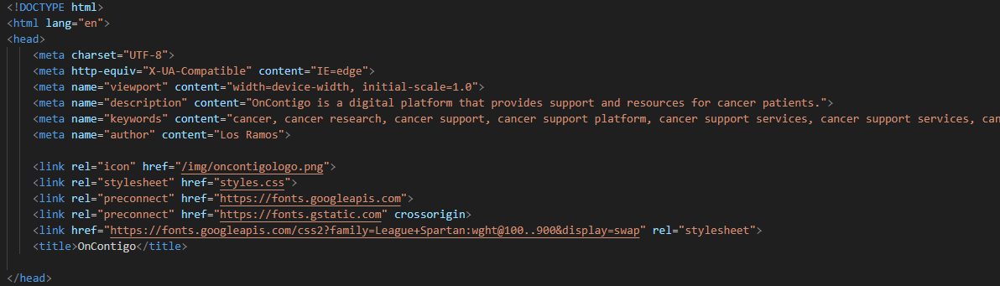
      <il><h3><a href="./content/chapter-4/chapter-4.md">4.2.4. Searching Systems</a></h3></il>
      A continuación, se mostrarán los sistemas de búsqueda implementados para ayudar a nuestros
usuarios a encontrar la información que están buscando.
Para el Landing Page, no se ha implementado un sistema de búsqueda, ya que la información esta
segmentada y enlaza con el menú principal. Por esto mismo, podrán buscar toda la información
necesaria para poder identificar lo más importante de nuestra solución, como a que nos dedicamos o
cuales son nuestros servicios o principalmente podrán buscar los contactos para que puedan
comunicarse con nosotros.
      <il><h3><a href="./content/chapter-4/chapter-4.md">4.2.5. Navigation Systems</a></h3></il>
    A continuación, se mostrarán los sistemas de navegación que le permitirán a nuestros usuarios
    moverse a través de las distintas piezas de contenido o información.
    Como se mencionó anteriormente en el Labeling Systems, contamos con cuatro “headings” en el
    Landing Page entre los cuales tenemos a About us, Members, Our Services, Plans y Testimonials. Estas secciones son
    ubicadas como un menú global horizontal a lo largo de la parte superior del Landing page, se dividió la
    información en estas cuatro secciones con la finalidad de que el cliente no estuviera recorriendo hacia
    abajo, a través de la barra de desplazamiento vertical, la inmensidad de información disponible. Esto le
    facilitaría movilizarse a través de nuestro contenido. Por supuesto, la estrategia es que revise primero el
    Home, dónde se encuentra la información más relevante y la que llamará más su atención, y luego viaje
    a través del resto del menú de izquierda a derecha
<il><h3><a href="./content/chapter-4/chapter-4.md">4.3. Landing Page UI Design</a></h3></il>
   <ul>
      <il><h3><a href="./content/chapter-4/chapter-4.md">4.3.1. Landing Page Wireframe</a></h3></il>

 **Landing Page desktop** 
 Se presenta la landing page vista desde el desktop browser. Donde se muestran la mision,vision,integrantes,caracteristicas,planes, testimonios y por ultimo el footer. 
      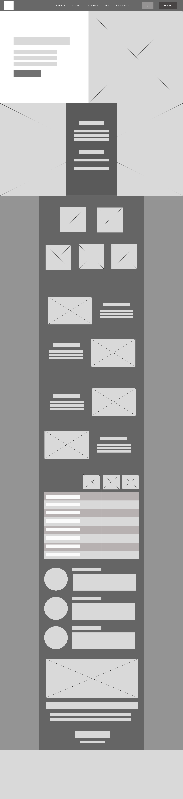 
**Landing pages Mobile** 
Se presenta la landing page vista desde el mobile web browser.Incluye el diseño desktop browser, pero adaptados a las dimensiones del dispositivo mobil.
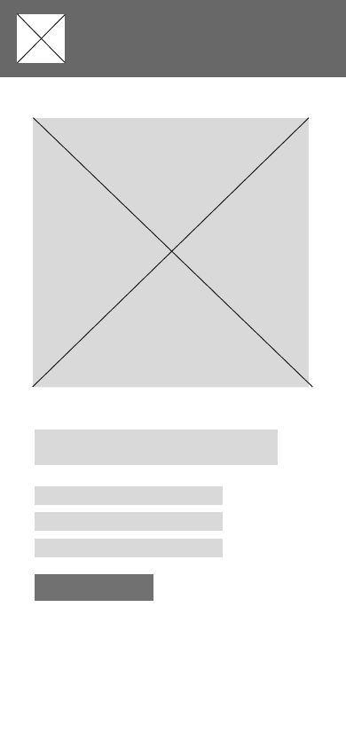 
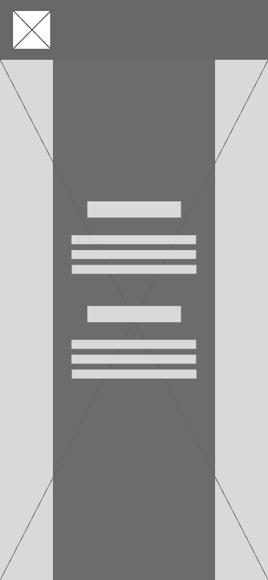 
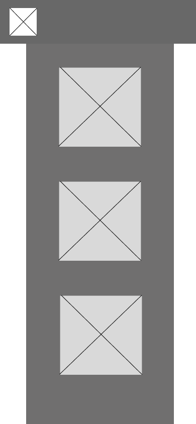 
 
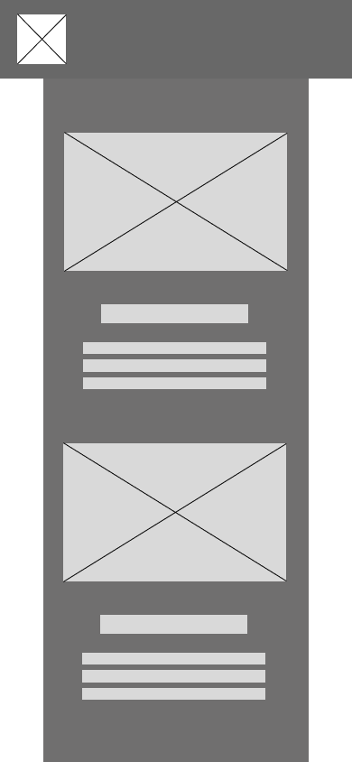 
 
 
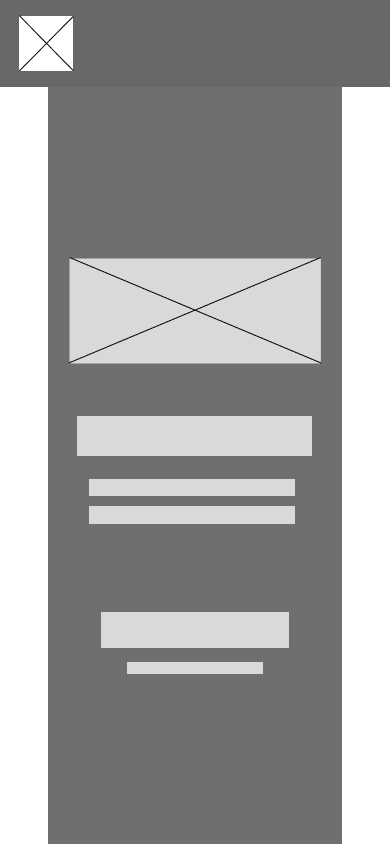 
      <il><h3><a href="./content/chapter-4/chapter-4.md">4.3.2. Landing Page Mock-up</a></h3></il>

**Landing Page para desktop Web browser** 
El wireframe de la vista desktop web browser de la landing page tuvo su utilidad para partir de un esquema definido y al elaborar la landing page mock up, la cual cuenta con los mismo contenidos previos mostrados. 
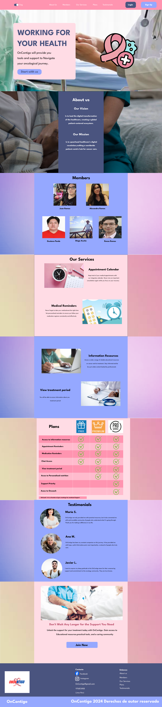 

**Landing Page para Mobile Web browser** 
Desde la vista de un user mobile web browser codse logra ver el contenido de la landing page. Se evidencia la tipografia,colores e imagenes añadidas y adaptadas al margen de los dispositivos mobiles.
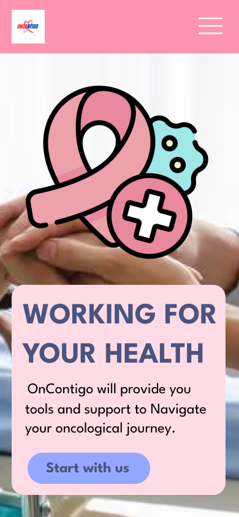 
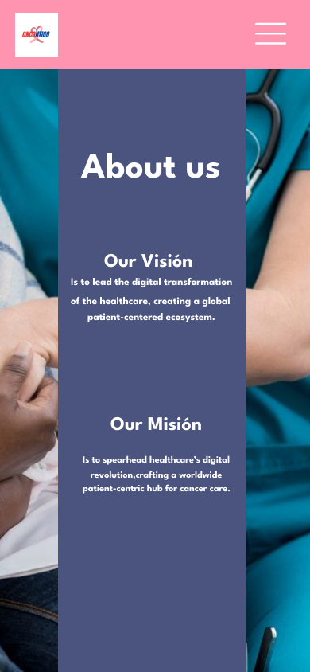 
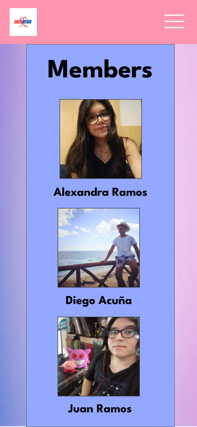 
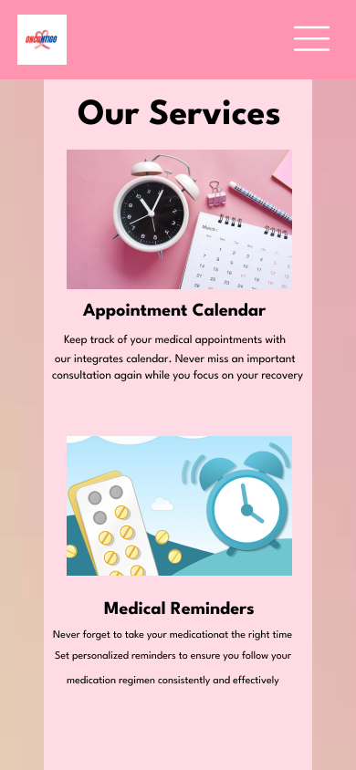 
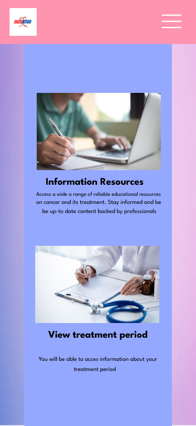 
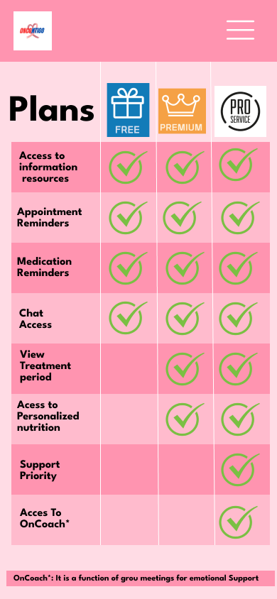 
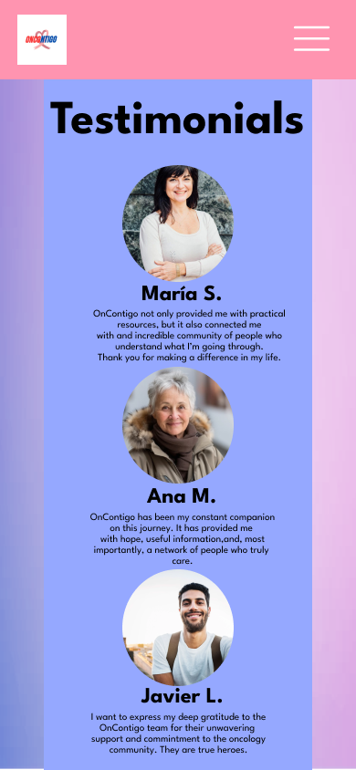 
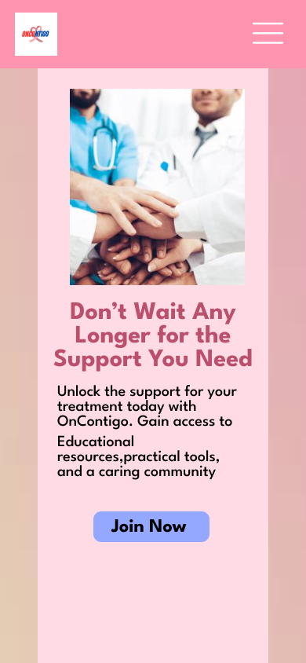 
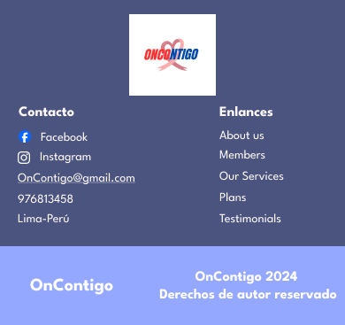 
      
   </ul>
<il><h3><a href="./content/chapter-4/chapter-4.md">4.4. Web Applications UX/UI Design</a></h3></il>
   <ul>
      <il><h3><a href="./content/chapter-4/chapter-4.md">4.4.1. Web Applications Wireframes</a></h3></il>
      <il><h3><a href="./content/chapter-4/chapter-4.md">4.4.2. Web Applications Wireflow Diagrams</a></h3></il>
      
**User Goal: Acceder al chat con el médico**
   
   User Persona: Paciente con tratamientos oncológicos.

   Explicación: Cuando el usuario haga click a "Mi Doctor", le aparecerá la interfaz con sus datos y un botón que dice "Chat". Cuando haga click en ese botón, ingresará al apartado de chat para que puedan comunicarse.

   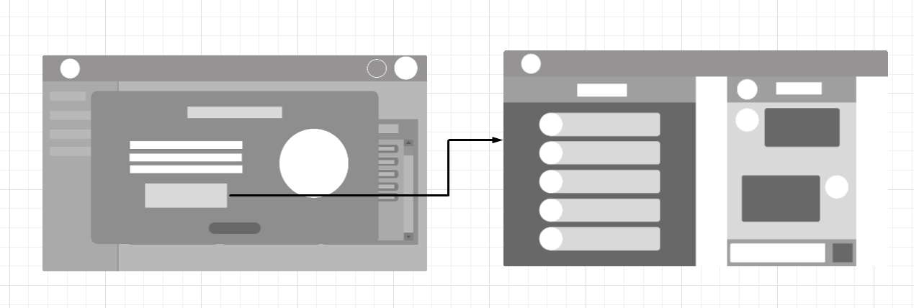 

**User Goal: Acceder al Calendario**

   User Persona: Paciente con tratamientos oncológicos.

   Explicación: Cuando el usuario se encuentre en la menú de inicio. Va aparecer en la izquierda una opción llamada "Calendario". Cuando haga click en ese botón lo redirigirá a la una interfaz con el calendario y las próximas citas o tratamientos a lo largo de la semana.

     

**User Goal: Poder agregar y/o eliminar a pacientes en la lista** 

   User Persona: Médico oncólogo

   Explicación: Cuando el usuario haga click en "Lista de pacientes", lo llevará a una tabla con sus pacientes y una lista de botones en la parte derecha. Si quiere agregar un paciente, tendrá que hacer click al botón "Agregar pacientes". Pero si quiere eliminarlo tendrá que escoger el último botón que dice "Eliminar paciente".

     

**User Goal: Poder usar un chat privado con mi paciente**

   User Persona: Médico oncólogo

   Explicación: Cuando el usuario haga click en "Lista de pacientes", lo llevará a una tabla con sus pacientes y una lista de botones en la parte derecha. Tendrá que seleccionar un paciente y darle al botón "Ver detalles". Le aparecerá el perfil del paciente y un botón que dice "Chat". El usuario tendrá que pulsarlo para iniciar un chat con el paciente.

   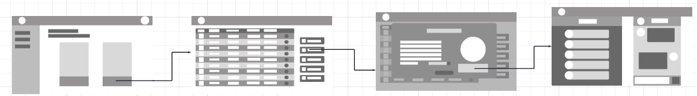  

**User Goal: Registrar medicamentos de un paciente**

   User Persona: Médico oncólogo

   Explicación: El usuario deberá hacer click en "Lista de pacientes", lo dirigirá a una tabla con sus pacientes y una lista de botones en la parte derecha. Tendrá que seleccionar un paciente y darle al botón "Recetar medicamento". Después le aparecerá una ventana emergente donde colocará toda la información acerca del medicamento.

     

**User Goal: Registrar tratamiento y procedimiento de un pacientes**

   User Persona: Médico oncólogo

   Explicación: El usuario deberá hacer click en "Lista de pacientes", lo dirigirá a una tabla con sus pacientes y una lista de botones en la parte derecha. Tendrá que seleccionar un paciente y darle al botón "Tratamientos y Procedimientos". Después le aparecerá una ventana emergente donde habrá dos tablas para describir los procedimientos y tratamientos respectivamente.

     

**User Goal Enviar alarma como notificacion a mis pacientes:**

   User Persona: Médico oncólogo

   Explicación: El usuario deberá hacer click en "Lista de pacientes", lo dirigirá a una tabla con sus pacientes.Cada paciente tiene un botón de alarma en la última columna. Cuando hace click a la alarma de un paciente, aparecerá una ventana donde el usuario tendrá que indicar la hora y el mensaje correspondiente que normalmente es un recordatorio.

     

**User goal: Registrar una nueva cita**
   
   User Persona: Médico oncólogo

   Explicación: Cuando el usuario se encuentre en la menú de inicio. Va a hacer click en una opción llamada "Calendario". Después va a poder visualizar el calendario de las citas programadas. Finalmente tendrá que escoger un espacio libre en el calendario. Esto le dará acceso a una interfaz para elegir al paciente y escoger la modalidad de cita.

       
      <il><h3><a href="./content/chapter-4//chapter-4.md">4.4.3. Web Applications Mock-ups</a></h3></il>
      <il><h3><a href="./content/chapter-4/chapter-4.md">4.4.4. Web Applications User Flow Diagrams</a></h3></il>
   </ul>
<il><h3><a href="./content/chapter-4/chapter-4.md">4.5. Web Applications Prototyping</a></h3></il>
<il><h3><a href="./content/chapter-4/chapter-4.md">4.6. Domain-Driven Software Architecture</a></h3></il>
En esta sección, se presentarán los respectivos diagramas correspondientes al diseño de software
basados en lo que utilizará nuestra aplicación web. Para dichos diseños, hemos aplicado patrones tanto
de alta como de bajo nivel siguiendo el enfoque del Domain-Driven; por lo que, de esta manera,
podremos explayar de manera más concisa y eficiente la arquitectura la cual OnContigo está compuesta
   <ul>
      <il><h3><a href="./content/chapter-4/chapter-4.md">4.6.1. Software Architecture Context Diagram</a></h3></il>
      Este apartado, mayormente se centra en la presentacion del diagrama de contexto del cual abarca
nuestro software. Esto nos permite identificar el sistema y sus multiples relaciones con el mundo de su
alrededor (en referencia a los usuarios con la aplicación), mostrando los principales puntos en su
arquitectura
 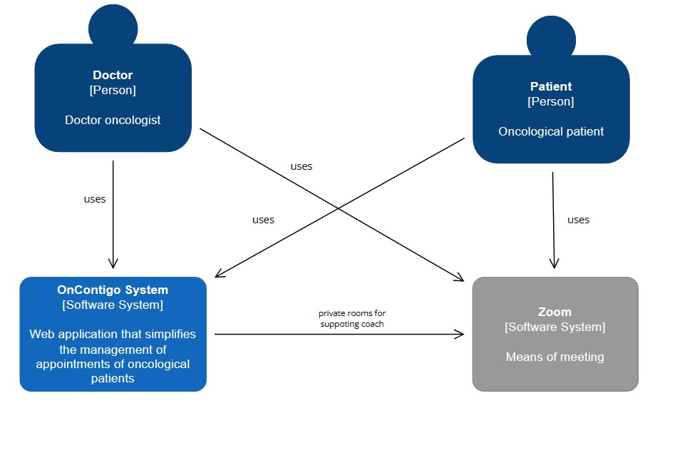
      <il><h3><a href="./content/chapter-4/chapter-4.md">4.6.2. Software Architecture Container Diagrams</a></h3></il>
      A continuación, se mostrará el respectivo diagrama de contenedores lo cual esta basado en nuestro
sistema; es por ello, que este artefacto presenta los componentes técnicos de alto nivel - generando un
enfoque más maximizado acerca de la visión de la arquitectura del software -.
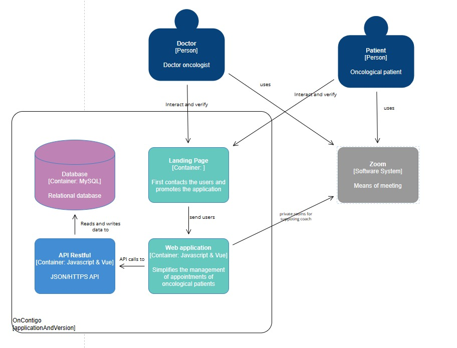
      <il><h3><a href="./content/chapter-4/chapter-4.md">4.6.3. Software Architecture Components Diagrams</a></h3></il>
   En este último apartado, se presenta el diagrma de componentes de nuestra arquitectura de software
en que se detallan los componentes de nuestros contenedores ya maquetados anteriormente; por
consiguiente, se señalan sus responsabilidades y los detalles en veredicto al enlace tecnológico e
implementación

##### Log-in Bounded Context
   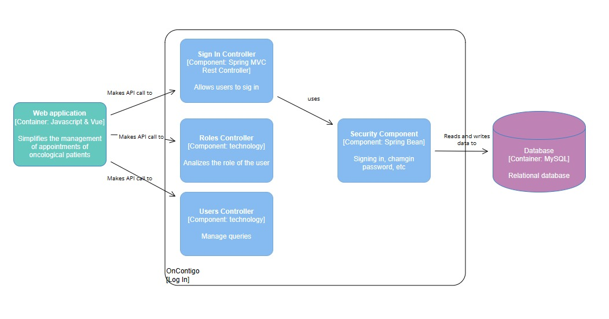
   </ul>
<il><h3><a href="./content/chapter-4/chapter-4.md">4.7. Software Object-Oriented Design</a></h3></il>
   <ul>
      <il><h3><a href="./content/chapter-4/chapter-4.md">4.7.1. Class Diagrams</a></h3></il>  
         <image src="../images/chapter-4/Class Diagram.png">  
      <il><h3><a href="./content/chapter-4/chapter-4.md">4.7.2. Class Dictionary</a></h3></il>
   </ul>
<il><h3><a href="./content/chapter-4/chapter-4.md">4.8. Database Design</a></h3></il>
   <ul>
      <il><h3><a href="./content/chapter-4/chapter-4.md">4.8.1. Database Diagram</a></h3></il>
            <image src="../images/chapter-4/Database_Model.png">  
   </ul>
