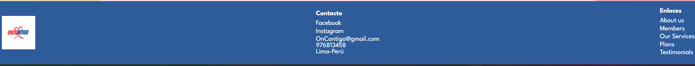
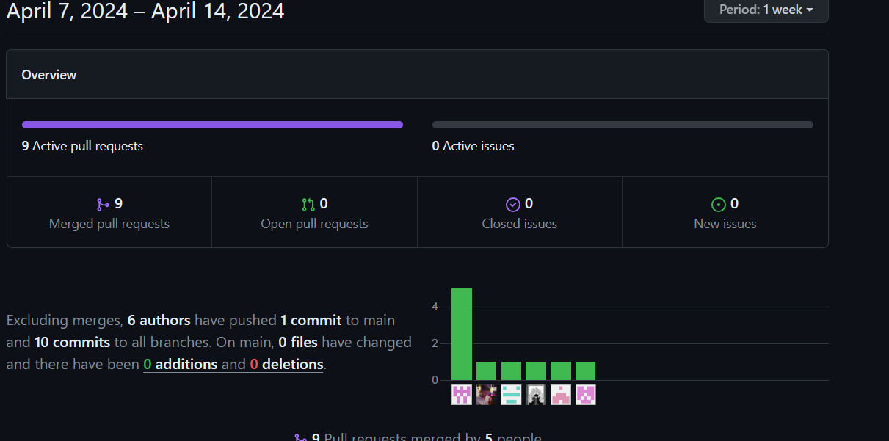
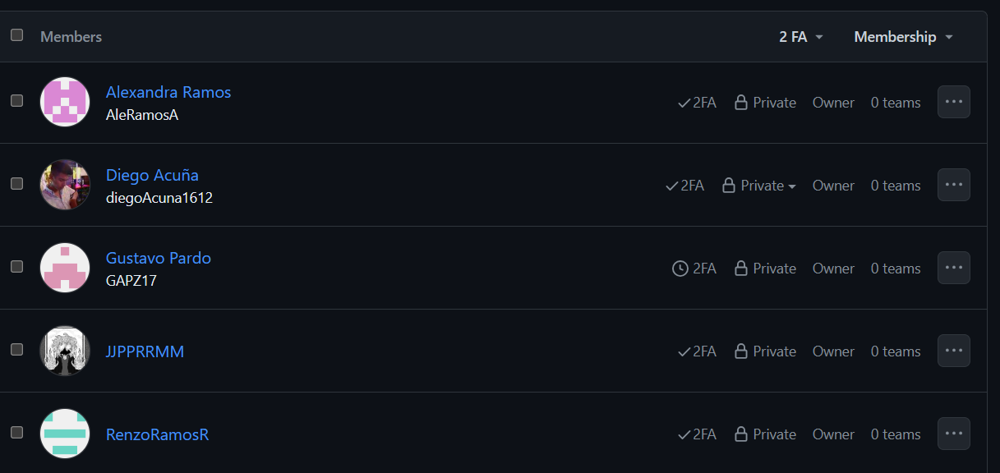
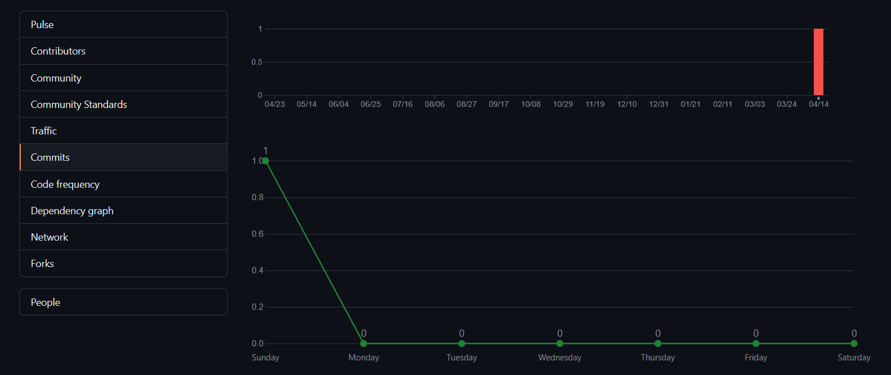
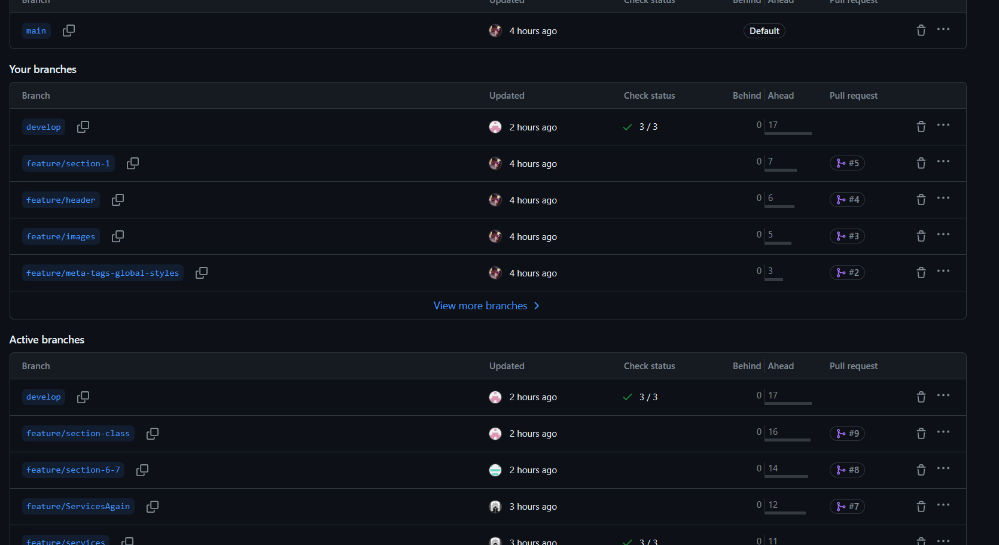

<il><h1><a href="./content/chapter-5/chapter-5.md">Capítulo V: Product Implementation, Validation & Deployment</a></h1></il>
<il><h3><a href="./content/chapter-5/chapter-5.md">5.1. Software Configuration Management</a></h3></il>
A continuación, se presentará un repositorio central y organizado que servirá como guía para el desarrollo enfocado y consistente de nuestra solución

   <ul>
      <il><h3><a href="./content/chapter-5/chapter-5.md">5.1.1. Software Development Environment Configuration</a></h3></il>


#### Requirements Management

Es el proceso de garantizar que una organización documente, verifique y satisfaga las necesidades y expectativas de sus clientes con las partes interesadas internas o externas.

- Trello: Plataforma de gestión de user stories, organización en epics y clasificación por puntaje. Permite compartir una vista en tiempo real del progreso del proyecto entre miembros del equipo.  

[https://trello.com/invite/b/gx5i8rKM/ATTI09d174300e2bf371f3e5625280ecdb95A762E269/product-backlog-oncontigo ](https://trello.com/invite/b/gx5i8rKM/ATTI09d174300e2bf371f3e5625280ecdb95A762E269/product-backlog-oncontigo )


#### Product UX/UI Design

- Uxpressia: Herramienta en línea para mapeo de trayectoria del cliente, creación de mapas de impacto y personas.  
EMPATHY MAP(PACIENTES)[https://uxpressia.com/w/mDdvz/p/JzlFH](https://uxpressia.com/w/mDdvz/p/JzlFH)
EMPATHY MAP(DOCTOR)[https://uxpressia.com/w/mDdvz/p/lg65v](https://uxpressia.com/w/mDdvz/p/lg65v)
JOURNEY MAP(DOCTOR)[https://uxpressia.com/w/mDdvz/m/196Tw](https://uxpressia.com/w/mDdvz/m/196Tw)
JOURNEY MAP(PACIENTE) [ https://uxpressia.com/w/mDdvz/m/FDtCu]( https://uxpressia.com/w/mDdvz/m/FDtCu)
- Figma: Pizarra digital colaborativa en línea para investigación, ideación, lluvias de ideas y mapas mentales.  
[https://www.figma.com/file/9fLXXyhFtxOwF2iFs8gBdM/Oncontigo-Mockups?type=design&node-id=0-1&mode=design&t=HkEWLTZnf3N6FtXp-0](https://www.figma.com/file/9fLXXyhFtxOwF2iFs8gBdM/Oncontigo-Mockups?type=design&node-id=0-1&mode=design&t=HkEWLTZnf3N6FtXp-0)

- Structurizr: Herramienta de diseño que soporta el modelo C4 para visualizar arquitecturas de software.  
[https://structurizr.com/](https://structurizr.com/)

- Lucid Chart: Herramienta de diagramación en línea para la colaboración en tiempo real.  
[https://lucid.app/lucidchart/84ff4b37-35d8-4d28-96f5-8e7fc2ef6c93/edit?viewport_loc=-10%2C-10%2C1813%2C789%2C0_0&invitationId=inv_f86e0e0e-cfe1-48c8-a60d-869b7a147a57](https://lucid.app/lucidchart/84ff4b37-35d8-4d28-96f5-8e7fc2ef6c93/edit?viewport_loc=-10%2C-10%2C1813%2C789%2C0_0&invitationId=inv_f86e0e0e-cfe1-48c8-a60d-869b7a147a57)

- MIRO: Pizarra digital colaborativa en línea para diversas actividades colaborativas.  
[https://miro.com/app/dashboard/](https://miro.com/app/dashboard/)

#### Software Development

Estructura aplicada al desarrollo de un producto de software.

- Github: Repositorio comunitario para almacenar avances de proyectos colaborativos.  
[https://github.com/OnContigo-upc](https://github.com/OnContigo-upc)

- Web Storm: Entorno de desarrollo orientado en JavaScript, ofrece integración con lenguajes web como HTML, CSS y TypeScript.  
[https://www.jetbrains.com/webstorm/promo/](https://www.jetbrains.com/webstorm/promo/)

- Visual Studio Code: Editor de código que ofrece extensiones y funcionalidades para el desarrollo eficiente, utilizado para construir backend de aplicaciones web.  
[https://code.visualstudio.com/](https://code.visualstudio.com/)

- HTML: Lenguaje para el desarrollo de plataformas web, será utilizado para la documentación de la página web.  
[https://www.jetbrains.com/help/webstorm/editing-html-files.html](https://www.jetbrains.com/help/webstorm/editing-html-files.html)

- CSS: Lenguaje de diseño gráfico para la elaboración de interfaces de usuario.  
[https://www.jetbrains.com/help/webstorm/style-sheets.html#ws_css_completion](https://www.jetbrains.com/help/webstorm/style-sheets.html#ws_css_completion)

#### Software Deployment

- Github pages: Servicio para alojar páginas web estáticas y aplicaciones web.  
[https://pages.github.com/](https://pages.github.com/)
      <il><h3><a href="./content/chapter-5/chapter-5.md">5.1.2. Source Code Management</a></h3></il>
A continuación, se presenta la gestión de código fuente o como es conocido por sus siglas en ingles SCM (Source Code Management). Su función principal es realizar un seguimiento de las modificaciones que el equipo realizara a lo largo del desarrollo de sus proyectos en los repositorios de código fuente. Se empleará como un sistema de control de versiones que permite dar seguimiento a los cambios que cada integrante o desarrollador realice en el proyecto. Asimismo, cabe resaltar que para el sistema de control de versiones emplearemos GitHub.

    #### Enlaces Importantes

    - **Organización en GitHub**: [OnContigo](https://github.com/OnContigo-upc)
    - **Repositorio del Landing Page**: [OnContigo Landing Page](https://github.com/OnContigo-upc/Landing-Page)

    #### GitFlow

    GitFlow es un flujo de trabajo de control de versiones que facilita la gestión de ramas durante el desarrollo:

    #### Main Branches

    - `main`: Rama principal que contiene el historial de publicación oficial y todas las versiones.
    - `develop`: Rama creada desde `main`, integra todas las funciones estables y prepara la próxima versión.

    #### Support Branches

    Estas ramas son temporales y se eliminan después de integrarse en sus ramas principales.

    ##### Feature

    - **Origen**: `develop`
    - **Destino**: `develop`
    - Se utilizan para el desarrollo de nuevas funcionalidades, existen mientras están en desarrollo y luego se integran a `develop`.

    ##### Release

    - **Origen**: `develop`
    - **Destino**: `develop` / `main`
    - Preparan la nueva versión de producción, corrigen errores menores y preparan metadatos para el lanzamiento.

    #### Motivos para usar Gitflow

    - Adecuado para proyectos con lanzamientos programados.
    - Combina los beneficios de un flujo centralizado y descentralizado.
    - Permite trabajo individual, ideal cuando el equipo tiene horarios diferentes.
    - Requiere actualización constante en el repositorio central.

    Cada miembro del equipo debe mantener su trabajo al día con el repositorio central en GitHub para garantizar la cohesión y el progreso del proyecto.
<il><h3><a href="./content/chapter-5/chapter-5.md">5.1.3. Source Code Style Guide & Conventions</a></h3></il>

    #### Nomenclatura General

    - Utilizaremos términos en inglés para nombrar variables, objetos, elementos y funciones que describan claramente su propósito.
    - No se utilizarán mayúsculas arbitrarias para mantener la legibilidad del código.

    Ejemplo de nomenclatura estándar:
    ```css
    .gallery {}
    .video {}
    .login {}
    ```

    #### Sangria
    - En HTML, CSS y JavaScript, aplicaremos espacios antes de cada línea dentro de un bloque.
    - Se recomienda usar dos espacios y evitar la tecla “Tabulación”.
    - Ejemplo de sangría en HTML:
        ```css
        <table>
        <tr>
            <th>Name</th>
            <th>Description</th>
        </tr>
        </table>
        ```
    - Ejemplo de sangría en CSS:
        ```css
        html {
        background: #fff;
        color: #404;
        }
        ```
    -Ejemplo de sangría en JavaScript:
        ```css
        function toCelsius(fahrenheit) {
            return (5 / 9) * (fahrenheit - 32);
        }
        ```

    #### HTML

    - Declare Document Type: Siempre declare el tipo de documento como HTML5 con <!DOCTYPE html>.
    - Blank Lines: Deje líneas en blanco después de bloques de gran longitud.
    Quote Attribute Values: Utilice comillas dobles alrededor de los valores de los atributos.
    - Multimedia Fallback: Asegure acceso alternativo para multimedia y añada dimensiones a los elementos.
    - Never Skip the <tittle> Element: El título de la página es crucial para SEO y se muestra en los resultados de búsqueda.
    - HTML Line-Wrapping: Evite líneas de código extensas. Utilice espacios para diferenciar elementos hijos.
    #### CSS
    - Shorthand Properties: Utilice la menor cantidad de líneas posibles para declarar propiedades.
    - Declaration Stops: Ponga un punto y coma después de cada declaración.
    - Property Name Stops: Incluya un espacio después de los dos puntos en una declaración de propiedad.
    - Declaration Block Separation: Separe el nombre de un selector y el inicio de un bloque con un espacio.
    - CSS Quotation Marks: Utilice comillas simples para valores de atributos y selectores.
    #### JavaScript
    - Spaces around operators: Incluya un espacio alrededor de los operadores.
    - Simple Statement’s End: Finalice las declaraciones simples con un punto y coma.
    - Beginning and End of a Function: Coloque una llave al final de la primera línea de una función y la llave de cierre sola en la última línea.
    #### Gherkin
    - Discernible Given-When-Then Blocks: Utilice la sangría para identificar fácilmente los pasos de un escenario.
    - Step with Tables: Para los pasos que requieran valores, utilice tablas.
    - Reducing Noise: Use valores por defecto en los pasos y coloque valores "estándar" entre comillas simples.
    - Scenarios Separator: Separe escenarios con saltos de línea y comentarios para facilitar la visualización.
    #### TypeScript
    - UpperCamelCase: Para clases, interfaces, tipos, enums y decoradores.
    - lowerCamelCase: Para variables, parámetros, funciones, métodos y alias de módulo.
    - CONSTANT_CASE: Para valores constantes globales, incluidos los valores de enumeración.
    - Evite identificadores privados.
    #### Vue.js
    - Nombres de Componentes: Utilice camelCase y nombres en singular.
    - Nombres de Servicios: Añada el sufijo "Service" y utilice mayúsculas al inicio de cada palabra.
    - Nombres de Archivos de Pruebas Unitarias: Incluya ".spec" antes de ".vue".
    - Declaración de Funciones: Especifique la visibilidad y evite el uso innecesario de "this".
    - División de Líneas: Haga un salto de línea después de una coma y divida antes de un operador.
<il><h3><a href="./content/chapter-5/chapter-5.md">5.1.4. Software Deployment Configuration</a></h3></il>
- Como ya se ha mencionado, la gestión de nuestro código fuente se realizará a través de GitHub. Asimismo, se utilizará GitHub Pages para la publicación y despliegue de la página. Cada sección del Landing Page que se ha creado deberá aparecer en el siguiente vínculo:
https://oncontigo-upc.github.io/Landing-Page/
<br>
- Para el desarrollo del Landing Page de OnContigo se han utilizado las siguientes herramientas:
    - Html: Es el lenguaje de marcado que estructuro nuestro Landing Page.
        Evidencia: Archivos HTML, el principal es index.html donde todos los integrantes juntaron el contenido
        realizado en su rama individual.
     - Css: Es aquel que nos ayudó con el diseño gráfico para que el Landing Page sea agradable e interactúale
        Evidencia: Se presenta el file styles.css, donde el grupo implemento el diseño de toda la estructura realizada con html.
    - JS: Nos ayudó a desarrollar la lógica necesaria para el Landing Page.
        Evidencia: Se muestra el documento main.js.
<br>
- El despliegue del Landing Page de OnContigo no pudo ser posible sin utilizar las siguientes tecnologías:
    - Git: Sistema de control de versiones que está pensado en la eficiencia y compatibilidad de versiones.
El cual nos ayudó a trabajar en equipo durante el desarrollo del Landing Page
    - Github: Plataforma de desarrollo colaborativo
    - Git Flow:Nos permitió controlar el avance de cada uno de nuestros integrantes con respecto al
desarrollo del Landing Page
    -  Git Hub PagesServicio de Github que nos permitió alojar nuestra Landing page.
- Asimismo, se han realizado los siguientes pasos:
    - Dirigirse al repositorio de la página: Dado que se ha empleado Github, debemos ir al repositorio creado en este sitio web para publicar el Landing Page que ha desarrollado el equipo. Desde aquí, se podrá iniciar la configuración del vínculo de la página dirigiéndonos al apartado de Settings.
    - Ir a la opción de páginas: Una vez presentes la configuración del repositorio, debemos dirigirnos a la sección de Pages. Esto se debe a que ahí se encuentran todas las opciones de configuración de publicación de la página en un link o vínculo

    -   Elección de rama y carpeta de guardado: Dentro de pages, se debe seleccionar la rama o branch que se va a publicar en el vínculo. De la misma manera, se tiene que elegir la carpeta donde se localizará esta publicación a realizar. Finalmente podremos acceder a nuestra página con el link que aparece en la parte superior de este apartado de configuración

-   Siguiendo los pasos, obtenemos el siguiente enlace:
https://oncontigo-upc.github.io/Landing-Page/
   </ul>
<il><h3><a href="./content/chapter-5/chapter-5.md">5.2. Landing Page, Services & Applications Implementation</a></h3></il>
   <ul>
      <il><h3><a href="./content/chapter-5/chapter-5.md">5.2.1. Sprint 1</a></h3></il>
      <ul>
         <il><h3><a href="./content/chapter-5/chapter-5.md">5.2.1.1. Sprint Planning 1</a></h3></il>
         <table>
  <tr>
    <th>Sprint #</th>
    <td>Sprint 1</td>
  </tr>
  <tr>
    <th>Sprint Planning Date</th>
    <td>2024-04-5</td>
  </tr>
  <tr>
    <th>Time</th>
    <td>04:00 PM</td>
  </tr>
  <tr>
    <th>Location</th>
    <td>Servidor de Discord del Equipo</td>
  </tr>
  <tr>
    <th>Prepared By</th>
    <td>Acuña Gomez Diego Jose</td>
  </tr>
  <tr>
    <th>Attendees</th>
    <td>Juan Pablo/ Diego Acuña / Belen Ramos / Renzo Ramos / Gustavo Pardo</td>
  </tr>
  <tr>
    <th>Sprint Review Summary</th>
    <td>En esta entrega, no hay un Sprint anterior, por lo tanto, no hay resúmen del Sprint.</td>
  </tr>
  <tr>
    <th>Sprint Retrospective Summary</th>
    <td>En esta entrega, no hay un Sprint anterior, por lo tanto, no hay resúmen del Sprint.</td>
  </tr>
  <tr>
    <th>Sprint Goal</th>
    <td>La meta de este Sprint es el funcionamiento de la Landing Page, tanto su visualización, el acceso a las redes sociales, el traslado en la Landing Page y la visualización de los canales de comunicación de la empresa.</td>
  </tr>
  <tr>
    <th>Sprint Velocity</th>
    <td>3</td>
  </tr>
  <tr>
    <th>Sum of Story Points</th>
    <td>13</td>
  </tr>
</table>
         <il><h3><a href="./content/chapter-5/chapter-5.md">5.2.1.2. Sprint Backlog 1</a></h3></il>
         <table border="1">
  <tr>
    <th>Sprint #</th>
    <th>User Story</th>
    <th>Work-item/Task</th>
    <th>Id</th>
    <th>Title</th>
    <th>Description</th>
    <th>Estimation (Hours)</th>
    <th>Assigned To</th>
    <th>Status (To-do / In-Process / To-Review / Done)</th>
  </tr>
  <tr>
    <td rowspan="4">Sprint 1</td>
    <td rowspan="4">HU22: Visualización de Landing Page</td>
    <td>TA01</td>
    <td>#182062223</td>
    <td>Agregar call-to-action hacia la Web App</td>
    <td>Se creará un botón que dirija a la aplicación web en el inicio; asimismo, debe incluir un párrafo llamativo que acompañe a la opción.</td>
    <td>2</td>
    <td>Diego Acuña</td>
    <td>Done</td>
  </tr>
  <tr>
    <td>TA02</td>
    <td>#182062223</td>
    <td>Añadir planes</td>
    <td>Para la seccion de planes, se podra ver los planes que ofrece nuestra aplicacion.</td>
    <td>2</td>
    <td>Renzo Ramos</td>
    <td>Done</td>
  </tr>
  <tr>
    <td>TA03</td>
    <td>#182062223</td>
    <td>Mostrar servicio a clientes</td>
    <td>Para la sección de ‘servicios para pacientes', se añadirá un listado que muestren los servicios que ofrece la app.</td>
    <td>2</td>
    <td>Juan Ramos</td>
    <td>Done</td>
  </tr>
   <tr>
    <td>TA04</td>
    <td>#182062273</td>
    <td>Mostrar miembros y sobre nosotros</td>
    <td>Para la sección de sobre nosotros, explicara nuestra mision y vision de equipo. Tambien la seccion miembros, sobre quienes son los que conforman el grupo</td>
    <td>4</td>
    <td>Alexandra Ramos</td>
    <td>Done</td>
  </tr>
  <tr>
    <td rowspan="1">Sprint 1</td>
    <td rowspan="1">HU13: Contacto con OnContigo</td>
    <td>TA01</td>
    <td>#182062235</td>
    <td>Añadir sección de footer</td>
    <td>Se creará una sección al final del Landing Page que esté dedicada totalmente al contacto con la empresa.(footer)</td>
    <td>2</td>
    <td>Gustavo Pardo</td>
    <td>Done</td>
  </tr>
 
</table>
         <il><h3><a href="./content/chapter-5/chapter-5.md">5.2.1.3. Development Evidence for Sprint Review</a></h3></il>
         En esta sección se presentan los avances de implementación con relación a los productos
desarrollados en el presente Sprint. La implementación que se desarrollo fue la primera version del
Landing Page, se implementaron ramas a partir de la rama develop para que cada integrante pueda
codificar su parte del Landing Page, se implementaron la navbar, la sección know us, la sección
services, goals, hero and footer. Con ello completamos el primer sprint de implementación.
<table border="1">
  <tr>
    <th>Repository</th>
    <th>Branch</th>
    <th>Commit Id</th>
    <th>Commit Message</th>
    <th>Commit Message Body</th>
    <th>Committed on (Date)</th>
  </tr>
  <tr>
    <td>Diego Acuna / Landing-Page</td>
    <td>feature/meta-tags-global-styles/td>
    <td>18400df</td>
    <td>meta tags</td>
    <td>feat:meta tags y estilos globales agregados</td>
    <td>14/4/24</td>
  </tr>
  <tr>
    <td>Diego Acuna / Landing-Page</td>
    <td>feature/images</td>
    <td>89f5c9d</td>
    <td>images</td>
    <td>feat:imagenes de la landing agregadas</td>
    <td>14/4/24</td>
  </tr>
  <tr>
    <td>Diego Acuna / Landing-Page</td>
    <td>feature/header</td>
    <td>fc6e906</td>
    <td>feat: html y css del header</td>
    <td>feat: html y css del header</td>
    <td>14/4/24</td>
  </tr>
  <tr>
    <td>Diego Acuna / Landing-Page</td>
    <td>ffeature/section-1</td>
    <td>98b7af5</td>
    <td>Feature/section 1</td>
    <td>Feature/section 1</td>
    <td>14/4/24</td>
  </tr>
  <tr>
    <td> Alexandra Ramos / Landing-Page</td>
    <td>feature/section-aboutus-members</td>
    <td>3baa605</td>
    <td>feat: about us & members section added</td>
    <td>feat: about us & members section added</td>
    <td>14/4/24</td>
  </tr>
  <tr>
    <td>Juan Ramos/ Landing-Page</td>
    <td>feature/ServicesAgain</td>
    <td>9fa14f7</td>
    <td>feat: Services Section Added #7
</td>
    <td>feat: Services Section Added #7
</td>
    <td>14/4/24</td>
  </tr>
 <tr>
    <td>Renzo Ramos/ Landing-Page</td>
    <td>feature/section-6-7</td>
    <td>9fa14f7</td>
    <td>feat: Section 6 & 7 agregado
</td>
    <td>feat: Section 6 & 7 agregado
</td>
    <td>14/4/24</td>
  </tr>

  <tr>
    <td>Gustavo Pardo/ Landing-Page</td>
    <td>feature/section-class</td>
    <td>9fa14f7</td>
    <td>feat: footer added
</td>
    <td>feat: footer added
</td>
    <td>14/4/24</td>
  </tr>
</table>
         <il><h3><a href="./content/chapter-5/chapter-5.md">5.2.1.4. Testing Suite Evidence for Sprint Review</a></h3></il>
         No se desarrolló en este sprint, pues en esta parte se presentarán los Unit Tests, Integration Tests y
Acceptance Tests automatizados, para Web Services
         <il><h3><a href="./content/chapter-5/chapter-5.md">5.2.1.5. Execution Evidence for Sprint Review</a></h3></il>
         Vistas implementadas:
         
#### Desktop Web Browser
 

 #### About us
 

 #### Members
 

 #### Services
 

 #### Plans
 

  #### Footer
 

 Link Figma: https://www.figma.com/file/9fLXXyhFtxOwF2iFs8gBdM/Oncontigo-Mockups?type=design&node-id=0-1&mode=design&t=HkEWLTZnf3N6FtXp-0
<il><h3><a href="./content/chapter-5/chapter-5.md">5.2.1.6. Services Documentation Evidence for Sprint Review</a></h3></il>
         No se desarrolló en este sprint, pues en esta sección presentaremos la relación de Endpoints
documentados con OpenAPI, relacionados con el alcance del Sprint y con web services.
         <il><h3><a href="./content/chapter-5/chapter-5.md">5.2.1.7. Software Deployment Evidence for Sprint Review</a></h3></il>
        Cada sección del Landing Page que se ha creado deberá aparecer en el siguiente vínculo:
https://oncontigo-upc.github.io/Landing-Page/
<br>
- Para el desarrollo del Landing Page de OnContigo se han utilizado las siguientes herramientas:
    - Html: Es el lenguaje de marcado que estructuro nuestro Landing Page.
        Evidencia: Archivos HTML, el principal es index.html donde todos los integrantes juntaron el contenido
        realizado en su rama individual.
     - Css: Es aquel que nos ayudó con el diseño gráfico para que el Landing Page sea agradable e interactúale
        Evidencia: Se presenta el file styles.css, donde el grupo implemento el diseño de toda la estructura realizada con html.
    - JS: Nos ayudó a desarrollar la lógica necesaria para el Landing Page.
        Evidencia: Se muestra el documento main.js.
<br>
- El despliegue del Landing Page de OnContigo no pudo ser posible sin utilizar las siguientes tecnologías:
    - Git: Sistema de control de versiones que está pensado en la eficiencia y compatibilidad de versiones.
El cual nos ayudó a trabajar en equipo durante el desarrollo del Landing Page
    - Github: Plataforma de desarrollo colaborativo
    - Git Flow:Nos permitió controlar el avance de cada uno de nuestros integrantes con respecto al
desarrollo del Landing Page
    -  Git Hub PagesServicio de Github que nos permitió alojar nuestra Landing page.
- Asimismo, se han realizado los siguientes pasos:
    - Dirigirse al repositorio de la página: Dado que se ha empleado Github, debemos ir al repositorio creado en este sitio web para publicar el Landing Page que ha desarrollado el equipo. Desde aquí, se podrá iniciar la configuración del vínculo de la página dirigiéndonos al apartado de Settings.
    - Ir a la opción de páginas: Una vez presentes la configuración del repositorio, debemos dirigirnos a la sección de Pages. Esto se debe a que ahí se encuentran todas las opciones de configuración de publicación de la página en un link o vínculo

    -   Elección de rama y carpeta de guardado: Dentro de pages, se debe seleccionar la rama o branch que se va a publicar en el vínculo. De la misma manera, se tiene que elegir la carpeta donde se localizará esta publicación a realizar. Finalmente podremos acceder a nuestra página con el link que aparece en la parte superior de este apartado de configuración

-   Siguiendo los pasos, obtenemos el siguiente enlace:
https://oncontigo-upc.github.io/Landing-Page/
         <il><h3><a href="./content/chapter-5/chapter-5.md">5.2.1.8. Team Collaboration Insights during Sprint</a></h3></il>
      </ul>
      Organización creada en GitHub, con dominio público para que el profesor pueda visualizar el proyecto.

    Repositorio Principal: LandingPage:https://github.com/OnContigo-upc/Landing-Page
    Landing Page: https://oncontigo-upc.github.io/Landing-Page/
    
    Integrantes:
<br>
 
 
<br><br>
 Insights Github
 <br>
  
  
  

   </ul>
   </ul>
</ul>
 