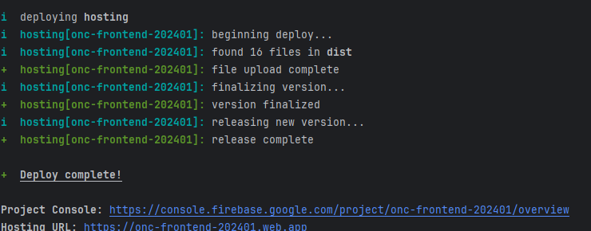
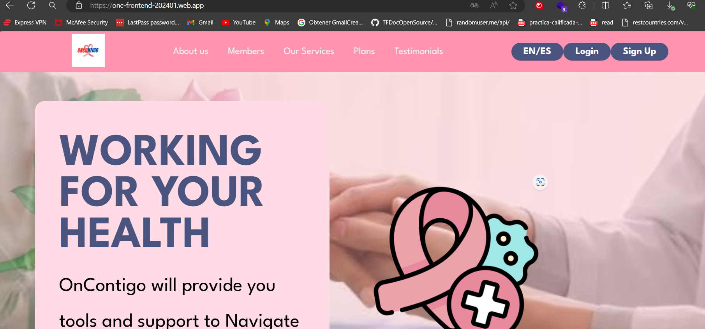
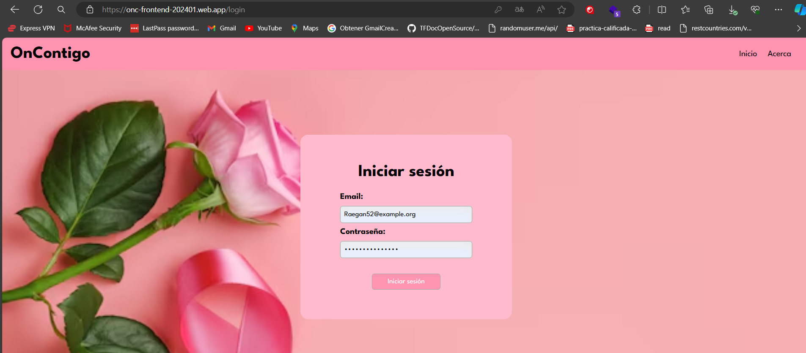
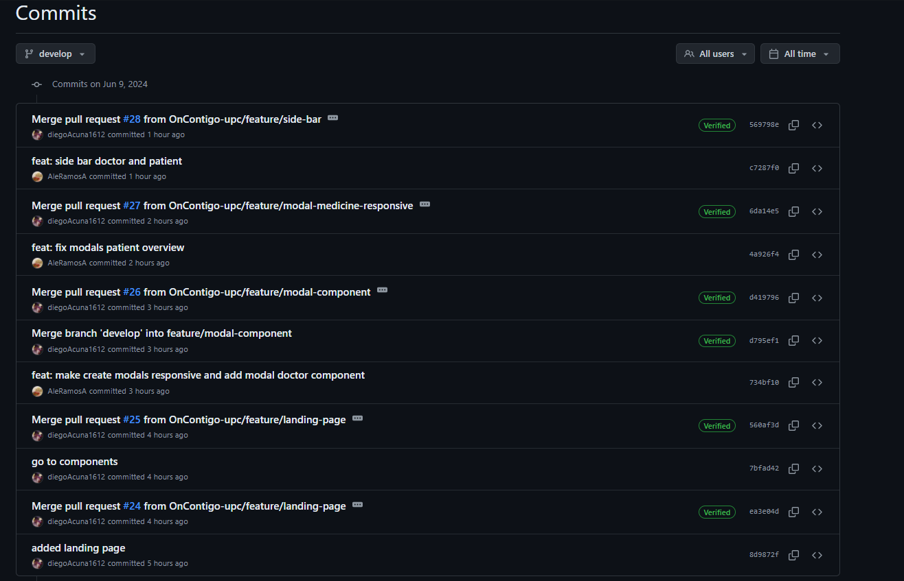

<il><h3><a href="./content/chapter-5/chapter-5.md">5.2.3 Sprint 3</a></h3></il>
   <ul>
      <il><h3><a href="./content/chapter-5/chapter-5.md">5.2.3. Sprint 3</a></h3></il>
      <ul>
         <il><h3><a href="./content/chapter-5/chapter-5.md">5.2.3.1. Sprint Planning 3</a></h3></il>
         <table>
  <tr>
    <th>Sprint #</th>
    <td>Sprint 3</td>
  </tr>
  <tr>
    <th>Sprint Planning Date</th>
    <td>2024-05-29</td>
  </tr>
  <tr>
    <th>Time</th>
    <td>06:00 PM</td>
  </tr>
  <tr>
    <th>Location</th>
    <td>Servidor de Discord del Equipo</td>
  </tr>
  <tr>
    <th>Prepared By</th>
    <td>Renzo Ramos</td>
  </tr>
  <tr>
    <th>Attendees</th>
    <td>Juan Pablo/ Diego Acuña / Belen Ramos / Renzo Ramos / Gustavo Pardo</td>
  </tr>
    <tr>
    <th>Sprint Review Summary</th>
    <td>En el Sprint anterior, la meta fue el desarrollo del FrontEnd. En este Sprint logramos corregir algunos detalles de responsive y algunas funcionalidad del FrontEnd.</td>
  </tr>
  <tr>
    <th>Sprint Retrospective Summary</th>
    <td>Aún así desarrollada el FrontEnd. Falto implemnetar mas funcionalidades como metodos delete o put</td>
  </tr>
  <tr>
    <th>Sprint Goal</th>
    <td>La meta de este Sprint es elaborar una primera version de nuestro RESTFul API</td>
  </tr>
  <tr>
    <th>Sprint Velocity</th>
    <td>5</td>
  </tr>
  <tr>
    <th>Sum of Story Points</th>
    <td>20</td>
  </tr>
</table>
         <il><h3><a href="./content/chapter-5/chapter-5.md">5.2.3.2. Sprint Backlog 3</a></h3></il>
         <table border="1">
           
         
           
         https://trello.com/b/dO38Ex1T/sprint-backlog-2-oncontigo 
  <tr>
    <th>Sprint #</th>
    <th>User Story</th>
    <th>Work-item/Task</th>
    <th>Id</th>
    <th>Title</th>
    <th>Description</th>
    <th>Estimation (Hours)</th>
    <th>Assigned To</th>
    <th>Status (To-do / In-Process / To-Review / Done)</th>
  </tr>
  <tr>
    <td rowspan="3">Sprint 3</td>
    <td rowspan="3">HU20: Registrar cuenta</td>
    <td>TA01</td>
    <td>#182031243</td>
    <td>Crear formulario de registro</td>
    <td>Desarrollar un formulario en la interfaz de usuario que permita a los usuarios ingresar sus datos</td>
    <td>5</td>
    <td>Juan Pardo</td>
    <td>Done</td>
  </tr>
  <tr>
    <td>TA02</td>
    <td>#182031243</td>
    <td>Implementar validación de datos en el formulario</td>
    <td>Añadir validaciones al formulario de registro para asegurarse de que todos los campos sean ingresados correctamente antes de permitir que el usuario envíe el formulario</td>
    <td>4</td>
    <td>Juan Pardo</td>
    <td>To-do</td>
  </tr>
  <tr>
    <td>TA03</td>
    <td>#182031243</td>
    <td>Configurar FakeAPI para registro de usuarios</td>
    <td>Desarrollar la lógica en el servidor para recibir los datos del formulario de registro, validarlos y almacenarlos en la base de datos.</td>
    <td>4</td>
    <td>Renzo Ramos</td>
    <td>To-do</td>
  </tr>
  <tr>
    <td rowspan="2">Sprint 3</td>
    <td rowspan="2">HU02: Iniciar sesión</td>
    <td>TA01</td>
    <td>#182062235</td>
    <td>Crear pantalla de inicio de sesión</td>
    <td>Desarrollar una pantalla que permita a los usuarios ingresar sus credenciales para iniciar sesión.</td>
    <td>4</td>
    <td>Juan Pardo</td>
    <td>Done</td>
  </tr>
  <tr>
    <td>TA02</td>
    <td>#182062223</td>
    <td>Integrar autenticación</td>
    <td>Programar la lógica necesaria en el servidor para autenticar a los usuarios basándose en las credenciales proporcionadas.</td>
    <td>5</td>
    <td>Diego Acuña</td>
    <td>Done</td>
  </tr>
  <tr>
    <td rowspan="1">Sprint 2</td>
    <td rowspan="1">HU08: Acceso al calendario</td>
    <td>TA01</td>
    <td>#182062235</td>
    <td>Desarrollar vista de calendario</td>
    <td>Implementar una vista de calendario en la aplicación que pueda ser accesible tanto por médicos como por pacientes para visualizar fechas importantes.</td>
    <td>6</td>
    <td>Gustavo Ramos</td>
    <td>Done</td>
  </tr>
  <tr>
    <td rowspan="1">Sprint 3</td>
    <td rowspan="1">HU09:  Registrar fecha de cita</td>
    <td>TA01</td>
    <td>#182062235</td>
    <td> Implementar funcionalidad de selección de fecha</td>
    <td>Añadir al calendario la capacidad de seleccionar una fecha y hora específica para agendar una cita médica.</td>
    <td>5</td>
    <td>Renzo Ramos</td>
    <td>Done</td>
  </tr>
  <tr>
    <td rowspan="1">Sprint 3</td>
    <td rowspan="1">HU10:  Registrar fecha de procedimiento</td>
    <td>TA01</td>
    <td>#182062235</td>
    <td>Desarrollar interfaz para registro de procedimientos</td>
    <td>Crear una interfaz en el calendario donde los médicos puedan registrar fechas y horas de procedimientos médicos realizados a los pacientes.</td>
    <td>5</td>
    <td>Renzo Ramos</td>
    <td>Done</td>
  </tr>
   <tr>
    <td rowspan="1">Sprint 3</td>
    <td rowspan="1">HU11:  Registrar periodo de tratamiento</td>
    <td>TA01</td>
    <td>#182062235</td>
    <td>Implementar registro de inicio y finalización de tratamiento</td>
    <td>Desarrollar funcionalidades para que los médicos puedan registrar la fecha de inicio y de finalización de los tratamientos de los pacientes</td>
    <td>5</td>
    <td>Renzo Ramos</td>
    <td>In process</td>
  </tr>
   <tr>
    <td rowspan="1">Sprint 3</td>
    <td rowspan="1">HU12: Registrar horario de medicamentos</td>
    <td>TA01</td>
    <td>#182062235</td>
    <td>Crear funcionalidad de programación de medicamentos</td>
    <td>Implementar una interfaz donde los médicos puedan registrar y programar los horarios de los medicamentos para cada paciente.</td>
    <td>6</td>
    <td>Renzo Ramos</td>
    <td></td>
  </tr>
  <tr>
    <td rowspan="1">Sprint 3</td>
    <td rowspan="1">HU19: Revisar consultas</td>
    <td>TA01</td>
    <td>#182062235</td>
    <td>Desarrollar historial de consultas médicas</td>
    <td>Crear una sección dentro de la aplicación donde los pacientes puedan revisar su historial de consultas médicas, tanto pasadas como futuras.</td>
    <td>5</td>
    <td>Renzo Ramos</td>
    <td>In process</td>
  </tr>
  <tr>
    <td rowspan="1">Sprint 3</td>
    <td rowspan="1">HU20: Ver lista de medicamentos</td>
    <td>TA01</td>
    <td>#182062235</td>
    <td>Implementar visualización de detalles de medicamentos</td>
    <td>Crear una interfaz que permita a los pacientes acceder a una lista detallada de todos los medicamentos prescritos, incluyendo dosis y frecuencia.</td>
    <td>5</td>
    <td>Renzo Ramos</td>
    <td>In process</td>
  </tr>
  <tr>
    <td rowspan="1">Sprint 3</td>
    <td rowspan="1">HU14:  Alarmas para pacientes</td>
    <td>TA01</td>
    <td>#182062235</td>
    <td>Diseñar interfaz para la gestión de alarmas</td>
    <td>Crear una interfaz dentro de la pestaña de cada paciente que permita al médico establecer alarmas. Esta interfaz deberá incluir opciones para configurar la hora, la fecha y el motivo de la alarma.</td>
    <td>4</td>
    <td>Belen Ramos</td>
    <td>Done</td>
  </tr>
   <tr>
    <td rowspan="2">Sprint 3</td>
    <td rowspan="2">HU23:  Lista de mis pacientes</td>
    <td>TA01</td>
    <td>#182062235</td>
    <td>Crear vista de lista de pacientes</td>
    <td>Desarrollar una vista en la pantalla principal para el médico que muestre la lista de todos sus pacientes. Esta lista debe incluir información relevante como el nombre del paciente, detalles de contacto, próxima cita y cualquier otra información pertinente.</td>
    <td>6</td>
    <td>Diego Acuña</td>
    <td>Done</td>
  </tr>
  <tr>
    <td>TA02</td>
    <td>#182062223</td>
    <td>Implementar funcionalidades de gestión</td>
    <td>Añadir funcionalidades en la lista de pacientes que permitan al médico gestionar las alarmas, acceder a los datos del paciente y eliminar paciente. Esto puede incluir botones o enlaces para cada paciente que dirijan a las vistas detalladas.</td>
    <td>4</td>
    <td>Diego Acuña</td>
    <td>Done</td>
  </tr>
  <tr>
    <td rowspan="2">Sprint 3</td>
    <td rowspan="2">HU01:  Registrar Cuenta</td>
    <td>TA01</td>
    <td>#182062235</td>
    <td>Desarrollar el Bounded Context Authentication</td>
    <td>Crear el bounded context de Authentication con su respectiva estructura</td>
    <td>3</td>
    <td>Gustavo Zapata</td>
    <td>Done</td>
  </tr>
  <tr>
    <td>TA02</td>
    <td>#182062223</td>
    <td> Crear los endpoints de Profiles y documentarlos en SwaggerUI</td>
    <td>Desarrollar los controladores del Bounded Context</td>
    <td>2</td>
    <td>Gustavo Zapata</td>
    <td>Done</td>
  </tr>
  <tr>
    <td rowspan="2">Sprint 3</td>
    <td rowspan="2">HU01:  Listar medicamentos</td>
    <td>TA01</td>
    <td>#182062235</td>
    <td> Desarrollar el Bounded Context HealthTracking</td>
    <td>Crear los aggregates,entities,commands,queries, services y repositories del Bounded Context HealthTraking</td>
    <td>4</td>
    <td>Renzo Ramos</td>
    <td>In process</td>
  </tr>
  <tr>
    <td>TA02</td>
    <td>#182062223</td>
    <td> Realizar los endpoints con los métodos http GET POST DELETE PATCH de Medications</td>
    <td> Crear los controladores para documentar los endpoints de Medications</td>
    <td>2</td>
    <td>Renzo Ramos</td>
    <td>To-do</td>
  </tr>
</table>
         <il><h3><a href="./content/chapter-5/chapter-5.md">5.2.3.3. Development Evidence for Sprint Review</a></h3></il>
        En esta sección se presentan los avances de implementación con relación a los productos desarrollados en el presente Sprint. La implementación de la primera version del Front End y mejora de la Landing Page. Se implementaron ramas a partir de la rama develop para que cada integrante
<table border="1">
  <tr>
    <th>Repository</th>
    <th>Branch</th>
    <th>Commit Id</th>
    <th>Commit Message</th>
    <th>Commit Message Body</th>
    <th>Committed on (Date)</th>
  </tr>
  <tr>
    <td>Diego Acuna /FrontEnd</td>
    <td>feature/responsive</td>
    <td>386f0d0</td>
    <td>feat:Patients Overview Responsive</td>
    <td>feat:Patients Overview Responsive</td>
    <td>01/06/2024</td>
  </tr>
   <tr>
    <td>Belen Ramos /FrontEnd</td>
    <td>feature/responsive</td>
    <td>386f145</td>
    <td>feat:dashBoard responsive</td>
    <td>feat:dashBoard responsive</td>
    <td>01/06/2024</td>
  </tr>
    <tr>
    <td>Diego Acuna /FrontEnd</td>
    <td>feature/landing-page</td>
    <td>386f0d0</td>
    <td>feat:added landing page</td>
    <td>feat:added landing page</td>
    <td>07/06/2024</td>
  </tr>
    <tr>
    <td>Belen Ramos /FrontEnd</td>
    <td>feature/responsive</td>
    <td>386f145</td>
    <td>feat:modals responsive</td>
    <td>feat:modals responsive</td>
   <td>07/06/2024</td>
  </tr>
    <tr>
    <td>Belen Ramos /FrontEnd</td>
    <td>feature/sidebar</td>
    <td>386f145</td>
    <td>feat:add sidebar</td>
    <td>feat:add sidebar</td>
   <td>07/06/2024</td>
  </tr>
  <tr>
    <td>Backend</td>
    <td>feature/Medications</td>
    <td>9a08b92</td>
    <td>feat:Medications and other aggregates added</td>
    <td>feat:Medications and other aggregates added</td>
   <td>09/06/2024</td>
  </tr>
   <tr>
    <td>Backend</td>
    <td>feature/Authentication</td>
    <td>919896b</td>
    <td>feat:added BC authentication</td>
    <td>feat:added BC authentication</td>
   <td>09/06/2024</td>
  </tr>
</table>
         <il><h3><a href="./content/chapter-5/chapter-5.md">5.2.3.4. Testing Suite Evidence for Sprint Review</a></h3></il>
         No se desarrolló en este sprint, pues en esta parte se presentarán los Unit Tests, Integration Tests y
Acceptance Tests automatizados, para Web Services
<il><h3><a href="./content/chapter-5/chapter-5.md">5.2.3.5. Execution Evidence for Sprint Review</a></h3></il>

<il><h3><a href="./content/chapter-5/chapter-5.md">5.2.3.6. Services Documentation Evidence for Sprint Review</a></h3></il>
<il><h3><a href="./content/chapter-5/chapter-5.md">5.2.3.7. Software Deployment Evidence for Sprint Review</a></h3></il>

#### FrontEnd We App deployment link:  https://onc-frontend-202401.web.app/
     

#### API RESTFul deployment:

<il><h3><a href="./content/chapter-5/chapter-5.md">5.2.3.8.Team Collaboration Insights during Sprint.</a></h3></il>
FRONTEND & BACKEND

  
  
  
  
  

</ul>
 
