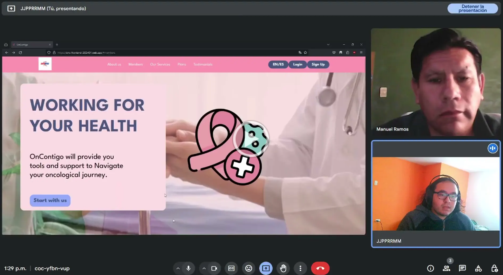
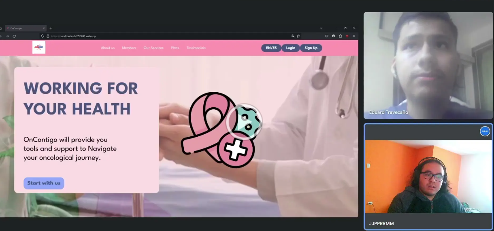

<il><h3><a href="./content/chapter-5/chapter-5.md">5.3 Validation Interviews</a></h3></il>

<il><h3><a href="./content/chapter-5/chapter-5.md">5.3.1.Diseño de Entrevistas.</a></h3></il>

¿Podría presentarse con su nombre completo, edad, distrito de residencia y ocupación?

Sobre el landing page, ¿la considera llamativa y visualmente interesante?

¿Considera que la información proporcionada comunica de forma correcta las funciones de nuestra aplicación?

¿Hay algo que considere deberíamos cambiar o eliminar en la página?

Sobre la aplicación, ¿las herramientas son claras y de fácil lectura?

¿Cree que nuestra aplicación le hubiera ayudado a tener mayor orden durante el proceso oncológico?

¿Qué cambios propondría para mejorar los elementos visuales de nuestra aplicación?

Si es que usara esta aplicación por primera vez sin una guía, ¿le parecería claro cómo utilizarla, o hay herramientas que no tienen un uso claro a simple vista?

¿Hay alguna opción o herramienta que cree que le falta a nuestra aplicación?

¿Recomendaría esta aplicación hacia médicos u otros pacientes oncológicos?

Médicos:
*¿Considera que las herramientas brindadas mejorarían su orden con los pacientes?
 
*¿Utilizaría la aplicación para organizar los procesos médicos de cada uno de sus pacientes?
<il><h3><a href="./content/chapter-5/chapter-5.md">5.3.2.Registro de Entrevistas.</a></h3></il>

Entrevista 1: Verónica Mendoza, 52, Chorrillos, profesora de tiempo completo en la upc ; familiar de paciente oncológico

 https://drive.google.com/file/d/1aMSpnoVOVk1TBoXqOUFQYVw73LOTRLD1/view?usp=sharing

Resumen:

La entrevistada tuvo una buena experiencia con el landing page, considerándolo bastante llamativo de forma visual pero con información clara, permitiendo conocer el objetivo y función de nuestra startup y aplicación realizada. El único detalle que sugirió como cambio es que nuestro logo sea más visible, quizás aumentando su tamaño o colocándolo en más lugares.
Sobre la aplicación, la entrevistada también tuvo una buena experiencia con ella. Consideró que cada botón y enlace mostrado era bastante claro en su función, por lo que incluso podría utilizarla de forma correcta sin necesidad de una guía. Los únicos cambios que realizaría sobre la aplicación es que el calendario muestre más detalles sobre el mes y semana en la que se realizarán las citas, una sección que presenta noticias sobre tratamientos oncológicos recientes y simplemente que nuestro logo aparezca más visible.
La entrevistada consideró que nuestra aplicación sería de mucha ayuda para personas pasando por los procesos oncológicos, además de que las herramientas para los médicos les ayudarían a mejorar su eficiencia y organización, además de que le hubiera gustado mucho tener esta aplicación mientras que su pariente se encontró en el proceso oncológico.

 
Entrevista 2: Manuel Luis Ramos, 52, San Luis, posición administrativa en resocentro ; familiar de paciente oncológico

 https://drive.google.com/file/d/1uc8FAaD1ArRYNPcP5_7kGPWF3bItJdF_/view?usp=sharing  

Resumen:

El entrevistado consideró la landing page impactante de forma visual, con la información en ella explicando claramente nuestra aplicación y objetivo al realizarla. Los únicos cambios que considera importantes son el uso de lazos de más colores, ya que solo utilizar un lazo rosado está vinculado a un solo tipo de cáncer y podría hacer creer a un usuario que solo nos enfocamos en ese tipo. Otro cambio que considera es cambiar el título de "Trabajando por tu salud" a uno más enfocado al cáncer y tratamientos oncológicos.
Para la aplicación, el entrevistado considera que todo está claro y conciso y de fácil entendimiento, por lo que sí podría utilizarla aunque no tuviera a alguien que le explique como usarla. El único cambio que considera de gran importancia es que las aplicaciones no estén completamente vinculadas entre médicos y pacientes, es decir, si es que el médico no tenga la aplicación descargada, entonces el paciente debería poder registrar citas en su calendario personal. A parte de esto, la aplicación le parece de gran utilidad al entrevistado.

 
Entrevista 3: Eduard Travezaño, 20, San Juan de Lurigancho, Estudiante universitario ; familiar de paciente

 https://drive.google.com/file/d/13l0HOKYB5VeZ4CLpG4pVyeep5gKchQea/view?usp=sharing 

Resumen:

El entrevistado tuvo una buena experiencia con nuestro landing page, pareciéndole única y llamativa con los tonos de colores rosados y con información no abrumadora que cause confusión visual. La página muestra información que comunica fácilmente el uso de la aplicación, aunque desearía que nos enfocáramos a la salud en general, no solamente a tratamientos y médicos oncológicos, aunque entiende nuestra misión de enfocarnos en ellos.
En términos de la aplicación, todo le parece entendible y claro al entrevistado y le agrada el calendario, aunque desearía que hubiera más información sobre las citas y pacientes o médicos además de su nombre y fecha, cosas como especialidad o razón de cita.
Además, el entrevistado considera que la aplicación está bastante completa, pero una lista de visitas al paciente si es que estuviera internado sería de gran ayuda.
<il><h3><a href="./content/chapter-5/chapter-5.md">5.3.3.Evaluaciones según heurísticas.</a></h3></il>

**SITE o APP A EVALUAR**

Meta: El propósito general de la evaluación es encontrar problemas existentes en la aplicación web "OnContigo".

Cómo: Los hallazgos del sitio web se llevarán a cabo utilizando la Lista Heurística de Nielsen, inicialmente investigada y creada por Jakob Nielsen.

**TAREAS A EVALUAR:**

**Desktop landing page**

Información y descripción de la aplicación y sus funcionalidades.
Visualización de planes de pago de la aplicación.
Header y footer apropiado para la landing page.
Interacción del landing page con la aplicación.
Redes sociales asociadas al startup.
Videos de about the product y about the team.

**Web Application**

Inicio de sesión con usuario existente de paciente y doctor.
Visualización de los planes para el registro del paciente.
Iconografía comprensible y consistente con el mundo real.
Mensajes de error que reflejen el registro de datos incorrectos.
Acciones de retroceso dentro de la aplicación.
Evaluar existencia de patrones de diseño o navegación.
Elementos de la interfaz de usuario consistentes.
Pestañas de navegación dentro de la aplicación.
Botones interactivos y de uso intuitivo.
Navegación y orientación dentro de la aplicación.
Visualización de perfil del paciente.
Visualización del perfil de la doctor.
Visualización del buscar doctor en la aplicación del paciente.
Visualización del perfil del doctor en la aplicación del paciente.
Estética general de la interfaz atractiva y agradable visualmente.

**No están incluidas en esta versión de la evaluación las siguientes tareas:**

**Desktop landing page**
Política de privacidad y condiciones de uso.

**Web Application**
Registro de un nuevo usuario.
Recuperación de contraseña.
Compra de los planes.
Solicitar cita a un doctor.
Acceso a recursos de ayuda dentro de la aplicación.
Actualizar la información del paciente y doctor.
Plan de paciente en la aplicación del doctor.
Política de privacidad y condiciones de uso.

**ESCALA DE SEVERIDAD:**

Los errores serán puntuados tomando en cuenta la siguiente escala de severidad 

|Nivel|Descripción |
| :- | :- |
|1|
Problema superficial: puede ser fácilmente superador por el usuario ó ocurre con muy poco 

frecuencia. No necesita ser arreglado a no ser que exista disponibilidad de tiempo.
|
|2|
Problema menor: puede ocurrir un poco más frecuentemente o es un poco más difícil de 

superar para el usuario. Se le debería asignar una prioridad baja resolverlo de cara al siguiente 

reléase
|
|3|
Problema mayor: ocurre frecuentemente o los usuarios no son capaces de resolverlos. Es 

importante que sean corregidos y se les debe asignar una prioridad alta.
|
|4|
Problema muy grave: un error de gran impacto que impide al usuario continuar con el uso de 

la herramienta. Es imperativo que sea corregido antes del lanzamiento.
|

**TABLA RESUMEN:**

**Desktop landing page**

|**#**|**Problema**|**Escala de severidad**|**Heurística/Principio violada(o)**|
| :- | :- | :- | :- |
|1|El logo de la aplicación esta muy resaltado en un cuadro |3|Usability: Coincidencia entre el sistema y el mundo real|
|2|En el contenido del meet us las letras no son fácil de visualizar, el color no es lo adecuado.|2|Usability: Coincidencia entre el sistema y el mundo real|
|3| No hay videos acerca del producto y del equipo en "About Us"..|2|Usabilidad: Visibilidad del estado del sistema.|

**PROBLEMA #01**:  El logo de la aplicación está muy resaltado en un cuadro

**Escala de severidad:3**

**Principio violado:** Usabilidad: Coincidencia entre el sistema y el mundo real**.**

**Descripción del problema:** El logo de la aplicación se destaca excesivamente en un cuadro, lo que puede distraer a los usuarios de otros elementos o contenido importante en la página de inicio. Esta falta de alineación con las expectativas de los usuarios y la convención del mundo real puede dificultar la comprensión de la interfaz y la navegación.

**Recomendación:**
Reduzca el resalte del logo en el cuadro o colóquelo de manera más equilibrada en la página de inicio para que no sea el elemento dominante. Asegúrese de que la página de inicio tenga un equilibrio visual adecuado y que los elementos esenciales sean fácilmente identificables sin distraer a los usuarios. Esto mejorará la experiencia del usuario y la alineación con el principio de "Coincidencia entre el sistema y el mundo real".

**PROBLEMA #02:** En el contenido del "Meet Us," las letras no son fáciles de visualizar y el color no es el adecuado.

**Escala de severidad:** 2

**Principio violado:** Coincidencia entre el sistema y el mundo real

**Descripción del problema:** El contenido de la sección "Meet Us" presenta dificultades en la legibilidad debido a la elección de colores y fuentes. Las letras pueden no ser fáciles de visualizar debido a problemas de contraste o elección de color inapropiado, lo que puede dificultar la comprensión del contenido.

**Recomendación:** Se recomienda mejorar la legibilidad del contenido en la sección "Meet Us" ajustando la elección de colores y fuentes para garantizar un contraste adecuado y una fácil visualización. Esto cumplirá con el principio de "Coincidencia entre el sistema y el mundo real" al facilitar la lectura del contenido.

**PROBLEMA #03**: No hay videos acerca del producto y del equipo en "About Us".
**Escala de severidad**: 2

**Principio violado**: Usabilidad: Visibilidad del estado del sistema.

**Descripción del problema**: En la sección "About Us," no se incluyen videos informativos sobre el producto o el equipo detrás de la aplicación. La falta de contenido multimedia puede limitar la comprensión y la visibilidad del estado del sistema. Los usuarios pueden esperar encontrar información más detallada y visual en esta sección.

**Recomendación**: Se sugiere enriquecer la sección "About Us" con videos informativos que presenten el producto y el equipo de desarrollo de la aplicación. Esto mejorará la visibilidad del estado del sistema y proporcionará a los usuarios una comprensión más completa, cumpliendo con el principio de "Visibilidad del estado del sistema."
