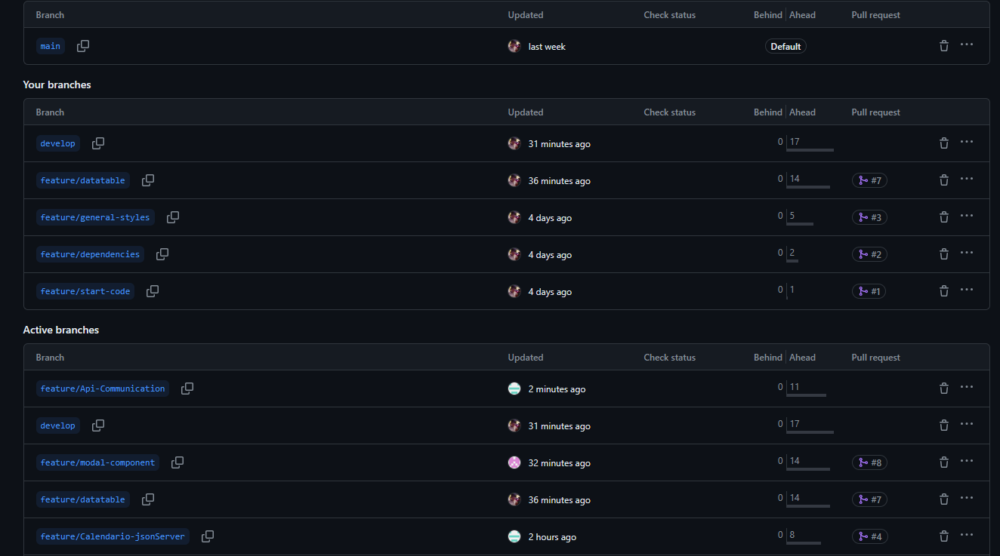
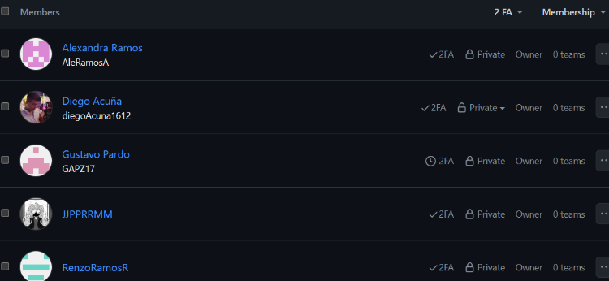

<il><h3><a href="./content/chapter-5.4/chapter-5.4.md">5.2.4 Sprint 4</a></h3></il>
   <ul>
      <il><h3><a href="./content/chapter-5.4/chapter-5.4.md">5.2.4 Sprint 4</a></h3></il>
      <ul>
         <il><h3><a href="./content/chapter-5.4/chapter-5.4.md">5.2.4.1. Sprint Planning 4</a></h3></il>
         <table>
  <tr>
    <th>Sprint #</th>
    <td>Sprint 4</td>
  </tr>
  <tr>
    <th>Sprint Planning Date</th>
    <td>2024-15-29</td>
  </tr>
  <tr>
    <th>Time</th>
    <td>06:00 PM</td>
  </tr>
  <tr>
    <th>Location</th>
    <td>Servidor de Discord del Equipo</td>
  </tr>
  <tr>
    <th>Prepared By</th>
    <td>Renzo Ramos</td>
  </tr>
  <tr>
    <th>Attendees</th>
    <td>Juan Pablo/ Diego Acuña / Belen Ramos / Renzo Ramos / Gustavo Pardo</td>
  </tr>
    <tr>
    <th>Sprint Review Summary</th>
    <td>El objetivo del sprint anterior fue el desarrollo del Back End. Para este sprint, la meta fue centrada en la finalización del front end y back end y de la corrección de errores encontrados para finalizar el proyecto.</td>
  </tr>
  <tr>
    <th>Sprint Retrospective Summary</th>
    <td>Aún había ciertas partes faltantes al back end y front end por lo que el grupo se ha enfocado a corregirlas.</td>
  </tr>
  <tr>
    <th>Sprint Goal</th>
    <td>La meta de este Sprint es corregir los errores encontrados y la adición de elementos faltantes en los sprints anteriores.</td>
  </tr>
  <tr>
    <th>Sprint Velocity</th>
    <td>5</td>
  </tr>
  <tr>
    <th>Sum of Story Points</th>
    <td>20</td>
  </tr>
</table>
         <il><h3><a href="./content/chapter-5/chapter-5.md">5.2.3.2. Sprint Backlog 3</a></h3></il>
         <table border="1">
           
         
           
         https://trello.com/b/dO38Ex1T/sprint-backlog-2-oncontigo 
  <tr>
    <th>Sprint #</th>
    <th>User Story</th>
    <th>Work-item/Task</th>
    <th>Id</th>
    <th>Title</th>
    <th>Description</th>
    <th>Estimation (Hours)</th>
    <th>Assigned To</th>
    <th>Status (To-do / In-Process / To-Review / Done)</th>
  </tr>
  <tr>
    <td rowspan="2">Sprint 3</td>
    <td rowspan="2">HU01:  Registrar Cuenta</td>
    <td>TA01</td>
    <td>#182062235</td>
    <td>Desarrollar el Bounded Context Authentication</td>
    <td>Crear el bounded context de Authentication con su respectiva estructura</td>
    <td>4</td>
    <td>Gustavo Zapata</td>
    <td>Done</td>
  </tr>
  <tr>
    <td>TA02</td>
    <td>#182062223</td>
    <td> Crear los endpoints de Profiles y documentarlos en SwaggerUI</td>
    <td>Desarrollar los controladores del Bounded Context</td>
    <td>4</td>
    <td>Gustavo Zapata</td>
    <td>Done</td>
  </tr>
  <tr>
    <td rowspan="2">Sprint 3</td>
    <td rowspan="2">HU01:  Listar medicamentos</td>
    <td>TA01</td>
    <td>#182062235</td>
    <td> Desarrollar el Bounded Context HealthTracking</td>
    <td>Crear los aggregates,entities,commands,queries, services y repositories del Bounded Context HealthTraking</td>
    <td>6</td>
    <td>Renzo Ramos</td>
    <td>In process</td>
  </tr>
  <tr>
    <td>TA02</td>
    <td>#182062223</td>
    <td> Realizar los endpoints con los métodos http GET POST DELETE PATCH de Medications</td>d
    <td> Crear los controladores para documentar los endpoints de Medications</td>
    <td>4</td>
    <td>Renzo Ramos</td>
    <td>To-do</td>
  </tr>
</table>
         <il><h3><a href="./content/chapter-5/chapter-5.md">5.2.3.3. Development Evidence for Sprint Review</a></h3></il>
        En esta sección se presentan los avances de implementación con relación a los productos desarrollados en el presente Sprint. La implementación de la primera version del Front End y mejora de la Landing Page. Se implementaron ramas a partir de la rama develop para que cada integrante
<table border="1">
  <tr>
    <th>Repository</th>
    <th>Branch</th>
    <th>Commit Id</th>
    <th>Commit Message</th>
    <th>Commit Message Body</th>
    <th>Committed on (Date)</th>
  </tr>
  <tr>
    <td>Diego Acuna /FrontEnd</td>
    <td>feature/responsive</td>
    <td>386f0d0</td>
    <td>feat:Patients Overview Responsive</td>
    <td>feat:Patients Overview Responsive</td>
    <td>01/06/2024</td>
  </tr>
   <tr>
    <td>Belen Ramos /FrontEnd</td>
    <td>feature/responsive</td>
    <td>386f145</td>
    <td>feat:dashBoard responsive</td>
    <td>feat:dashBoard responsive</td>
    <td>01/06/2024</td>
  </tr>
    <tr>
    <td>Diego Acuna /FrontEnd</td>
    <td>feature/landing-page</td>
    <td>386f0d0</td>
    <td>feat:added landing page</td>
    <td>feat:added landing page</td>
    <td>07/06/2024</td>
  </tr>
    <tr>
    <td>Belen Ramos /FrontEnd</td>
    <td>feature/responsive</td>
    <td>386f145</td>
    <td>feat:modals responsive</td>
    <td>feat:modals responsive</td>
   <td>07/06/2024</td>
  </tr>
    <tr>
    <td>Belen Ramos /FrontEnd</td>
    <td>feature/sidebar</td>
    <td>386f145</td>
    <td>feat:add sidebar</td>
    <td>feat:add sidebar</td>
   <td>07/06/2024</td>
  </tr>
  <tr>
    <td>Backend</td>
    <td>feature/Medications</td>
    <td>9a08b92</td>
    <td>feat:Medications and other aggregates added</td>
    <td>feat:Medications and other aggregates added</td>
   <td>09/06/2024</td>
  </tr>
   <tr>
    <td>Backend</td>
    <td>feature/Authentication</td>
    <td>919896b</td>
    <td>feat:added BC authentication</td>
    <td>feat:added BC authentication</td>
   <td>09/06/2024</td>
  </tr>
</table>
         <il><h3><a href="./content/chapter-5/chapter-5.md">5.2.3.4. Testing Suite Evidence for Sprint Review</a></h3></il>
         No se desarrolló en este sprint, pues en esta parte se presentarán los Unit Tests, Integration Tests y
Acceptance Tests automatizados, para Web Services
<il><h3><a href="./content/chapter-5/chapter-5.md">5.2.3.5. Execution Evidence for Sprint Review</a></h3></il>
Implementacion de la Landing page en el FrontEnd 
  
Responsive Modals 
  
SideBar del FrontEND  
  
<il><h3><a href="./content/chapter-5/chapter-5.md">5.2.3.6. Services Documentation Evidence for Sprint Review</a></h3></il>
  
  
  

<il><h3><a href="./content/chapter-5/chapter-5.md">5.2.3.7. Software Deployment Evidence for Sprint Review</a></h3></il>

#### FrontEnd We App deployment link:  https://onc-frontend-202401.web.app/
     

#### API RESTFul deployment:

<il><h3><a href="./content/chapter-5/chapter-5.md">5.2.3.8.Team Collaboration Insights during Sprint.</a></h3></il>
FRONTEND & BACKEND
  
  
  
  
  

</ul>
 
