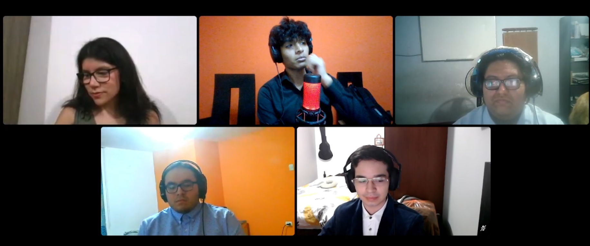

# CONCLUSIONES

## Conclusiones y recomendaciones 

  Para finalizar, podemos concluir que, con lo realizado durante el transcurso del proyecto, hemos desarrollado una aplicación funcional con las metas que nos planteamos al inicio, siendo OnContigo una herramienta de gran utilidad para nuestro público objetivo, como se pudo demostrar en las entrevistas de validación. Creemos que, con esta herramienta, ayudaríamos a reducirle el estrés y malestar debido a la incertidumbre de los procesos de recuperación oncológicos a los pacientes y sus familiares, además de mejorar la organziación de los médicos oncólogos. 

Además, podemos concluir en la utilidad que la realización de este proyecto tendrá sobre nuestros futuros laborales. Hemos aprendido de forma práctica cómo desarrollar un Front End y Back End, además de conectarlos juntos, para el correcto desarrollo de una aplicación web habilidades de gran utilidad que serán un requerimiento básico en el futuro. 

Finalmente, el desarrollo en equipo también es de gran ayuda laboral, puesto que la metodología ágil con Sprints es de gran utilidad para producir un proyecto de forma organizada y coherente, con avances continuos y la capacidad de revisar avances anteriores sin impedir el desarrollo en general. Las habilidades de comunicación como equipo también son de gran utilidad, ya que este tipo de metodología requiere una comunicación constante. 

Como recomendaciones, reconocemos que podríamos haber realizado una mejor división de actividades en los primeros sprints realizados, debido que, como un grupo, aún no nos conocíamos tan bien. Recomendamos que, durante un desarrollo en sprints, cada miembro debe tener sus habilidades bien definidas. Además, damos a conocer que hay ciertas funcionalidades planeadas que no están disponibles en esta versión del proyecto, principalmente, la comunicación entre diferentes usuarios.
  

## About the Team

https://upcedupe-my.sharepoint.com/:v:/g/personal/u20201c794_upc_edu_pe/Ecc4jKTgR-tBneCGm-1a3GgBm891XP20JkFyD5chTgFcMg?e=eH7G5W&nav=eyJyZWZlcnJhbEluZm8iOnsicmVmZXJyYWxBcHAiOiJTdHJlYW1XZWJBcHAiLCJyZWZlcnJhbFZpZXciOiJTaGFyZURpYWxvZy1MaW5rIiwicmVmZXJyYWxBcHBQbGF0Zm9ybSI6IldlYiIsInJlZmVycmFsTW9kZSI6InZpZXcifX0%3D
 

